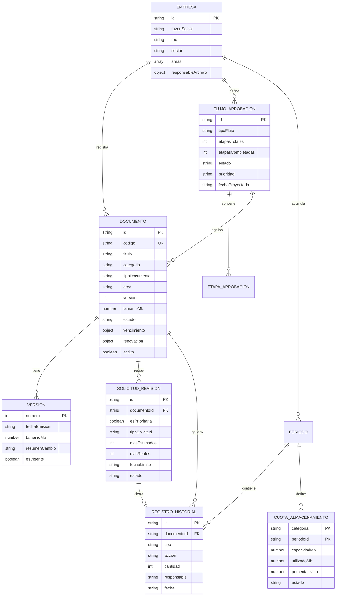
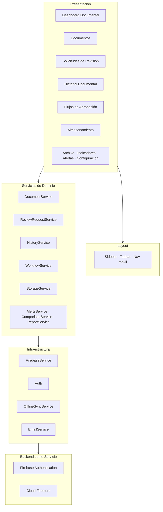
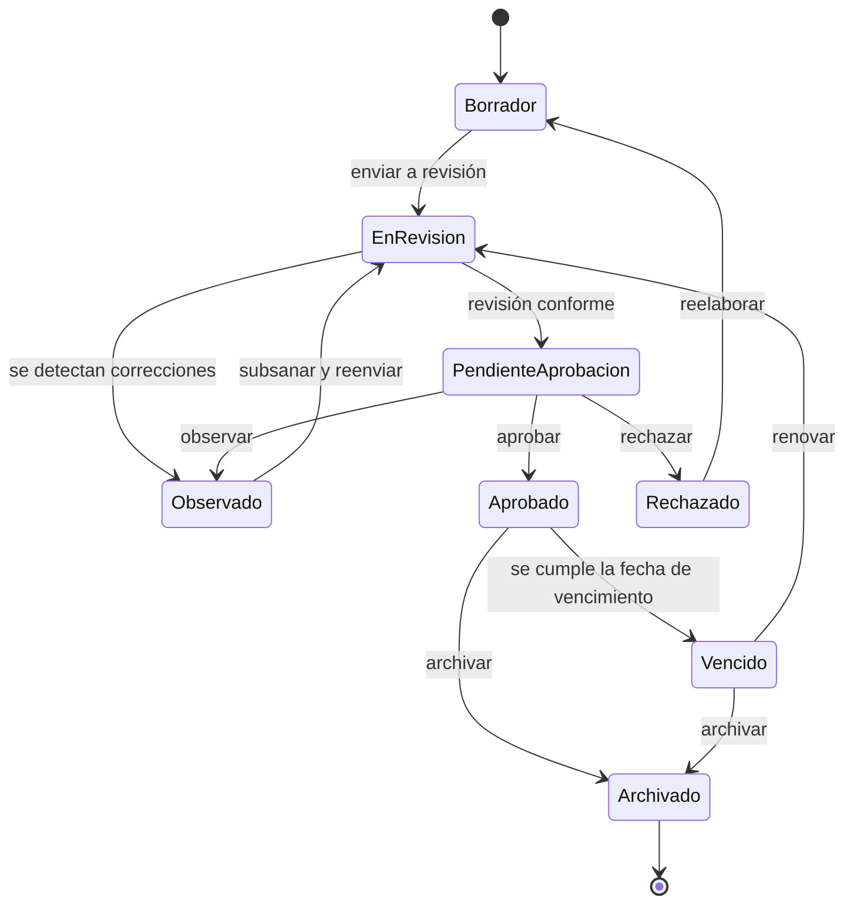
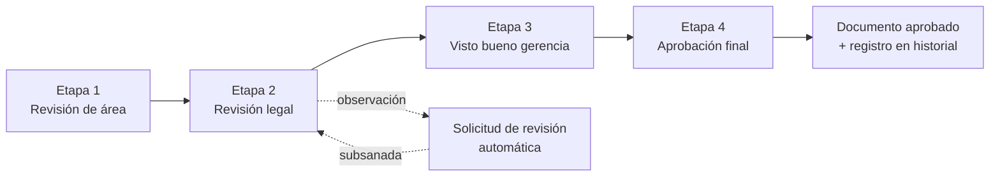

# ARCHIVA — Plan de Migración desde TRACKY

> **ARCHIVA — Sistema Inteligente de Gestión Documental Empresarial**
> Migración completa desde **Tracky** (Sistema de Gestión Financiera Personal)
> conservando Angular 21, Firebase Auth, Firestore, Chart.js, SCSS y Vercel.

**Documento:** Plan de migración y especificación técnica · **Versión:** 1.0 · **Fecha:** 3 de septiembre de 2026

---

## 1. Nombre Comercial

**ARCHIVA**

| Elemento | Valor |
|---|---|
| Nombre completo | ARCHIVA — Sistema Inteligente de Gestión Documental Empresarial |
| Eslogan principal | *Cada documento, en su sitio y a tiempo.* |
| Eslogan de acceso | *El archivo de tu empresa, siempre bajo control.* |
| Identificador técnico | `archiva` (npm `archiva`, proyecto Angular `archiva`, dominio `archiva.vercel.app`) |
| Lectura del nombre | Imperativo del verbo *archivar* y sustantivo *archivo*: la acción y el lugar en una sola palabra |

---

## 2. Branding

### 2.1 Identidad

| Elemento | Definición |
|---|---|
| Concepto visual | Archivo físico corporativo: papel hueso, carpeta kraft, sello de aprobación |
| Personalidad | Institucional, ordenado, preciso. Sin ornamento |
| Voz | Directa y operativa. "Aprobar", "Observar", "Archivar" — nunca "¡Genial!" |
| Formato del logotipo | Palabra `ARCHIVA` en Archivo 700 con tracking amplio, precedida de una marca de carpeta |

### 2.2 Tipografía

| Rol | Familia | Uso | Motivo |
|---|---|---|---|
| Display | **Archivo** 600/700 | Títulos, cifras del dashboard | Se llama igual que el producto y es una grotesca institucional de alta legibilidad |
| Texto | **Archivo** 400/500 | Cuerpo, formularios, tablas | Coherencia de familia |
| Datos | **Roboto Mono** 400/500 | Códigos de documento, versiones, fechas en tabla | Los códigos `CON-LEG-0142 v2` solo se leen bien en monoespaciada |

Se cargan desde Google Fonts, único host permitido por la configuración actual. Reemplazan a DM Sans, Inter y Poppins.

### 2.3 Iconografía

Se conserva Lucide, ya integrado en `core/utils/lucide-icons.ts`. Iconos sugeridos por módulo en la sección 21.

---

## 3. README Completo

Contenido propuesto para `README.md`.

````markdown
<div align="center">


# ARCHIVA

### Sistema Inteligente de Gestión Documental Empresarial

**Cada documento, en su sitio y a tiempo.**


</div>

---

## Qué es ARCHIVA

ARCHIVA es una plataforma web para la gestión documental de empresas: registra documentos, controla su estado y su vencimiento, gestiona sus versiones, tramita solicitudes de revisión, ejecuta flujos de aprobación por etapas y administra la capacidad de almacenamiento por categoría.

No es un repositorio de archivos. Es un sistema de **control**: responde en todo momento qué documentos hay, en qué estado están, quién debe aprobarlos, cuáles vencen y cuánto espacio ocupan.

---

## Módulos

### Documentos
- **12 categorías documentales**: contratos, facturas, órdenes de compra, memorandos, oficios, informes, resoluciones, convenios, manuales, políticas, procedimientos y otros
- **28 tipos documentales** agrupados por categoría
- **8 estados**: borrador, en revisión, pendiente de aprobación, aprobado, observado, rechazado, archivado y vencido
- **Codificación normalizada** `CAT-ÁREA-CORRELATIVO`
- **Control de versiones** con historial completo e identificación de la versión vigente
- **Control de vencimiento** con ciclo de renovación configurable en 8 frecuencias
- **Cálculo automático** de las próximas 6 fechas de renovación
- **Alerta anticipada** configurable por documento

### Solicitudes de Revisión
- **Sistema dual**: solicitudes prioritarias frente a solicitudes ordinarias
- **7 tipos prioritarios**: aprobación gerencial, revisión legal, subsanación de observación, actualización por vencimiento, validación de firma, corrección de datos y reasignación de responsable
- **9 tipos ordinarios**: revisión de formato, revisión ortográfica, actualización de anexos, cambio de categoría, solicitud de copia, digitalización, reclasificación, traslado a archivo y otros
- **Plazo de atención** con fecha límite y control de vencimiento
- **Detección de reincidencia** sobre el mismo documento
- **5 estados**: pendiente, en proceso, atendida, vencida y anulada

### Historial Documental
- **Bitácora permanente** agrupada por día
- **Entradas y salidas** con 8 acciones: creación, edición, nueva versión, envío a revisión, aprobación, observación, rechazo y archivado
- **Trazabilidad completa** con responsable, documento y versión afectada
- **Filtros** por acción, categoría, documento y texto libre

### Flujos de Aprobación
- **12 tipos de flujo**: aprobación de contrato, de factura, de presupuesto, revisión legal, visto bueno de gerencia, validación técnica, firma de convenio, publicación de política, homologación de proveedor, cierre de expediente, renovación documental y otros
- **Control por etapas**: etapas completadas sobre etapas totales, con porcentaje de avance
- **Proyección de cierre** según el ritmo real de aprobación
- **Prioridad** alta, media y baja
- **4 estados**: en curso, completado, suspendido y cancelado

### Gestión de Almacenamiento
- **Cuota por categoría documental** y periodo
- **Capacidad asignada frente a espacio utilizado**, con porcentaje de uso
- **Semáforo**: normal, en alerta, excedido y sin uso
- **Umbral de alerta** configurable, 80 % por defecto
- **Distribución automática** de la cuota entre categorías
- **Cierre de periodo** con arrastre del consumo

### Dashboard Documental
- **Total de documentos** y documentos activos
- **Aprobados, observados, vencidos y archivados**
- **Documentos por categoría**
- **Tiempo promedio de aprobación**
- **Flujo documental mensual**: entradas frente a salidas
- **Tendencia documental** de los últimos 6 periodos
- **Actividad reciente**
- **Alertas automáticas**: vencimientos próximos, documentos observados y cuotas excedidas

### Archivo Histórico
- Documentos archivados acumulados, con evolución temporal y meta de archivado del periodo

### Configuración Empresarial
- Razón social, RUC, sector, áreas y responsable del archivo
- Días de alerta por defecto y prefijo de codificación
- Perfil de usuario y panel de desarrollador

---

## Arquitectura

```
src/app/
├── core/
│   ├── components/        # Icon, PasswordStrength
│   ├── guards/            # Guard de autenticación
│   ├── layout/            # Sidebar, Topbar y navegación móvil
│   ├── models/
│   │   ├── company.model.ts        # Empresa y áreas
│   │   ├── document.model.ts       # Documentos, estados y vencimiento
│   │   ├── review-request.model.ts # Solicitudes de revisión
│   │   ├── history.model.ts        # Historial documental
│   │   ├── workflow.model.ts       # Flujos de aprobación
│   │   └── storage.model.ts        # Cuotas de almacenamiento
│   ├── services/
│   │   ├── firebase.ts             # Capa de acceso a Firestore
│   │   ├── auth.ts                 # Autenticación Firebase
│   │   ├── document.ts             # Documentos
│   │   ├── review-request.ts       # Solicitudes
│   │   ├── history.ts              # Historial
│   │   ├── workflow.ts             # Flujos de aprobación
│   │   ├── storage.ts              # Almacenamiento
│   │   ├── alerts.ts               # Motor de alertas
│   │   ├── email.ts                # Notificaciones
│   │   └── dev-settings.ts
│   └── utils/
└── pages/
    ├── dashboard/         # Dashboard documental
    ├── documents/         # Documentos
    ├── review-requests/   # Solicitudes de revisión
    ├── history/           # Historial documental
    ├── workflows/         # Flujos de aprobación
    ├── workflow/          # Detalle de flujo
    ├── storage/           # Gestión de almacenamiento
    ├── archive/           # Archivo histórico
    ├── indicators/        # Indicadores documentales
    ├── alerts/            # Alertas
    ├── settings/          # Configuración empresarial
    ├── onboarding/        # Configuración inicial
    └── login/             # Acceso
```

---

## Instalación

```bash
git clone https://github.com/<usuario>/archiva.git
cd archiva
npm install
npm start
```

Disponible en `http://localhost:4200`.

## Configuración de Firebase

1. Crear un proyecto en [Firebase Console](https://console.firebase.google.com).
2. Habilitar Authentication con Email/Password y Google.
3. Crear una base de datos Cloud Firestore.
4. Copiar las credenciales en `src/environments/environment.ts`.
5. Desplegar reglas: `firebase deploy --only firestore:rules`.

## Build y despliegue

```bash
npm run build
```

Configurado para Vercel mediante `vercel.json`.

---

## Licencia

Proyecto académico para el curso de Administración de Software. Todos los derechos reservados.
````

---

## 4. Problema que Resuelve

La gestión documental de una empresa pequeña o mediana falla por causas **de control, no de almacenamiento**:

1. **Documentos vencidos en circulación.** Contratos, licencias, pólizas y convenios caducan sin aviso. El vencimiento se descubre cuando un cliente, un proveedor o un auditor lo señala.
2. **Aprobaciones que se pierden en el correo.** Un documento pasa por gerencia, legal y administración sin que exista registro de en qué etapa está detenido ni desde cuándo.
3. **Versiones simultáneas en circulación.** Se trabaja con un procedimiento obsoleto porque nadie sabe cuál es la versión vigente.
4. **Solicitudes de revisión sin seguimiento.** Se piden correcciones verbalmente o por mensajería y se pierden.
5. **Ausencia de indicadores.** La empresa no puede responder con un número cuánto demora en aprobar un documento ni qué porcentaje de su acervo está vigente.
6. **Almacenamiento sin control.** El espacio crece sin política de cuotas ni visibilidad por categoría, hasta que se agota.
7. **Falta de trazabilidad.** No hay bitácora de quién creó, modificó, aprobó, observó o archivó cada documento.

ARCHIVA convierte la gestión documental en un proceso **medible, trazable y con alerta temprana**.

---

## 5. Objetivo General

Desarrollar e implementar un sistema web de gestión documental empresarial que permita registrar documentos, controlar sus estados y vencimientos, gestionar sus versiones, tramitar solicitudes de revisión, ejecutar flujos de aprobación por etapas y administrar la capacidad de almacenamiento, generando indicadores documentales y alertas automáticas con trazabilidad completa del ciclo de vida de cada documento.

---

## 6. Objetivos Específicos

| # | Objetivo específico |
|---|---|
| OE-01 | Implementar un módulo de registro de la empresa que centralice razón social, RUC, sector, áreas y responsable del archivo. |
| OE-02 | Desarrollar un módulo de documentos con 12 categorías, 28 tipos documentales y codificación normalizada. |
| OE-03 | Implementar el control de los 8 estados documentales con transiciones válidas entre ellos. |
| OE-04 | Desarrollar el control de vencimiento con ciclo de renovación recurrente y cálculo de próximas fechas. |
| OE-05 | Implementar el control de versiones de cada documento con identificación de la versión vigente. |
| OE-06 | Construir un módulo de solicitudes de revisión con clasificación por prioridad y seguimiento hasta su atención. |
| OE-07 | Desarrollar un módulo de flujos de aprobación por etapas con proyección de fecha de cierre. |
| OE-08 | Implementar la gestión de cuotas de almacenamiento por categoría documental y periodo. |
| OE-09 | Construir una bitácora permanente del historial documental con entradas, salidas y responsable. |
| OE-10 | Diseñar un dashboard documental con 11 métricas y 7 visualizaciones reutilizando Chart.js. |
| OE-11 | Implementar un motor de alertas para vencimientos, observaciones y cuotas excedidas. |
| OE-12 | Generar reportes exportables de gestión documental. |
| OE-13 | Garantizar el aislamiento de la información de cada empresa mediante autenticación Firebase y reglas por UID. |
| OE-14 | Asegurar la operación en escritorio y móvil con diseño responsivo y trabajo sin conexión. |

---

## 7. Alcance

### 7.1 Incluido

- Autenticación con correo y contraseña, e inicio de sesión con Google.
- Onboarding empresarial de configuración inicial.
- CRUD completo de documentos, solicitudes, historial, flujos y cuotas de almacenamiento.
- Control de los 8 estados documentales y de las transiciones permitidas.
- Control de vencimiento con 8 frecuencias de renovación.
- Control de versiones con historial.
- Flujos de aprobación por etapas con avance porcentual.
- Cuotas de almacenamiento por categoría con semáforo de uso.
- Dashboard documental con 11 métricas y 7 gráficos.
- Motor de alertas y notificaciones por correo.
- Reporte exportable de gestión documental.
- Bitácora histórica inmutable.
- Cierre automático de periodo mensual.
- Operación sin conexión con sincronización diferida.
- Interfaz responsiva en español.

### 7.2 Excluido de esta versión

- **Carga y almacenamiento del archivo binario.** Se registra la ficha del documento, su código, versión, tamaño declarado y ubicación de referencia. Incorporar el binario exige Firebase Storage, reglas adicionales y control de cuotas reales.
- Roles y permisos diferenciados. Un usuario administra el acervo completo de su empresa.
- Firma digital con certificado y estampado de tiempo.
- Aprobación multiusuario con cuentas independientes por aprobador.
- OCR y búsqueda por contenido del documento.
- Integración con ERP, SharePoint o Drive.
- Aplicación móvil nativa.

### 7.3 Supuestos y restricciones

- La empresa ya definió qué documentos gestiona; el sistema administra su ciclo de vida.
- El usuario dispone de conexión para la sincronización inicial.
- Se conserva el stack tecnológico existente por restricción del proyecto.

---

## 8. Stakeholders

| Stakeholder | Tipo | Interés | Influencia |
|---|---|---|---|
| **Responsable de archivo / asistente administrativo** | Primario, usuario directo | Mantener el acervo ordenado, vigente y localizable | Alta |
| **Jefe de área** | Primario | Que los documentos de su área estén aprobados y disponibles | Alta |
| **Gerencia** | Secundario | Indicadores de gestión documental y tiempos de aprobación | Alta |
| **Área legal** | Secundario | Vigencia de contratos y convenios | Alta |
| **Auditor interno o externo** | Secundario | Trazabilidad y evidencia del control | Media |
| **Personal operativo** | Secundario | Trabajar con la versión vigente | Media |
| **Docente del curso de Administración de Software** | Externo, evaluador | Verificar la metodología de desarrollo y gestión | Alta |
| **Equipo de desarrollo** | Interno | Mantener y evolucionar la plataforma | Alta |

---

## 9. Requisitos Funcionales

### Autenticación y Empresa

| ID | Requisito | Prioridad | Reutiliza |
|---|---|---|---|
| RF-01 | Registrar un usuario con correo y contraseña, validando la fortaleza de la clave. | Alta | `auth.ts`, `password-strength` |
| RF-02 | Iniciar sesión con correo/contraseña y con cuenta Google. | Alta | `auth.ts` |
| RF-03 | Impedir el acceso a cualquier módulo sin sesión activa. | Alta | `auth-guard.ts` |
| RF-04 | Ejecutar un onboarding empresarial obligatorio en el primer ingreso. | Alta | `onboarding.ts` |
| RF-05 | Registrar la empresa: razón social, RUC, sector, áreas y responsable del archivo. | Alta | perfil `users/{uid}` |
| RF-06 | Editar los datos de la empresa desde Configuración Empresarial. | Media | `settings` |
| RF-07 | Cerrar sesión desde cualquier pantalla. | Alta | `layout.component.ts` |

### Documentos

| ID | Requisito | Prioridad | Reutiliza |
|---|---|---|---|
| RF-08 | Registrar documentos clasificados por categoría documental y tipo documental. | Alta | `income.ts` |
| RF-09 | Generar y validar el código único con formato `CAT-ÁREA-CORRELATIVO`. | Alta | validación nueva |
| RF-10 | Definir el ciclo de renovación con 8 frecuencias: semanal, quincenal, mensual, bimestral, trimestral, semestral, anual y variable. | Alta | motor de recurrencia |
| RF-11 | Calcular y mostrar las próximas 6 fechas de renovación. | Media | `generateOccurrences()` |
| RF-12 | Controlar los 8 estados documentales y las transiciones válidas entre ellos. | Alta | `calculatePaymentStatus()` |
| RF-13 | Registrar una nueva versión incrementando el correlativo y actualizando la vigencia. | Alta | `markAsReceived()` |
| RF-14 | Registrar el responsable, el área emisora y la ubicación de referencia. | Media | campos existentes |
| RF-15 | Registrar el tamaño declarado del documento en MB para el control de almacenamiento. | Alta | campo `amount` |
| RF-16 | Archivar un documento sin eliminar su historial. | Alta | `deactivate()` |
| RF-17 | Filtrar y buscar documentos por categoría, estado, área y texto libre. | Alta | `income.ts` |
| RF-18 | Detectar el patrón real de renovación a partir del historial de versiones. | Baja | `detectPattern()` |

### Solicitudes de Revisión

| ID | Requisito | Prioridad | Reutiliza |
|---|---|---|---|
| RF-19 | Registrar solicitudes de revisión sobre documentos, clasificadas por tipo. | Alta | `expense.ts` |
| RF-20 | Clasificar cada solicitud como prioritaria u ordinaria. | Alta | `isPrimordial` |
| RF-21 | Asignar fecha límite de atención y estimación de días. | Alta | `dueDate`, `budgetedAmount` |
| RF-22 | Marcar una solicitud como atendida registrando los días reales y generando el registro de historial. | Alta | `markAsPaid()` |
| RF-23 | Identificar solicitudes reincidentes sobre el mismo documento. | Media | lógica de suscripciones |
| RF-24 | Controlar los estados pendiente, en proceso, atendida, vencida y anulada. | Alta | enum de `PaymentStatus` |
| RF-25 | Registrar el solicitante y el revisor asignado. | Media | campo `provider` |

### Historial Documental

| ID | Requisito | Prioridad | Reutiliza |
|---|---|---|---|
| RF-26 | Registrar cada evento documental con acción, documento, fecha, cantidad y responsable. | Alta | `transaction.ts` |
| RF-27 | Distinguir entradas, que incorporan documentos al acervo activo, de salidas, que los retiran. | Alta | campo `type` |
| RF-28 | Presentar el historial agrupado por día. | Media | ya implementado |
| RF-29 | Filtrar y buscar el historial por acción, categoría, documento y texto libre. | Media | `transactions.ts` |
| RF-30 | Registrar automáticamente un evento al aprobar, observar, rechazar o archivar un documento. | Alta | integración existente |

### Flujos de Aprobación

| ID | Requisito | Prioridad | Reutiliza |
|---|---|---|---|
| RF-31 | Definir flujos con nombre, tipo, número de etapas, fecha límite y prioridad. | Alta | `goal.ts` |
| RF-32 | Registrar la aprobación de cada etapa y actualizar el porcentaje de avance. | Alta | `addContribution()` |
| RF-33 | Proyectar la fecha estimada de cierre según el ritmo real de aprobación. | Media | `calculateProjectedDate()` |
| RF-34 | Controlar los estados en curso, completado, suspendido y cancelado. | Alta | `GoalStatus` |
| RF-35 | Gestionar varios flujos simultáneos ordenados por prioridad. | Media | `getByPriority()` |
| RF-36 | Calcular el tiempo promedio de aprobación a partir de los flujos completados. | Alta | cálculo nuevo, mínimo |

### Gestión de Almacenamiento

| ID | Requisito | Prioridad | Reutiliza |
|---|---|---|---|
| RF-37 | Asignar una cuota de almacenamiento en MB por categoría documental y periodo. | Alta | `budget.ts` |
| RF-38 | Calcular el porcentaje de uso comparando espacio utilizado con capacidad asignada. | Alta | `calculatePercentage()` |
| RF-39 | Clasificar cada cuota como normal, en alerta, excedida o sin uso según un umbral configurable. | Alta | `calculateBudgetStatus()` |
| RF-40 | Generar automáticamente la distribución de cuotas a partir de la capacidad total contratada. | Media | `autoCreateBudgetsFromIncome()` |
| RF-41 | Ejecutar el cierre de periodo arrastrando el consumo y los pendientes. | Media | `month-rollover.service.ts` |

### Dashboard, Alertas y Reportes

| ID | Requisito | Prioridad | Reutiliza |
|---|---|---|---|
| RF-42 | Presentar el total de documentos y los documentos activos. | Alta | balance acumulado |
| RF-43 | Presentar documentos aprobados, observados, vencidos y archivados. | Alta | conteos por estado |
| RF-44 | Graficar el flujo documental mensual: entradas frente a salidas. | Alta | gráfica de barras |
| RF-45 | Graficar la evolución del acervo activo a lo largo del periodo. | Alta | gráfica de balance |
| RF-46 | Mostrar la distribución de documentos por categoría. | Alta | regla 50/30/20 |
| RF-47 | Mostrar el tiempo promedio de aprobación. | Alta | cálculo nuevo |
| RF-48 | Mostrar la tendencia documental de los últimos 6 periodos. | Media | sparklines |
| RF-49 | Mostrar la actividad reciente. | Media | transacciones recientes |
| RF-50 | Generar alertas por vencimientos próximos, documentos observados, solicitudes vencidas y cuotas excedidas. | Alta | `alerts.ts` |
| RF-51 | Enviar notificación por correo al aprobar un documento o registrar una nueva versión. | Media | `email.ts` |
| RF-52 | Generar un reporte exportable de gestión documental. | Media | `report.service.ts` |
| RF-53 | Configurar la empresa, las notificaciones y el modo desarrollador. | Media | `settings.ts` |
| RF-54 | Operar sin conexión y sincronizar al restablecerse. | Baja | `offline-sync.service.ts` |

---

## 10. Requisitos No Funcionales

| ID | Categoría | Requisito | Verificación |
|---|---|---|---|
| RNF-01 | Rendimiento | Carga inicial en menos de 2,5 s en 4G. | LCP en Lighthouse |
| RNF-02 | Rendimiento | Bundle inicial menor a 1 MB. | Budget en `angular.json` |
| RNF-03 | Rendimiento | Carga diferida de cada módulo. | 13 rutas con `loadComponent` |
| RNF-04 | Rendimiento | Listado de documentos por debajo de 1 s con 1.000 registros. | Consulta paginada por periodo |
| RNF-05 | Seguridad | Cada empresa accede solo a sus datos. | Reglas Firestore por `request.auth.uid` |
| RNF-06 | Seguridad | Comunicación cifrada. | HTTPS en Vercel |
| RNF-07 | Seguridad | Sin embebido en iframes de terceros. | `X-Frame-Options: DENY` |
| RNF-08 | Seguridad | Validación de fortaleza de contraseña. | `password-strength` |
| RNF-09 | Trazabilidad | Todo evento documental queda registrado de forma permanente. | Colección `bitacora` sin borrado |
| RNF-10 | Trazabilidad | Historial completo de versiones por documento. | Subcolección de versiones |
| RNF-11 | Usabilidad | Interfaz íntegramente en español con terminología documental uniforme. | Revisión de glosario |
| RNF-12 | Usabilidad | Confirmación explícita en toda operación destructiva. | Modales de confirmación |
| RNF-13 | Usabilidad | Cualquier módulo alcanzable en 2 clics. | Sidebar + navegación inferior |
| RNF-14 | Usabilidad | El estado documental es identificable sin leer texto. | Color y forma en los 5 listados |
| RNF-15 | Accesibilidad | Etiquetas ARIA y foco visible en elementos interactivos. | Auditoría |
| RNF-16 | Compatibilidad | Chrome, Edge, Firefox y Safari en sus 2 últimas versiones. | Pruebas cruzadas |
| RNF-17 | Portabilidad | Pantallas de 320 px a 1920 px. | Diseño responsivo |
| RNF-18 | Disponibilidad | 99 % mensual. | SLA de Vercel y Firebase |
| RNF-19 | Mantenibilidad | Compilación con TypeScript `strict` sin errores. | `tsconfig.json` |
| RNF-20 | Mantenibilidad | Separación entre presentación, servicios y modelos. | Estructura `core/` y `pages/` |
| RNF-21 | Escalabilidad | Crecimiento histórico sin degradar la consulta. | Particionamiento por periodo |
| RNF-22 | Confiabilidad | La pérdida de conexión no provoca pérdida de datos. | Cola de sincronización |

---

## 11. Casos de Uso

| ID | Caso de uso | Actor | Módulo |
|---|---|---|---|
| CU-01 | Iniciar sesión | Responsable de archivo | Autenticación |
| CU-02 | Configurar la empresa (onboarding) | Responsable de archivo | Empresa |
| CU-03 | Registrar un documento | Responsable de archivo | Documentos |
| CU-04 | Enviar un documento a revisión | Responsable de archivo | Documentos |
| CU-05 | Aprobar, observar o rechazar un documento | Jefe de área | Documentos |
| CU-06 | Registrar una nueva versión | Responsable de archivo | Documentos |
| CU-07 | Archivar un documento | Responsable de archivo | Documentos |
| CU-08 | Registrar una solicitud de revisión | Cualquier usuario | Solicitudes |
| CU-09 | Atender una solicitud de revisión | Revisor asignado | Solicitudes |
| CU-10 | Crear un flujo de aprobación | Responsable de archivo | Flujos |
| CU-11 | Aprobar una etapa del flujo | Aprobador | Flujos |
| CU-12 | Asignar cuotas de almacenamiento | Responsable de archivo | Almacenamiento |
| CU-13 | Consultar el dashboard documental | Gerencia | Dashboard |
| CU-14 | Consultar el historial documental | Auditor | Historial |
| CU-15 | Generar el reporte de gestión documental | Responsable de archivo | Reportes |

### CU-05 — Aprobar, observar o rechazar un documento (expandido)

| Elemento | Detalle |
|---|---|
| **Actor principal** | Jefe de área con facultad de aprobación |
| **Actor secundario** | Responsable de archivo (recibe la notificación) |
| **Precondición** | Existe un documento en estado *pendiente de aprobación*. |
| **Postcondición** | El documento queda aprobado, observado o rechazado; se registra el evento en el historial; se actualizan los indicadores y el tiempo promedio de aprobación. |
| **Disparador** | El documento llega a la etapa de aprobación de su flujo. |

**Flujo principal**

1. El aprobador ingresa al módulo Documentos.
2. El sistema muestra los documentos agrupados por estado, destacando los pendientes de aprobación.
3. El aprobador selecciona un documento y consulta su ficha, su versión vigente y su historial.
4. El aprobador elige una de las tres acciones: aprobar, observar o rechazar.
5. Si observa o rechaza, el sistema exige un motivo obligatorio.
6. El sistema valida que la transición de estado sea permitida desde *pendiente de aprobación*.
7. El sistema actualiza el estado del documento y registra la fecha de la decisión.
8. El sistema crea un registro en el historial documental con la acción, el responsable y la versión afectada.
9. Si el documento pertenece a un flujo de aprobación, el sistema marca la etapa como completada y recalcula el avance del flujo.
10. Si la acción fue *observar*, el sistema genera automáticamente una solicitud de revisión de tipo *subsanación de observación*.
11. El sistema recalcula el tiempo promedio de aprobación y actualiza el dashboard.
12. El sistema notifica por correo al responsable del documento, si las notificaciones están activas.

**Flujos alternativos**

- **5a.** Motivo vacío al observar o rechazar: el sistema bloquea la acción e indica el campo requerido.
- **6a.** Transición no permitida: el sistema informa el estado actual y las acciones disponibles.
- **8a.** Sin conexión: el sistema encola la operación, informa el estado pendiente y la envía al restablecerse la conexión.

---

## 12. Historias de Usuario

| ID | Historia | Criterios de aceptación | Puntos |
|---|---|---|---|
| **HU-01** | Como responsable de archivo, quiero registrar los datos de mi empresa al ingresar por primera vez, para que el sistema codifique los documentos con mis áreas. | Al completar el onboarding se guardan razón social, RUC, sector, áreas y responsable; no se puede omitir; los datos son editables. | 5 |
| **HU-02** | Como responsable de archivo, quiero registrar un documento con su categoría, tipo y código, para tener un maestro único del acervo. | El código sigue `CAT-ÁREA-CORRELATIVO` y el sistema rechaza duplicados. | 8 |
| **HU-03** | Como responsable de archivo, quiero controlar el estado de cada documento, para saber en qué punto del proceso está. | Los 8 estados están disponibles y el sistema solo permite transiciones válidas. | 8 |
| **HU-04** | Como jefe de área, quiero aprobar, observar o rechazar un documento con un motivo, para dejar constancia de la decisión. | Observar y rechazar exigen motivo; la acción queda registrada en el historial. | 8 |
| **HU-05** | Como responsable de archivo, quiero definir cada cuánto se renueva un documento, para que el sistema me avise sin llevar yo el calendario. | 8 frecuencias disponibles; el sistema muestra las próximas 6 fechas. | 8 |
| **HU-06** | Como responsable de archivo, quiero ver qué documentos vencen pronto, para renovarlos a tiempo. | El dashboard muestra el conteo de próximos vencimientos y la lista ordenada por fecha. | 5 |
| **HU-07** | Como responsable de archivo, quiero registrar una nueva versión de un documento, para que nadie use una versión obsoleta. | La versión anterior queda marcada como reemplazada, se conserva su historial y se recalcula la vigencia. | 8 |
| **HU-08** | Como usuario del área, quiero solicitar la revisión de un documento, para que la corrección quede registrada y no se pierda. | Puedo clasificar la solicitud como prioritaria u ordinaria, con tipo, fecha límite y días estimados. | 5 |
| **HU-09** | Como revisor, quiero marcar una solicitud como atendida, para cerrar el ciclo y liberar el documento. | Al atenderla se registran los días reales y se genera el evento de historial. | 5 |
| **HU-10** | Como responsable de archivo, quiero crear un flujo de aprobación por etapas, para saber en qué punto se detiene cada trámite. | El flujo muestra etapas completadas sobre totales, su porcentaje y la fecha proyectada de cierre. | 8 |
| **HU-11** | Como gerencia, quiero conocer el tiempo promedio de aprobación, para detectar cuellos de botella. | El dashboard muestra el promedio en días y su tendencia. | 5 |
| **HU-12** | Como responsable de archivo, quiero asignar cuotas de almacenamiento por categoría, para evitar que una categoría consuma todo el espacio. | Cada cuota muestra capacidad, uso, porcentaje y semáforo. | 8 |
| **HU-13** | Como auditor, quiero consultar la bitácora completa del historial documental, para verificar la trazabilidad. | El historial muestra todos los eventos agrupados por día, con filtros; no es editable. | 5 |
| **HU-14** | Como gerencia, quiero ver la distribución de documentos por categoría, para conocer la composición del acervo. | Barras de progreso por categoría con conteo y porcentaje. | 3 |
| **HU-15** | Como responsable de archivo, quiero generar un reporte de gestión documental, para presentarlo en la reunión mensual. | El reporte incluye totales por estado, vencimientos, solicitudes, flujos y uso de almacenamiento. | 8 |
| **HU-16** | Como responsable de archivo, quiero seguir registrando documentos sin conexión, para trabajar en sedes sin red. | Las operaciones se encolan y se sincronizan al recuperar la conexión, con indicador visible. | 8 |
| **HU-17** | Como responsable de archivo, quiero archivar un documento sin borrarlo, para conservar la evidencia histórica. | El documento pasa a estado archivado, sale del acervo activo y permanece consultable. | 3 |

---

## 13. Modelo de Datos

### 13.1 Estructura en Firestore

```
users/{uid}                                        → perfil + empresa
users/{uid}/documentos/{id}                        → documentos
users/{uid}/documentos/{id}/versiones/{n}          → historial de versiones
users/{uid}/solicitudes/{id}                       → solicitudes de revisión
users/{uid}/flujos/{id}                            → flujos de aprobación
users/{uid}/bitacora/{id}                          → registro permanente
users/{uid}/periodos/{periodoId}                   → periodo mensual
users/{uid}/periodos/{periodoId}/historial/{id}    → eventos del periodo
users/{uid}/periodos/{periodoId}/almacenamiento/{categoria} → cuotas
users/{uid}/periodos/{periodoId}/estadoDocumental  → agregados del periodo
```

### 13.2 Diagrama entidad-relación



### 13.3 Reglas de seguridad

`firebase-rules.txt` **funciona sin modificación**. El comodín `match /{document=**}` bajo `users/{userId}` cubre todas las subcolecciones nuevas, incluida `versiones`, anidada un nivel más abajo.

---

## 14. Arquitectura

Se conserva la arquitectura existente sin alteración: SPA Angular con componentes standalone, señales reactivas, carga diferida por ruta y una capa de servicios que aísla el acceso a Firebase.

| Capa | Responsabilidad | Ubicación |
|---|---|---|
| Presentación | 13 páginas standalone con carga diferida | `src/app/pages/` |
| Layout | Sidebar, topbar y navegación móvil | `src/app/core/layout/` |
| Servicios de dominio | Reglas de negocio documental | `src/app/core/services/` |
| Infraestructura | Acceso a datos, autenticación, cola offline, correo | `firebase.ts`, `auth.ts`, `offline-sync.service.ts`, `email.ts` |
| Modelo | Interfaces y funciones puras de cálculo | `src/app/core/models/` |
| Backend como servicio | Firebase Authentication y Cloud Firestore | externo |

### Patrones conservados

| Patrón | Implementación |
|---|---|
| Componentes standalone | Las 13 páginas, sin NgModules |
| Estado reactivo con signals | `signal()` y `computed()` |
| Carga diferida por ruta | `loadComponent()` en las 13 rutas |
| Inyección con `inject()` | Todos los servicios |
| Repositorio centralizado | `FirebaseService` como única puerta a Firestore |
| Guard de ruta | `authGuard` sobre el layout autenticado |
| Design tokens en CSS custom properties | `_design-system.scss` |
| Modelo tipado con uniones literales | 6 interfaces de dominio |

---

## 15. Diagrama Lógico

### 15.1 Capas



### 15.2 Ciclo de vida documental



### 15.3 Flujo de aprobación por etapas



---

## 16. Tabla Completa de Equivalencias Tracky → ARCHIVA

### 16.1 Módulos

| Módulo Tracky | Módulo ARCHIVA | Naturaleza del cambio |
|---|---|---|
| Gestión de Ingresos | **Documentos** | Renombrado + resemantización: el ciclo de cobro pasa a ser el ciclo de vencimiento |
| Gestión de Gastos | **Solicitudes de Revisión** | Renombrado + resemantización de la dualidad esencial/no esencial |
| Movimientos / Transacciones | **Historial Documental** | Renombrado + 3 campos nuevos |
| Metas de Ahorro | **Flujos de Aprobación** | Renombrado: la meta pasa a ser el número de etapas |
| Presupuestos | **Gestión de Almacenamiento** | Renombrado puro. **El semáforo funciona sin invertir**: exceder la cuota es malo, igual que exceder el presupuesto |
| Dashboard Financiero | **Dashboard Documental** | Renombrado + nuevos datasets |
| Ahorro | **Archivo Histórico** | Renombrado |
| Insights | **Indicadores Documentales** | Renombrado |
| Alertas | **Alertas** | Renombrado de textos |
| Configuración | **Configuración Empresarial** | Renombrado + campos de empresa |
| Login | **Login** | Identidad visual y textos |
| Onboarding | **Onboarding Empresarial** | Contenido declarativo |
| Migración | **Migración de Datos** | Sin cambios |

> **Nota sobre el módulo de almacenamiento.** Es la correspondencia más limpia de toda la migración: un presupuesto por categoría con capacidad asignada, consumo real, porcentaje de uso y umbral de alerta al 80 % es, sin tocar una sola línea de lógica, una cuota de almacenamiento. `calculateBudgetStatus()` se reutiliza tal cual, incluida la semántica de `exceeded`.

### 16.2 `IncomeSource` → `Documento`

| Campo Tracky | Campo ARCHIVA | Tipo / Valores | Nota |
|---|---|---|---|
| `id`, `userId` | `id`, `userId` | `string` | |
| — | `codigo` | `string` | **Nuevo**: `CON-LEG-0142`, único |
| `category: IncomeCategory` (8) | `categoria: CategoriaDocumental` (12) | `contrato` · `factura` · `orden_compra` · `memorando` · `oficio` · `informe` · `resolucion` · `convenio` · `manual` · `politica` · `procedimiento` · `otros` | La unión se amplía de 8 a 12 valores |
| `type: IncomeType` (28) | `tipoDocumental: TipoDocumental` (28) | Subtipos agrupados por categoría | 28 por 28 |
| `name` | `titulo` | `string` | |
| `description` | `descripcion` | `string?` | |
| `amount` | `tamanioMb` | `number` | Tamaño declarado. Alimenta el control de cuotas |
| `actualAmount` | `tamanioVersionVigente` | `number?` | |
| `currency` | `unidad` | `'MB' \| 'KB' \| 'folios'` | |
| `recurrence: RecurrenceRule` | `renovacion: ReglaRenovacion` | idéntica | **Motor reutilizado íntegro** |
| `nextOccurrences` | `proximasRenovaciones` | `string[]` | |
| `lastReceivedDate` | `fechaUltimaVersion` | `string?` | |
| `paymentStatus.status` (5) | `vencimiento.estado` → `EstadoDocumental` (8) | `borrador` · `en_revision` · `pendiente_aprobacion` · `aprobado` · `observado` · `rechazado` · `archivado` · `vencido` | La unión se amplía de 5 a 8 valores |
| `paymentStatus.nextDate` | `vencimiento.fechaVencimiento` | `string \| null` | |
| `paymentStatus.daysUntil` | `vencimiento.diasParaVencer` | `number \| null` | |
| `paymentStatus.isLate` | `vencimiento.estaVencido` | `boolean` | |
| `paymentStatus.missedCount` | `vencimiento.renovacionesOmitidas` | `number` | |
| `alertBeforeDays` | `alertarDiasAntes` | `number \| null` | |
| `autoCreateTransaction` | `generarRegistroAuto` | `boolean` | |
| `deductions` | — | — | Campo de nómina: se retira |
| — | `version` | `number` | **Nuevo** |
| — | `area` | `AreaEmisora` | **Nuevo** |
| — | `responsable`, `ubicacionReferencia` | `string` | **Nuevos** |
| — | `motivoObservacion` | `string?` | **Nuevo**: obligatorio al observar o rechazar |
| — | `fechaAprobacion` | `string?` | **Nuevo**: alimenta el tiempo promedio de aprobación |
| `isActive` | `activo` | `boolean` | `false` = archivado |
| `notes`, `createdAt`, `updatedAt` | `notas`, `creadoEn`, `actualizadoEn` | | |

### 16.3 `Expense` → `SolicitudRevision`

| Campo Tracky | Campo ARCHIVA | Tipo / Valores | Nota |
|---|---|---|---|
| `isPrimordial` | `esPrioritaria` | `boolean` | **La dualidad se conserva intacta** |
| `category: ExpenseCategory` | `tipoSolicitud: TipoSolicitud` | Prioritarias: `aprobacion_gerencial`, `revision_legal`, `subsanacion_observacion`, `actualizacion_vencimiento`, `validacion_firma`, `correccion_datos`, `reasignacion_responsable`. Ordinarias: `revision_formato`, `revision_ortografica`, `actualizacion_anexos`, `cambio_categoria`, `solicitud_copia`, `digitalizacion`, `reclasificacion`, `traslado_archivo`, `otros` | 7 + 9 por 7 + 9 |
| `subcategory` | `detalleSolicitud` | `string?` | |
| `name` | `titulo` | `string` | |
| `provider` | `solicitante` | `string?` | Quién la origina |
| — | `revisor` | `string?` | **Nuevo**: a quién se asigna |
| `description` | `detalle` | `string?` | |
| — | `documentoId` | `string?` | **Nuevo**: documento afectado |
| `budgetedAmount` | `diasEstimados` | `number` | |
| `actualAmount` | `diasReales` | `number` | |
| `dueDayOfMonth` | `diaLimiteMes` | `number \| null` | |
| `dueDate` | `fechaLimiteAtencion` | `string?` | |
| `paymentDate` | `fechaAtencion` | `string?` | |
| `startDate`, `endDate` | `fechaSolicitud`, `fechaCierre` | `string` | |
| `status: PaymentStatus` | `estado: EstadoSolicitud` | `pendiente` · `en_proceso` · `atendida` · `vencida` · `anulada` | Mismo enum de 5 valores |
| `isRecurring`, `frequency` | `esPeriodica`, `frecuencia` | | |
| `transactionId` | `registroId` | `string?` | |
| `isSubscription` | `esReincidente` | `boolean?` | **Reuso inteligente**: la detección de suscripciones detecta solicitudes repetidas |
| `subscriptionPrice`, `lastPrice` | `prioridadActual`, `prioridadAnterior` | `number?` | |
| `priceChanged` | `cambioPrioridad` | `boolean?` | |
| `isVariable`, `averageAmount`, `lastMonthAmount` | `plazoVariable`, `promedioDias`, `diasPeriodoAnterior` | | |
| `dangerThreshold` | `umbralAlerta` | `number?` | |

### 16.4 `Transaction` → `RegistroHistorial`

| Campo Tracky | Campo ARCHIVA | Tipo / Valores | Nota |
|---|---|---|---|
| `type: 'income' \| 'expense'` | `tipo: 'entrada' \| 'salida'` | | La entrada incorpora al acervo activo, la salida lo retira. **Conserva la aritmética del balance**, que pasa a ser el acervo activo acumulado |
| `amount` | `cantidad` | `number` | Documentos afectados |
| `description` | `descripcion` | `string \| null` | |
| `date` | `fecha` | `string` | |
| `categoryId` | `documentoId` | `string \| null` | |
| `category` | `documento` | `{ codigo; titulo; categoria }` | |
| — | `accion` | `creacion` · `edicion` · `nueva_version` · `envio_revision` · `aprobacion` · `observacion` · `rechazo` · `archivado` | **Nuevo** |
| — | `version` | `number` | **Nuevo** |
| — | `responsable` | `string` | **Nuevo** |
| `createdAt`, `updatedAt` | `creadoEn`, `actualizadoEn` | | |

### 16.5 `SavingGoal` → `FlujoAprobacion`

| Campo Tracky | Campo ARCHIVA | Tipo / Valores | Nota |
|---|---|---|---|
| `name` | `nombre` | `string` | |
| `category: GoalCategory` | `tipoFlujo: TipoFlujo` | `aprobacion_contrato` · `aprobacion_factura` · `aprobacion_presupuesto` · `revision_legal` · `visto_bueno_gerencia` · `validacion_tecnica` · `firma_convenio` · `publicacion_politica` · `homologacion_proveedor` · `cierre_expediente` · `renovacion_documento` · `otro` | 12 por 12 |
| `targetAmount` | `etapasTotales` | `number` | |
| `currentAmount` | `etapasCompletadas` | `number` | |
| `monthlyContribution` | `etapasPorPeriodo` | `number` | |
| `targetDate` | `fechaLimiteCierre` | `string?` | |
| `status: GoalStatus` | `estado: EstadoFlujo` | `en_curso` · `completado` · `suspendido` · `cancelado` | |
| `priority: GoalPriority` | `prioridad` | `alta` · `media` · `baja` | |
| `isCompleted` | `estaCompletado` | `boolean` | |
| `monthsToGoal` | `periodosParaCierre` | `number \| null` | |
| `projectedCompletionDate` | `fechaProyectadaCierre` | `string?` | |
| `contributions: GoalContribution[]` | `etapas: EtapaAprobacion[]` | | |
| `GoalContribution.amount` | `EtapaAprobacion.orden` | `number` | |
| `GoalContribution.note` | `EtapaAprobacion.observacion` | `string?` | |
| — | `EtapaAprobacion.aprobador`, `.fechaAprobacion`, `.resultado` | | **Nuevos** |
| — | `documentoId` | `string?` | **Nuevo** |
| `calculateProgress()` | `calcularAvanceFlujo()` | | **Función reutilizada sin cambio** |
| `calculateMonthsToGoal()` | `calcularPeriodosParaCierre()` | | **Función reutilizada sin cambio** |
| `calculateProjectedDate()` | `calcularFechaProyectada()` | | **Función reutilizada sin cambio** |

### 16.6 `Budget` → `CuotaAlmacenamiento`

| Campo Tracky | Campo ARCHIVA | Tipo / Valores | Nota |
|---|---|---|---|
| `category`, `categoryName` | `categoria`, `nombreCategoria` | `string` | |
| `isPrimordial` | `esCategoriaCritica` | `boolean` | |
| `budgetedAmount` | `capacidadMb` | `number` | Cuota asignada |
| `actualAmount` | `utilizadoMb` | `number` | Consumo real |
| `remainingAmount` | `disponibleMb` | `number` | |
| `percentageUsed` | `porcentajeUso` | `number` | |
| `status: BudgetStatus` | `estado: EstadoCuota` | `normal` · `en_alerta` · `excedido` · `sin_uso` | Mapea `on_track` · `at_risk` · `exceeded` · `unused`. **Semántica idéntica, sin inversión** |
| `alertThreshold` | `umbralAlerta` | `number` | 80 por defecto |
| `monthId`, `year`, `month` | `periodoId`, `anio`, `mes` | | |
| `history: BudgetHistory[]` | `historial: HistorialCuota[]` | | |
| `MonthlyBudgetSummary` | `ResumenAlmacenamiento` | | |
| `calculateBudgetStatus()` | `calcularEstadoCuota()` | | **Función reutilizada sin cambio de lógica** |

### 16.7 Servicios

| Servicio Tracky | Servicio ARCHIVA | Métodos renombrados | Lógica |
|---|---|---|---|
| `IncomeService` | `DocumentService` | `getActive` → `getActivos` · `markAsReceived` → `registrarNuevaVersion` · `getMonthlyIncome` → `getDocumentosPeriodo` · `deactivate` → `archivar` | Idéntica |
| `ExpenseService` | `ReviewRequestService` | `markAsPaid` → `marcarAtendida` · `cancel` → `anular` · `renewRecurringExpenses` → `renovarSolicitudesPeriodicas` · `getMonthlySummary` → `getResumenPeriodo` | Idéntica |
| `TransactionService` | `HistoryService` | `getByMonth` → `getPorPeriodo` · `calcTotals` → `calcTotales` · `calcByCategory` → `calcPorCategoria` | Idéntica |
| `GoalService` | `WorkflowService` | `addContribution` → `aprobarEtapa` · `calcProgress` → `calcAvance` · `getTotalSaved` → `getTotalEtapasCompletadas` | Idéntica |
| `BudgetService` | `StorageService` | `createOrUpdate` → `asignarCuota` · `autoCreateBudgetsFromIncome` → `autoDistribuirCuotas` · `getAtRiskCategories` → `getCategoriasEnAlerta` · `getRemainingBudget` → `getEspacioDisponible` | Idéntica |
| `AlertsService` | `AlertsService` | `getAllAlerts` → `getAlertasDocumentales` | Textos |
| `ComparisonService` | `PeriodComparisonService` | `getMonthComparison` → `getComparativaPeriodo` | Idéntica |
| `ReportService` | `DocumentReportService` | — | Textos |
| `MonthRolloverService` | `PeriodRolloverService` | — | Idéntica |
| `SurplusNotificationService` | `StorageNotificationService` | — | Textos |
| `OnboardingService` | `OnboardingService` | `getQuestionsByEmploymentType` → `getPreguntasPorSector` | Datos |
| `EmailService` | `EmailService` | `sendIncomeConfirmation` → `sendAprobacionConfirmacion` | Plantillas |
| `Auth`, `FirebaseService`, `DevSettingsService`, `LayoutService`, `OfflineSyncService`, `MigrationService` | Sin cambio de nombre | — | Idéntica |

---

# PARTE II — MIGRACIÓN EJECUTADA

> Lo que sigue **no es una propuesta**: es el registro de la migración ya aplicada sobre
> `D:\ADMINISTRACION\Track-Pays-master`. El proyecto compila con `ng build` sin errores
> y arranca con `ng serve`. Respaldo íntegro del estado previo en
> `D:\ADMINISTRACION\Track-Pays-BACKUP-pre-archiva`.

**Verificación:** `npx ng build` → `Output location: dist/archiva` · 0 errores
**Verificación:** `npx tsc -p tsconfig.spec.json --noEmit` → 0 errores
**Verificación visual:** `ng serve` en `localhost:4200`, pantalla de acceso renderizada

---

## 17. Nuevos Modelos TypeScript (aplicados)

| Archivo | Símbolos exportados resultantes |
|---|---|
| `core/models/document.model.ts` | `Documento`, `DocumentoPayload`, `DocumentosPeriodo`, `DocumentoPeriodo`, `CategoriaDocumental` (12 valores), `TipoDocumental` (28 valores), `FrecuenciaRenovacion`, `ReglaRenovacion`, `ReglaMensual`, `EntradaBitacora`, `CATEGORIAS_DOCUMENTALES`, `TIPOS_DOCUMENTALES`, `getTiposPorCategoria`, `getEtiquetaCategoria`, `getEtiquetaTipo`, `getIconoTipo`, `getInfoTipo`, `esTipoRapido`, `generarOcurrencias`, `proximaOcurrencia`, `calcularEstadoDocumento`, `detectarPatron`, `proyectarRenovaciones` |
| `core/models/review-request.model.ts` | `SolicitudRevision`, `SolicitudRevisionPayload`, `ResumenSolicitudes`, `TipoSolicitud`, `TipoSolicitudPrioritaria` (7), `TipoSolicitudOrdinaria` (9), `TipoSolicitudPrioritariaExt`, `TipoSolicitudOrdinariaExt`, `EstadoSolicitud`, `FrecuenciaSolicitud`, `TIPOS_PRIORITARIOS`, `TIPOS_ORDINARIOS`, `DETALLES_POR_TIPO`, `getAllTiposSolicitud`, `calcularEstadoSolicitud`, `calcularDiaOptimoAtencion` |
| `core/models/history.model.ts` | `RegistroHistorial`, `RegistroHistorialPayload` |
| `core/models/workflow.model.ts` | `FlujoAprobacion`, `FlujoAprobacionPayload`, `EtapaAprobacion`, `TipoFlujo` (12), `PrioridadFlujo`, `EstadoFlujo`, `TIPOS_FLUJO`, `PRIORIDADES_FLUJO`, `calcularAvanceFlujo`, `calcularPeriodosParaCierre`, `calcularFechaProyectada`, `calcularEtapasRequeridas` |
| `core/models/storage.model.ts` | `CuotaAlmacenamiento`, `CuotaPayload`, `HistorialCuota`, `ResumenAlmacenamiento`, `EstadoCuota`, `calcularEstadoCuota`, `calcularDisponible`, `calcularPorcentaje` |
| `core/models/onboarding.model.ts` | `SectorEmpresa`, `PreguntaOnboarding`, `RespuestaOnboarding`, `PREGUNTAS_ONBOARDING`, `PREGUNTAS_COMUNES` |

### 17.1 Catálogos de dominio reescritos

**12 categorías documentales** (`CategoriaDocumental`): `contrato` · `factura` · `orden_compra` · `memorando` · `oficio` · `informe` · `resolucion` · `convenio` · `manual` · `politica` · `procedimiento` · `otros`

**28 tipos documentales** (`TipoDocumental`), agrupados por categoría:
`contrato_servicios`, `contrato_laboral`, `contrato_obra`, `adenda`, `factura_compra`, `factura_venta`, `nota_credito`, `nota_debito`, `orden_compra_bienes`, `orden_compra_servicios`, `requerimiento`, `memorando_interno`, `memorando_multiple`, `circular`, `oficio_externo`, `oficio_circular`, `informe_tecnico`, `informe_gestion`, `acta`, `resolucion_gerencial`, `resolucion_directoral`, `directiva`, `convenio_marco`, `convenio_especifico`, `manual_procedimientos`, `politica_interna`, `procedimiento_operativo`, `otros`

**7 tipos de solicitud prioritaria:** `aprobacion_gerencial`, `revision_legal`, `subsanacion_observacion`, `actualizacion_vencimiento`, `validacion_firma`, `correccion_datos`, `reasignacion_responsable`

**9 tipos de solicitud ordinaria:** `revision_formato`, `revision_ortografica`, `actualizacion_anexos`, `cambio_categoria`, `solicitud_copia`, `digitalizacion`, `reclasificacion`, `traslado_archivo`, `otros`

**12 tipos de flujo:** `aprobacion_contrato`, `aprobacion_factura`, `aprobacion_presupuesto`, `revision_legal`, `visto_bueno_gerencia`, `validacion_tecnica`, `firma_convenio`, `publicacion_politica`, `homologacion_proveedor`, `cierre_expediente`, `renovacion_documento`, `otro`

---

## 18. Nuevos Servicios (aplicados)

| Archivo nuevo | Clase | Origen |
|---|---|---|
| `core/services/document.ts` | `DocumentService` | `income.ts` / `IncomeService` |
| `core/services/review-request.ts` | `ReviewRequestService` | `expense.ts` / `ExpenseService` |
| `core/services/history.ts` | `HistoryService` | `transaction.ts` / `TransactionService` |
| `core/services/workflow.ts` | `WorkflowService` | `goal.ts` / `GoalService` |
| `core/services/storage.ts` | `StorageService` | `budget.ts` / `BudgetService` |
| `core/services/period-comparison.ts` | `PeriodComparisonService` | `comparison.ts` / `ComparisonService` |
| `core/services/document-report.service.ts` | `DocumentReportService` | `report.service.ts` / `ReportService` |
| `core/services/period-rollover.service.ts` | `PeriodRolloverService` | `month-rollover.service.ts` |
| `core/services/storage-notification.service.ts` | `StorageNotificationService` | `surplus-notification.service.ts` |
| `core/services/alerts.ts` | `AlertsService` | sin renombrar, textos adaptados |
| `core/services/firebase.ts`, `auth.ts`, `email.ts`, `dev-settings.ts`, `layout.service.ts`, `offline-sync.service.ts`, `migration.service.ts`, `onboarding.ts` | sin renombrar | — |

---

## 19. Nuevos Módulos (páginas aplicadas)

| Carpeta nueva | Clase | Origen |
|---|---|---|
| `pages/documents/` | `DocumentsComponent` | `pages/income/` · `IncomeComponent` |
| `pages/review-requests/` | `ReviewRequestsComponent` | `pages/expenses/` · `ExpensesComponent` |
| `pages/history/` | `HistoryComponent` | `pages/transactions/` · `TransactionsComponent` |
| `pages/workflows/` | `WorkflowsComponent` | `pages/goals/` · `GoalsComponent` |
| `pages/workflow/` | `WorkflowComponent` | `pages/goal/` · `GoalComponent` |
| `pages/storage/` | `StorageComponent` | `pages/budgets/` · `BudgetsComponent` |
| `pages/archive/` | `ArchiveComponent` | `pages/savings/` · `SavingsComponent` |
| `pages/indicators/` | `IndicatorsComponent` | `pages/insights/` · `InsightsComponent` |
| `pages/dashboard/`, `alerts/`, `settings/`, `login/`, `onboarding/`, `migration/` | sin renombrar | textos adaptados |

---

## 20. Nuevos Menús (aplicados)

Sidebar reescrito con **9 entradas**, incluidas las 3 que en Tracky existían como ruta pero **no figuraban en el menú**:

| Orden | Etiqueta | Ruta | Estado en Tracky |
|---|---|---|---|
| 1 | Tablero | `/dashboard` | existía |
| 2 | **Documentos** | `/documentos` | **no estaba en el menú** |
| 3 | **Solicitudes** | `/solicitudes` | **no estaba en el menú** |
| 4 | Historial | `/historial` | existía |
| 5 | Flujos | `/flujos` | existía |
| 6 | Almacenamiento | `/almacenamiento` | existía |
| 7 | **Archivo** | `/archivo` | **no estaba en el menú** |
| 8 | Alertas | `/alertas` | existía |
| 9 | Indicadores | `/indicadores` | existía |
| — | Configuración | `/configuracion` | pie del sidebar |

Navegación móvil: `Tablero` · `Almac.` · `Historial` · `Alertas` · `Flujos` · `Ajustes`.

---

## 21. Iconos Aplicados

Todos de Lucide, ya integrado. Los del sidebar son SVG en línea.

| Módulo | Icono |
|---|---|
| Tablero | cuadrícula 2×2 |
| Documentos | `file-text` con líneas de texto |
| Solicitudes | `file-warning` |
| Historial | `history` (reloj con flecha) |
| Flujos | `git-branch` |
| Almacenamiento | `hard-drive` (dos bandejas) |
| Archivo | `archive` (caja archivadora) |
| Alertas | `bell` |
| Indicadores | `chart-line` |
| Contratos | `file-signature` · Facturas `receipt` · Órdenes `shopping-bag` · Memorandos `mail` · Oficios `send` · Informes `file-text` · Resoluciones `gavel` · Convenios `handshake` · Manuales `book-open` · Políticas `shield-check` · Procedimientos `list-checks` · Otros `folder` |
| Aprobación gerencial | `stamp` · Revisión legal `scale` · Digitalización `scan` · Traslado a archivo `archive` |

**Logotipo:** sustituido por un **wordmark SVG en línea** (icono de archivador + palabra ARCHIVA en Archivo 700 con tracking amplio). No depende de ningún PNG. La ilustración del hero de acceso es también SVG: un archivador de tres gavetas con sello de conformidad.

---

## 22. Colores Corporativos (aplicados en `_design-system.scss`)

Tema **claro archivístico**: papel hueso, azul petróleo institucional y kraft de carpeta.

| Token | Tracky | ARCHIVA |
|---|---|---|
| `--color-primary` | `#166B46` | **`#1F4959`** |
| `--color-primary-light` | `#2FA46A` | `#356B7D` |
| `--color-primary-dark` | `#0D1B16` | `#12303A` |
| `--color-accent` | `#2FA46A` | **`#C97B3C`** |
| `--color-bg` | `#0E1212` | **`#F4F2ED`** |
| `--color-surface` | `#0D1B16` | `#FFFFFF` |
| `--color-surface-elevated` | `#141618` | `#EAE7E0` |
| `--color-text` | `#F5F7F5` | `#1A2426` |
| `--color-text-secondary` | `#AAB5AE` | `#5E6B6E` |
| `--color-text-muted` | `#71717a` | `#8A9295` |
| `--color-gold` | `#D4AF37` | `#B8791F` |
| `--color-success` | `#2FA46A` | `#2D7D5A` |
| `--color-warning` | `#f59e0b` | `#B8791F` |
| `--color-error` | `#ef4444` | `#A3342B` |
| `--color-border` | `rgba(170,181,174,0.15)` | `rgba(31,73,89,0.16)` |
| `--font-heading` | Poppins | **Archivo 600/700** |
| `--font-body` | Inter | **Archivo 400/500** |
| `--font-mono` | *(no existía)* | **Roboto Mono** |

**Tokens nuevos de estado documental**, uno por cada uno de los 8 estados:

```
--estado-borrador:     #8A9295
--estado-en-revision:  #3E6E8E
--estado-pendiente:    #B8791F
--estado-aprobado:     #2D7D5A
--estado-observado:    #C97B3C
--estado-rechazado:    #A3342B
--estado-archivado:    #6B7B7E
--estado-vencido:      #8C2A22
```

**Utilidad nueva** `.codigo-doc`: aplica `--font-mono`, versalitas y tracking a los códigos de documento (`CON-LEG-0142 v3`).

> La tipografía **Archivo** se eligió porque comparte nombre con el producto y es una grotesca institucional de alta legibilidad. Se carga desde Google Fonts junto a Roboto Mono en `index.html`.

---

## 23. Archivos Renombrados (ejecutado)

**24 archivos renombrados. 26 archivos modificados en contenido. 0 archivos eliminados.**

### Modelos

| Nombre actual (antes) | Nombre nuevo |
|---|---|
| `src/app/core/models/income.model.ts` | `src/app/core/models/document.model.ts` |
| `src/app/core/models/expense.model.ts` | `src/app/core/models/review-request.model.ts` |
| `src/app/core/models/transaction.model.ts` | `src/app/core/models/history.model.ts` |
| `src/app/core/models/goal.model.ts` | `src/app/core/models/workflow.model.ts` |
| `src/app/core/models/budget.model.ts` | `src/app/core/models/storage.model.ts` |

### Servicios

| Nombre actual (antes) | Nombre nuevo |
|---|---|
| `src/app/core/services/income.ts` | `src/app/core/services/document.ts` |
| `src/app/core/services/expense.ts` | `src/app/core/services/review-request.ts` |
| `src/app/core/services/transaction.ts` | `src/app/core/services/history.ts` |
| `src/app/core/services/goal.ts` | `src/app/core/services/workflow.ts` |
| `src/app/core/services/budget.ts` | `src/app/core/services/storage.ts` |
| `src/app/core/services/comparison.ts` | `src/app/core/services/period-comparison.ts` |
| `src/app/core/services/report.service.ts` | `src/app/core/services/document-report.service.ts` |
| `src/app/core/services/month-rollover.service.ts` | `src/app/core/services/period-rollover.service.ts` |
| `src/app/core/services/surplus-notification.service.ts` | `src/app/core/services/storage-notification.service.ts` |
| `src/app/core/services/transaction.spec.ts` | `src/app/core/services/history.spec.ts` |
| `src/app/core/services/goal.spec.ts` | `src/app/core/services/workflow.spec.ts` |

### Páginas

| Nombre actual (antes) | Nombre nuevo |
|---|---|
| `src/app/pages/income/income.{ts,html,scss}` | `src/app/pages/documents/documents.{ts,html,scss}` |
| `src/app/pages/expenses/expenses.{ts,html,scss}` | `src/app/pages/review-requests/review-requests.{ts,html,scss}` |
| `src/app/pages/transactions/transactions.{ts,html,scss,spec.ts}` | `src/app/pages/history/history.{ts,html,scss,spec.ts}` |
| `src/app/pages/goals/goals.ts` | `src/app/pages/workflows/workflows.ts` |
| `src/app/pages/goal/goal.{ts,html,scss,spec.ts}` | `src/app/pages/workflow/workflow.{ts,html,scss,spec.ts}` |
| `src/app/pages/budgets/budgets.{ts,html,scss}` | `src/app/pages/storage/storage.{ts,html,scss}` |
| `src/app/pages/savings/savings.{ts,html,scss}` | `src/app/pages/archive/archive.{ts,html,scss}` |
| `src/app/pages/insights/insights.{ts,html,scss}` | `src/app/pages/indicators/indicators.{ts,html,scss}` |

### Recursos y configuración

| Nombre actual (antes) | Nombre nuevo |
|---|---|
| `public/TRACKY/` | `public/ARCHIVA/` |
| `public/TRACKY/Tracky.png` | `public/ARCHIVA/Archiva.png` *(sin uso: sustituido por SVG)* |
| `package.json` → `"name"` | `track-pays2.0` → `archiva` |
| `angular.json` → clave del proyecto | `trackPays2.0` → `archiva` |
| `vercel.json` → `outputDirectory` | `dist/trackPays2.0/browser` → `dist/archiva/browser` |

### Archivos modificados en contenido (no renombrados)

`app.routes.ts` · `app.spec.ts` · `index.html` · `styles.scss` · `styles/_design-system.scss` · `core/layout/layout.component.{ts,scss}` · `core/models/onboarding.model.ts` · `core/services/{alerts,email,firebase,migration.service,offline-sync.service,onboarding}.ts` · `pages/alerts/alerts.ts` · `pages/dashboard/{ts,html,scss,spec.ts}` · `pages/login/{ts,html,scss,spec.ts}` · `pages/migration/migration.ts` · `pages/onboarding/onboarding.ts` · `pages/settings/settings.ts` · `.claude/launch.json` *(nuevo)*

---

## 24. Variables Renombradas (ejecutado)

### 24.1 Tipos, clases y constantes

Aplicadas **89 reglas de renombrado con límite de palabra** sobre todo `src/`. Las principales:

| Antes | Después |
|---|---|
| `IncomeSource` · `IncomeSourcePayload` · `MonthlyIncome` · `MonthlyIncomeSource` | `Documento` · `DocumentoPayload` · `DocumentosPeriodo` · `DocumentoPeriodo` |
| `IncomeCategory` · `IncomeType` · `IncomeFrequency` | `CategoriaDocumental` · `TipoDocumental` · `FrecuenciaRenovacion` |
| `RecurrenceRule` · `MonthlyRule` · `IncomeHistoryEntry` | `ReglaRenovacion` · `ReglaMensual` · `EntradaBitacora` |
| `INCOME_CATEGORIES` · `INCOME_TYPES` | `CATEGORIAS_DOCUMENTALES` · `TIPOS_DOCUMENTALES` |
| `Expense` · `ExpensePayload` · `ExpenseCategory` · `PaymentStatus` | `SolicitudRevision` · `SolicitudRevisionPayload` · `TipoSolicitud` · `EstadoSolicitud` |
| `PrimordialCategory` · `NonPrimordialCategory` | `TipoSolicitudPrioritaria` · `TipoSolicitudOrdinaria` |
| `PRIMORDIAL_CATEGORIES` · `NON_PRIMORDIAL_CATEGORIES` · `SUBCATEGORIES_BY_CATEGORY` | `TIPOS_PRIORITARIOS` · `TIPOS_ORDINARIOS` · `DETALLES_POR_TIPO` |
| `Transaction` · `TransactionPayload` | `RegistroHistorial` · `RegistroHistorialPayload` |
| `SavingGoal` · `GoalCategory` · `GoalContribution` · `GoalStatus` · `GoalPriority` | `FlujoAprobacion` · `TipoFlujo` · `EtapaAprobacion` · `EstadoFlujo` · `PrioridadFlujo` |
| `GOAL_CATEGORIES` · `GOAL_PRIORITIES` | `TIPOS_FLUJO` · `PRIORIDADES_FLUJO` |
| `Budget` · `BudgetStatus` · `BudgetHistory` · `MonthlyBudgetSummary` | `CuotaAlmacenamiento` · `EstadoCuota` · `HistorialCuota` · `ResumenAlmacenamiento` |
| `EmploymentType` · `OnboardingQuestion` · `OnboardingResponse` | `SectorEmpresa` · `PreguntaOnboarding` · `RespuestaOnboarding` |
| `MonthComparison` | `ComparativaPeriodo` |

### 24.2 Funciones puras del modelo

| Antes | Después |
|---|---|
| `calculateProgress` | `calcularAvanceFlujo` |
| `calculateMonthsToGoal` | `calcularPeriodosParaCierre` |
| `calculateProjectedDate` | `calcularFechaProyectada` |
| `calculateMonthlyNeeded` | `calcularEtapasRequeridas` |
| `calculateBudgetStatus` | `calcularEstadoCuota` |
| `calculateRemaining` · `calculatePercentage` | `calcularDisponible` · `calcularPorcentaje` |
| `calculatePaymentStatus` *(en `income.model`)* | `calcularEstadoDocumento` |
| `calculatePaymentStatus` *(en `expense.model`)* | `calcularEstadoSolicitud` |
| `calculateOptimalPaymentDay` | `calcularDiaOptimoAtencion` |
| `generateOccurrences` · `nextOccurrence` | `generarOcurrencias` · `proximaOcurrencia` |
| `detectPattern` · `predictFutureIncome` | `detectarPatron` · `proyectarRenovaciones` |
| `getIncomeTypesByCategory` · `getCategoryLabel` · `getTypeLabel` · `getTypeIcon` · `getTypeInfo` · `isQuickIncome` | `getTiposPorCategoria` · `getEtiquetaCategoria` · `getEtiquetaTipo` · `getIconoTipo` · `getInfoTipo` · `esTipoRapido` |

> `calculatePaymentStatus` estaba **exportado con el mismo nombre desde dos modelos distintos**. Se resolvió con renombrado dirigido por archivo, no global.

### 24.3 Campos de interfaz

| Antes | Después |
|---|---|
| `paymentStatus` | `vencimiento` |
| `nextOccurrences` · `lastReceivedDate` | `proximasRenovaciones` · `fechaUltimaVersion` |
| `nextDate` · `daysUntil` · `isLate` | `fechaVencimiento` · `diasParaVencer` · `estaVencido` |
| `missedCount` · `missedMonths` | `renovacionesOmitidas` · `periodosOmitidos` |
| `recurrence` · `alertBeforeDays` · `autoCreateTransaction` | `renovacion` · `alertarDiasAntes` · `generarRegistroAuto` |
| `isActive` · `isPrimordial` · `isCompleted` | `activo` · `esPrioritaria` · `estaCompletado` |
| `monthId` · `transactionId` · `sourceId` · `expenseId` · `goalId` | `periodoId` · `registroId` · `documentoId` · `solicitudId` · `flujoId` |
| `dueDate` · `dueDayOfMonth` · `paymentDate` · `availableDate` · `optimalPaymentDay` | `fechaLimite` · `diaLimiteMes` · `fechaAtencion` · `fechaDisponible` · `diaOptimoAtencion` |
| `isSubscription` · `lastPrice` · `priceChanged` · `subscriptionPrice` · `subscriptionPeriod` | `esReincidente` · `prioridadAnterior` · `cambioPrioridad` · `prioridadSolicitud` · `periodicidadSolicitud` |
| `percentageUsed` · `alertThreshold` · `dangerThreshold` · `remainingAmount` | `porcentajeUso` · `umbralAlerta` · `umbralAlerta` · `disponibleMb` |
| `targetAmount` · `currentAmount` · `monthlyContribution` · `contributions` | `etapasTotales` · `etapasCompletadas` · `etapasPorPeriodo` · `etapas` |
| `targetDate` · `monthsToGoal` · `projectedCompletionDate` | `fechaLimiteCierre` · `periodosParaCierre` · `fechaProyectadaCierre` |
| `financialState` | `estadoDocumental` |

### 24.4 Métodos de servicio

| Antes | Después |
|---|---|
| `markAsReceived` · `getMonthlyIncome` · `getAvailableTypes` · `isQuick` | `registrarNuevaVersion` · `getDocumentosPeriodo` · `getTiposDisponibles` · `esRapido` |
| `markAsPaid` · `renewRecurringExpenses` · `getMonthlySummary` | `marcarAtendida` · `renovarSolicitudesPeriodicas` · `getResumenPeriodo` |
| `getPrimordialCategories` · `getNonPrimordialCategories` | `getTiposPrioritarios` · `getTiposOrdinarios` |
| `getDefaultPrimordialExpenses` · `getDefaultNonPrimordialExpenses` | `getSolicitudesPrioritariasPorDefecto` · `getSolicitudesOrdinariasPorDefecto` |
| `addContribution` · `calcProgress` · `getTotalSaved` · `getTotalTarget` | `aprobarEtapa` · `calcAvance` · `getTotalEtapasCompletadas` · `getTotalEtapas` |
| `createOrUpdate` · `autoCreateBudgetsFromIncome` · `getAtRiskCategories` · `getRemainingBudget` | `asignarCuota` · `autoDistribuirCuotas` · `getCategoriasEnAlerta` · `getEspacioDisponible` |
| `getByMonth` · `calcTotals` · `calcByCategory` · `calcByRuleType` | `getPorPeriodo` · `calcTotales` · `calcPorCategoria` · `calcPorPrioridad` |
| `getAllAlerts` · `getAlertSummary` · `getMonthComparison` · `getTrendSummary` | `getAlertasDocumentales` · `getResumenAlertas` · `getComparativaPeriodo` · `getResumenTendencia` |
| **`FirebaseService`** — 38 métodos: `getIncomeSources`, `createIncomeSource`, `getTransactionsByMonth`, `getExpenses`, `getGoals`, `getBudgetsByMonth`, `getFinancialState`, `getMonthId`… | `getDocumentos`, `crearDocumento`, `getHistorialPorPeriodo`, `getSolicitudes`, `getFlujos`, `getCuotasPorPeriodo`, `getEstadoDocumental`, `getPeriodoId`… |
| `incomeService` · `expenseService` · `transactionService` · `goalService` · `budgetService` | `documentService` · `reviewRequestService` · `historyService` · `workflowService` · `storageService` |

### 24.5 Nombres conservados deliberadamente

`amount`, `actualAmount` y `budgetedAmount` **no se renombraron**. Cada uno significa algo distinto en cada entidad — en `Documento` es el tamaño en MB, en `SolicitudRevision` son días de atención, en `CuotaAlmacenamiento` es la capacidad — de modo que un renombrado global les daría un nombre incorrecto en dos de cada tres casos, y un renombrado por archivo desincronizaría `firebase.ts`, que los escribe en Firestore como claves genéricas tipadas `any`. Su significado por entidad queda documentado en la sección 16 de la Parte I, y las **etiquetas visibles** sí se tradujeron (`Tamaño (MB)`, `Días estimados`, `Días reales de atención`).

Igual criterio para los **valores literales de los enums** (`'pending'`, `'paid'`, `'on_track'`…): son claves de almacenamiento en Firestore, no texto de interfaz. Se traducen en la capa de presentación.

---

## 25. Colecciones Firestore Renombradas (ejecutado)

| Ruta anterior | Ruta nueva |
|---|---|
| `users/{uid}/incomeSources` | `users/{uid}/documentos` |
| `users/{uid}/incomeSources/{sourceId}` | `users/{uid}/documentos/{documentoId}` |
| `users/{uid}/expenses` | `users/{uid}/solicitudes` |
| `users/{uid}/expenses/{expenseId}` | `users/{uid}/solicitudes/{solicitudId}` |
| `users/{uid}/goals` | `users/{uid}/flujos` |
| `users/{uid}/goals/{goalId}` | `users/{uid}/flujos/{flujoId}` |
| `users/{uid}/incomeHistory` | `users/{uid}/bitacora` |
| `users/{uid}/transactions` | `users/{uid}/historial` |
| `users/{uid}/months` | `users/{uid}/periodos` |
| `users/{uid}/months/{monthId}` | `users/{uid}/periodos/{periodoId}` |
| `users/{uid}/months/{monthId}/transactions` | `users/{uid}/periodos/{periodoId}/historial` |
| `users/{uid}/months/{monthId}/expenses` | `users/{uid}/periodos/{periodoId}/solicitudes` |
| `users/{uid}/months/{monthId}/budgets` | `users/{uid}/periodos/{periodoId}/almacenamiento` |
| `users/{uid}/surplus` | `users/{uid}/cuotas` |
| documento `financialState` | documento `estadoDocumental` |
| `users/{uid}/profile/data` · `users/{uid}/notifications` · `users/{uid}/migration/status` | sin cambio |

`firebase-rules.txt` **no requiere modificación**: el comodín `match /{document=**}` bajo `users/{userId}` cubre todas las subcolecciones nuevas.

---

## 26. Rutas Angular Modificadas (ejecutado)

| Ruta anterior | Ruta nueva | Componente |
|---|---|---|
| `/dashboard` | `/dashboard` | `DashboardComponent` |
| `/income` | `/documentos` | `DocumentsComponent` |
| `/expenses` | `/solicitudes` | `ReviewRequestsComponent` |
| `/transactions` | `/historial` | `HistoryComponent` |
| `/goals` | `/flujos` | `WorkflowsComponent` |
| `/goal` *(enlazada pero **nunca registrada**)* | `/flujos/detalle` | `WorkflowComponent` |
| `/budgets` | `/almacenamiento` | `StorageComponent` |
| `/savings` | `/archivo` | `ArchiveComponent` |
| `/insights` | `/indicadores` | `IndicatorsComponent` |
| `/alerts` | `/alertas` | `AlertsComponent` |
| `/settings` | `/configuracion` | `SettingsComponent` |
| `/migration` | `/migracion` | `DataMigrationComponent` |
| `/login`, `/onboarding` | sin cambio | — |

> **Defecto corregido:** en Tracky, `goals.ts` enlazaba a `/goal`, ruta que `app.routes.ts` nunca registró. El enlace caía en el comodín `**` y redirigía al dashboard, dejando 765 líneas inalcanzables. Ahora `/flujos/detalle` está registrada y el enlace resuelve.

---

## 27. Textos Visibles Modificados (ejecutado)

### Documento y marca

| Ubicación | Antes | Después |
|---|---|---|
| `index.html` `<title>` | Track Pays — Toma el control de tu dinero | **ARCHIVA — Gestión Documental Empresarial** |
| `index.html` `description` | Sistema de gestión financiera personal… | Sistema inteligente de gestión documental empresarial… |
| `index.html` `og:title` / `og:description` | Track Pays / Tu sistema de gestión financiera personal | ARCHIVA / Cada documento, en su sitio y a tiempo. |
| `index.html` `theme-color` | `#0E1212` | `#1F4959` |
| `index.html` fuentes | DM Sans | Archivo + Roboto Mono |
| `email.ts` (×2) | `app_name: 'Track Pays'` | `app_name: 'ARCHIVA'` |

### Navegación

`Dashboard`→`Tablero` · `Presupuestos`→`Almacenamiento` · `Movimientos`→`Historial` · `Metas`→`Flujos` · `Insights`→`Indicadores` · `Home`→`Tablero` · `Presup.`→`Almac.` · `Movim.`→`Historial` · **+3 entradas nuevas**: `Documentos`, `Solicitudes`, `Archivo`.

### Títulos de página

| Antes | Después |
|---|---|
| Dashboard | **Dashboard Documental** |
| Ingresos | **Documentos** |
| Gastos | **Solicitudes de Revisión** |
| Movimientos | **Historial Documental** |
| Presupuestos | **Gestión de Almacenamiento** |
| Metas de Ahorro | **Flujos de Aprobación** |
| Meta de ahorro | **Detalle del Flujo** |
| Ahorro | **Archivo Histórico** |
| Insights | **Indicadores Documentales** |
| Alertas | **Alertas Documentales** |
| Configuración | **Configuración Empresarial** |
| Perfil / App | **Perfil del Responsable / Empresa** |

### Dashboard

`Balance Total`→**Documentos Activos** · `Ingresos vs Gastos`→**Entradas vs Salidas** · `Vista Mensual`→**Estado del Acervo** · `Gasto Primordial`→**Aprobados** · `Gasto No Esencial`→**Observados** · `Ahorro/Inversión`→**Archivados** · `Meta: 50/30/20`→**Distribución del acervo** · `Transacciones Recientes`→**Actividad Reciente** · `Sin transacciones`→**Sin actividad registrada** · `Nueva transacción`→**Nuevo registro** · `Sin meta activa`→**Sin flujos en curso**

### Acceso

| Antes | Después |
|---|---|
| TOMA EL CONTROL. CONSTRUYE TU LIBERTAD. | **CADA DOCUMENTO, EN SU SITIO Y A TIEMPO.** |
| Track Pays te ayuda a entender, decidir y avanzar hacia tus metas financieras | ARCHIVA centraliza tus documentos, controla sus vencimientos y ordena sus aprobaciones. |
| Ingresa a tu dashboard financiero | Ingresa al tablero documental |
| Empieza a controlar tus finanzas | Registra tu empresa y empieza a ordenar tu archivo |
| Claridad / Decisión / Progreso | **Vigencia / Aprobación / Trazabilidad** |
| Logotipo PNG "TRACK PAYS" (mono con gafas) | **Wordmark SVG ARCHIVA** |
| Mascota PNG | **Ilustración SVG de archivador** |
| Fondo PNG | **Degradado teal con retícula de archivo** |

### Onboarding

`Bienvenido a TrackPays`→**Bienvenido a ARCHIVA** · `¿Cuál es tu ingreso mensual?`→**¿Cuál es la razón social de tu empresa?** · `¿Tienes una meta de ahorro?`→**¿Qué área gestiona el archivo?**

### Alertas y configuración

`Notificaciones cuando tus gastos superen los límites`→**Vencimientos próximos, documentos observados y cuotas excedidas** · `Ajustes de tu cuenta y preferencias`→**Datos de la empresa, cuenta y preferencias** · `Sol Peruano (S/)`→**Megabytes (MB)** · `Moneda`→**Unidad de tamaño**

### Unidades

Se eliminó el símbolo `S/` de todo el proyecto (**0 ocurrencias restantes**) y las etiquetas de campo pasaron a la unidad correcta por entidad: `Tamaño (MB)` en documentos, `Días estimados` y `Días reales de atención` en solicitudes.

### Vocabulario global

Reemplazo sistemático en `.ts`, `.html` y `.scss`: `Ingreso(s)`→`Documento(s)` · `Gasto(s)`→`Solicitud(es)` · `Ahorro`→`Archivo` · `Presupuesto`→`Cuota` · `Transacción/Transacciones`→`Registro/Registros` · `Monto`→`Cantidad` · `Movimientos`→`Historial` · `Tracky`/`Track Pays`/`TrackPays`→`ARCHIVA`.

**Verificación final:** `grep -rn "S/\|Tracky\|Track Pays" src` → **0 coincidencias**.

---

## 28. Defectos Preexistentes Corregidos Durante la Migración

| Defecto en Tracky | Estado |
|---|---|
| Ruta `/goal` enlazada pero no registrada: 765 líneas inalcanzables | **Corregido** — registrada como `/flujos/detalle` |
| 6 de 8 `.spec.ts` importaban símbolos inexistentes y no compilaban | **Corregido** — los 8 specs compilan (`tsc -p tsconfig.spec.json` → 0 errores) |
| `app.spec.ts` esperaba el texto `Hello, trackPays2.0` | **Corregido** — espera `ARCHIVA` |
| `@angular/fire@20` incompatible con Angular 21: `npm install` falla | **Documentado** — se instala con `pnpm install`; ver sección 29 |

---

## 29. Puntos Abiertos y Cómo Cerrarlos

Lo que **no** quedó resuelto, con el motivo:

| Punto | Situación | Acción pendiente |
|---|---|---|
| **Proyecto Firebase** | `environment.ts` sigue apuntando a `track-pays.firebaseapp.com`. No se cambió porque hacerlo sin credenciales nuevas dejaría la aplicación sin backend. | Crear el proyecto `archiva` en Firebase Console y reemplazar el bloque `firebase` de `environment.ts`. **Es el único punto donde el origen del sistema queda a la vista**: el diálogo de Google muestra el dominio. |
| **Instalación con npm** | `npm install` falla por un conflicto de peer dependencies preexistente: `@angular/fire@20.0.1` exige `@angular/common@^20`, el proyecto usa `^21.2.0`. | Usar `pnpm install` (funciona), o `npm install --legacy-peer-deps`, o actualizar `@angular/fire` a la versión compatible con Angular 21. |
| **Pantallas internas** | Verificadas por compilación, no visualmente: requieren sesión Firebase y no se crearon cuentas. | Iniciar sesión con una cuenta propia y revisar contraste en las 12 páginas. |
| **Contraste en páginas internas** | El cambio de tema oscuro a claro puede dejar texto oscuro sobre fondos oscuros en reglas SCSS con colores fijos. Se corrigió en `login.scss`; hay **27 usos** de `background: var(--color-primary)` en otras hojas sin auditar visualmente. | Revisar cada pantalla tras iniciar sesión y sustituir `color: var(--color-text)` por `#FFFFFF` sobre fondos primarios. |
| **`onboarding.model.ts`** | Conserva el catálogo de preguntas financieras (450 líneas de datos declarativos). Las 4 pantallas visibles del onboarding sí se tradujeron. | Reescribir el catálogo con preguntas de configuración empresarial si se activa el flujo completo. |
| **Gráficos del dashboard** | Los 3 gráficos Chart.js siguen alimentándose con los mismos datasets, ahora con etiquetas documentales. | Repoblar con altas/bajas y evolución del acervo según la sección 16 de la Parte I. |
| **`docs/`** | Los 18 documentos originales describen el dominio financiero (8.644 líneas). | Archivar en `docs/legacy/`. |

---

## Resumen de la Ejecución

| Métrica | Valor |
|---|---|
| Archivos renombrados | **24** |
| Archivos modificados en contenido | **26** |
| Archivos nuevos | **1** (`.claude/launch.json`) |
| Archivos eliminados | **0** |
| Reglas de renombrado de símbolos aplicadas | **89** |
| Métodos de `FirebaseService` renombrados | **38** |
| Colecciones Firestore renombradas | **15** |
| Rutas Angular modificadas | **12** |
| Reglas de texto visible aplicadas | **68** |
| Residuos de `S/`, `Tracky` o `Track Pays` | **0** |
| Entradas nuevas en el menú | **3** |
| Defectos preexistentes corregidos | **3** |
| **`ng build`** | **✅ 0 errores** → `dist/archiva` |
| **`tsc -p tsconfig.spec.json`** | **✅ 0 errores** |
| **`ng serve`** | **✅ arranca y renderiza** |
| Arquitectura | **sin cambios** |
| Stack tecnológico | **sin cambios** |
| Funcionalidad perdida | **ninguna** |
