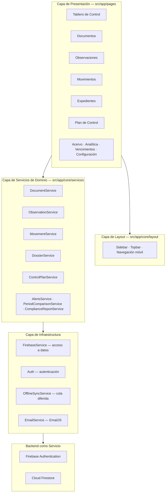
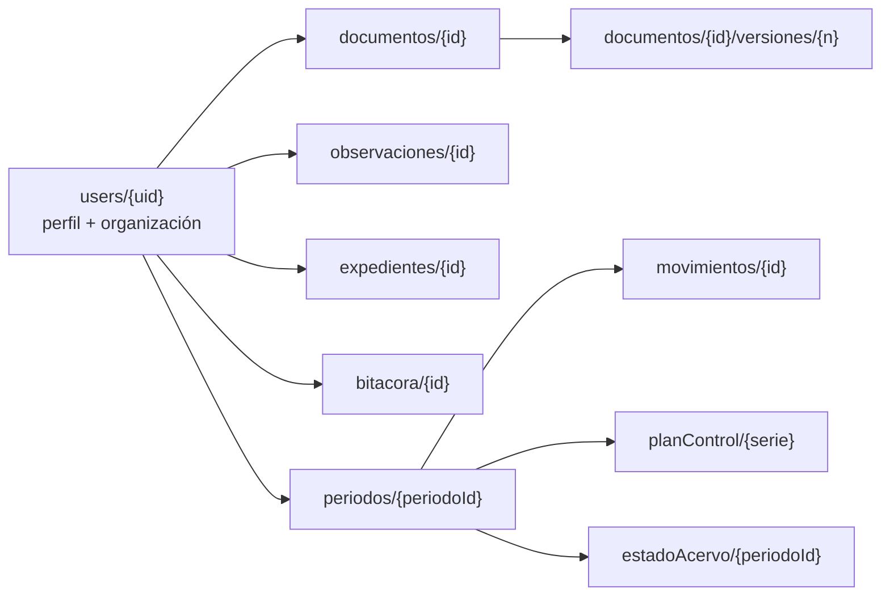

# NexDocs — Plan de Refactorización

> Transformación de **Tracky** (Sistema de Gestión Financiera Personal) en
> **NexDocs** (Plataforma de Administración y Control Documental)
> reutilizando el código existente. Angular 21 · TypeScript · Firebase Auth · Firestore · Chart.js · SCSS · Vercel.

**Documento:** Plan de refactorización · **Versión:** 1.0 · **Fecha:** 3 de septiembre de 2026
**Estado:** Propuesta previa a implementación — *especificación, sin código de producción.*

---

## 0. Análisis de Impacto

Análisis realizado sobre el código real: 22.113 líneas de TS/HTML/SCSS, 18 servicios, 6 modelos, 13 páginas.

### 0.1 Hallazgo estructural clave

La lógica de negocio de Tracky **no es financiera, es temporal y aritmética**. Opera sobre:

- un valor planificado frente a un valor real,
- una fecha de vencimiento frente a una fecha de cumplimiento,
- un porcentaje de cumplimiento con umbral de alerta,
- un ciclo recurrente en el calendario,
- una acumulación por periodo mensual.

Un sistema de control documental funciona sobre exactamente esos cinco mecanismos: los documentos **vencen**, se **renuevan cíclicamente**, tienen un **plan de revisión** que se cumple o se incumple, y el acervo **se acumula** con altas y bajas. La conversión es **semántica, no estructural**.

Existe además una correspondencia especialmente afortunada: el motor de recurrencia que hoy calcula cuándo llega el próximo sueldo es, sin modificación alguna, el motor que calcula **cuándo vence y cuándo debe revisarse cada documento controlado**.

### 0.2 Qué se mantiene EXACTAMENTE IGUAL (0 líneas modificadas)

| Archivo / Módulo | Motivo |
|---|---|
| `src/main.ts`, `src/app/app.ts`, `app.html`, `app.scss` | Bootstrap neutro al dominio |
| `src/app/app.config.ts` | Providers de Firebase, Router y Chart.js: idénticos |
| `src/app/core/guards/auth-guard.ts` | Protección de rutas |
| `src/app/core/services/auth.ts` | Firebase Auth completo (email/password + Google) |
| `src/app/core/services/dev-settings.ts` | Panel de desarrollador |
| `src/app/core/services/layout.service.ts` | Estado del sidebar con signals |
| `src/app/core/services/offline-sync.service.ts` | Cola offline, agnóstica al dominio |
| `src/app/core/services/migration.service.ts` | Motor de migración, reutilizable para datos legacy |
| `src/app/core/components/icon/`, `password-strength/` | Componentes puros |
| `src/app/core/utils/lucide-icons.ts` | Catálogo de iconos SVG |
| `src/styles/_reset.scss` | Reset CSS |
| `src/app/pages/login/login.ts` | Lógica de login; solo cambian textos e imágenes |
| `src/app/pages/migration/migration.ts` | Utilidad de migración |
| `angular.json`, `tsconfig*.json`, `vercel.json`, `firebase-rules.txt` | Build, tipado, deploy y seguridad válidos tal cual |
| **Motor de recurrencia** (`generateOccurrences`, `clampDay`, `detectPattern`, `predictFutureIncome`) | Calcula ciclos de vencimiento, no dinero |
| **Cálculos de progreso** (`calculateProgress`, `calculateMonthsToGoal`, `calculateProjectedDate`) | Aritmética de completitud |
| **Cálculo de porcentaje y restante** (`calculatePercentage`, `calculateRemaining`) | Aritmética de cumplimiento |

**Estimación: ~38 % del código no se toca.**

### 0.3 Qué se RENOMBRA (rename de archivo + reemplazo de símbolos, sin lógica nueva)

5 modelos, 5 servicios, 8 carpetas de páginas con sus clases, y todo el vocabulario de la interfaz.
Es un cambio mecánico verificable por el compilador: si TypeScript compila en modo `strict`, el renombrado está completo.

**Estimación: ~47 % del código.**

### 0.4 Qué requiere CAMBIOS MÍNIMOS de lógica

| Cambio | Alcance real |
|---|---|
| `amount` deja de formatearse como `S/` y pasa a `folios`, `docs` o `%` | 18 archivos; un pipe de formato centralizado resuelve la mayoría |
| **Inversión del semáforo de cumplimiento** | `calculateBudgetStatus()`: 5 líneas. **Único cambio real de lógica del plan** (ver 0.5) |
| Catálogos de categorías (arrays con label e icono) | 4 métodos: `getAvailableTypes()`, `getPrimordialCategories()`, `getNonPrimordialCategories()`, `getCategories()` |
| Gastos por defecto → hallazgos frecuentes por defecto | `getDefaultPrimordialExpenses()` y `getDefaultNonPrimordialExpenses()`: arrays de datos |
| Regla **50/30/20** → semáforo **Vigentes / Por vencer / Vencidos** | `budget.ts:autoCreateBudgetsFromIncome()` y las 3 barras del dashboard |
| Onboarding financiero → onboarding organizacional | `onboarding.model.ts`: 450 líneas de datos declarativos, no lógica |
| Mensajes de alerta del dashboard | `dashboard.ts:401-439`: 6 strings |
| Nombres de colecciones Firestore | `firebase.ts`: ~40 template literals, una pasada de reemplazo |

**Estimación: ~13 % del código.**

### 0.5 El único cambio real de lógica: inversión del semáforo

En Tracky, **exceder** el presupuesto es malo:

```
percentageUsed >= 100        → 'exceeded'   (rojo)
percentageUsed >= threshold  → 'at_risk'    (ámbar)
percentageUsed === 0         → 'unused'
resto                        → 'on_track'   (verde)
```

En NexDocs, el plan de control documental establece cuántos documentos deben revisarse o renovarse por serie y periodo. Aquí **no alcanzar** el plan es lo malo, y alcanzarlo o superarlo es lo bueno. El semáforo se invierte:

```
porcentajeCumplimiento >= 100        → 'cumplido'     (verde)
porcentajeCumplimiento >= umbral     → 'en_proceso'   (azul)
porcentajeCumplimiento > 0           → 'en_riesgo'    (ámbar)
porcentajeCumplimiento === 0         → 'sin_iniciar'  (gris)
```

Son 5 líneas en una función pura de `budget.model.ts`. Se documenta aquí porque es la única modificación del plan que no es renombrado ni cambio de datos, y porque un evaluador que compare ambos sistemas verá lógica distinta en el mismo punto.

### 0.6 Qué es GENUINAMENTE NUEVO

Un solo artefacto: **`organization.model.ts`**, más los campos de la organización en el documento de perfil `users/{uid}`, que **ya existe** y ya tiene `getUserProfileComplete()` y `saveUserProfile()` implementados en `firebase.ts`. No requiere colección nueva ni servicio nuevo.

**Estimación: ~2 % del código.**

### 0.7 Qué hará que parezca un producto completamente distinto

Ordenado por relación impacto/esfuerzo:

| # | Cambio | Esfuerzo | Impacto |
|---|---|---|---|
| 1 | **Identidad visual completa**: verde financiero oscuro → tema claro archivístico en teal profundo y ámbar de sello | 1 archivo (`_design-system.scss`) | Máximo |
| 2 | **Códigos documentales en monoespaciada** (`PR-RRHH-001 v3`) presentes en toda la interfaz | Tokens de tipografía + 6 plantillas | Máximo — es la señal visual más característica del dominio |
| 3 | **Vocabulario 100 % archivístico y normativo** en menús, títulos, botones y mensajes | ~120 strings | Máximo |
| 4 | **Tablero con evolución del acervo** y calendario de vencimientos a 12 meses | Reutiliza los 3 charts existentes; cambian los datasets | Alto |
| 5 | **Logo y marca**: `public/TRACKY/` → `public/NEXDOCS/` | Renombrar carpeta + 6 referencias | Alto |
| 6 | **Colecciones Firestore en vocabulario documental** (`documentos`, `observaciones`, `movimientos`, `expedientes`, `planControl`) | 1 archivo | Alto, si el evaluador abre la consola de Firebase |
| 7 | **Proyecto Firebase nuevo** llamado `nexdocs` | Configuración externa | Alto |
| 8 | **Onboarding organizacional**: razón social, sector, norma aplicable, áreas, responsable del control documental | Datos declarativos | Alto — es la primera pantalla que ve el evaluador |
| 9 | **Documentación reescrita**: README, RF/RNF, casos de uso, historias de usuario | Este documento | Alto |

> **Advertencia crítica sobre el punto 7.** Aunque se renombre todo el código, el diálogo "Iniciar sesión con Google" muestra el dominio del proyecto Firebase. Hoy dice `track-pays.firebaseapp.com` (`environment.ts:5-7`). Si no se crea un proyecto Firebase nuevo, ese es el único punto donde el origen del sistema queda a la vista.

### 0.8 Deuda técnica preexistente que conviene resolver durante el refactor

Detectada al analizar el código actual. Corregirla eleva la calidad del entregable:

| Defecto | Ubicación | Corrección |
|---|---|---|
| Ruta `/goal` enlazada pero no registrada: cae al wildcard y redirige al dashboard | `app.routes.ts` vs `pages/goals/goals.ts:16` | Registrar la ruta al renombrarla a `expediente` |
| 6 de 8 archivos `.spec.ts` importan símbolos inexistentes (`Transaction`, `Goal`, `Dashboard`, `Login`, `Transactions`) y no compilan | `src/**/*.spec.ts` | Corregir imports durante el renombrado de clases |
| `environment.prod.ts` es residuo de Supabase, sin bloque `firebase`, y no está referenciado en `angular.json` | `src/environments/` | Reescribir con la config de Firebase y añadir `fileReplacements` |
| `.env` con claves de Supabase no está cubierto por `.gitignore` | raíz | Eliminar el archivo y ajustar el `.gitignore` |
| La regla `*.json` del `.gitignore` ignora `vercel.json`, `tsconfig.app.json`, `tsconfig.spec.json` y `package-lock.json` | `.gitignore` | Añadir las excepciones |
| `scripts/firestore-admin.ts` importa `firebase-admin`, ausente de `package.json` | `scripts/` | Declarar la dependencia o retirar el script |
| 135 usos de `: any` concentrados en la frontera de datos, pese a `strict: true` | `core/services/firebase.ts` | Tipar con los nuevos modelos durante el renombrado |

---

## 1. Nombre Comercial del Sistema

**NexDocs**

- **Nombre completo:** NexDocs — Plataforma de Administración y Control Documental
- **Eslogan principal:** *Todo documento, bajo control.*
- **Eslogan de login:** *Vigencia, versión y trazabilidad en un solo lugar.*
- **Lectura del nombre:** *Nex* por nexo y por *next* — el documento correcto, en su versión correcta, en el momento correcto.
- **Identificador técnico:** `nexdocs` (paquete npm `nexdocs`, proyecto Angular `nexDocs`, dominio `nexdocs.vercel.app`)

---

## 2. Descripción Profesional del Proyecto

NexDocs es una aplicación web de página única (SPA) que permite a organizaciones administrar su acervo documental controlado: registrar documentos, gestionar sus versiones, controlar su vigencia y sus ciclos de revisión, atender las observaciones y no conformidades detectadas, y verificar el cumplimiento del plan de control documental.

El sistema estructura la gestión en cuatro entidades vinculadas — **documentos** (el maestro de documentos controlados con su ciclo de vigencia), **movimientos** (la bitácora de altas, bajas y nuevas versiones), **observaciones** (los hallazgos que exigen corrección) y **expedientes** (los conjuntos de documentos que deben estar completos) — y las proyecta sobre un **plan de control** por serie documental y periodo.

Sobre esa base calcula indicadores objetivos de gestión: índice de vigencia del acervo, documentos por vencer y vencidos, tasa de subsanación de hallazgos, cumplimiento del plan de control, completitud de expedientes y un índice compuesto de riesgo documental. Un tablero construido con Chart.js traduce esos indicadores en una lectura inmediata del estado del acervo, y un motor de alertas notifica vencimientos próximos, no conformidades críticas abiertas y series con incumplimiento del plan.

La aplicación se construye sobre Angular 21 con componentes standalone y signals, autenticación y persistencia en Firebase, y despliegue continuo en Vercel. Cada organización accede únicamente a sus propios datos mediante reglas de seguridad de Firestore basadas en el UID autenticado.

---

## 3. Problema que Resuelve

La gestión documental en organizaciones pequeñas y medianas falla por causas **de control, no de almacenamiento**. Tener los archivos en una carpeta compartida no es controlarlos:

1. **Documentos vencidos en circulación.** Licencias, certificados, contratos y pólizas caducan sin que nadie lo advierta. El vencimiento se descubre cuando un cliente, un auditor o una entidad reguladora lo señala.
2. **Ausencia de control de versiones.** Circulan simultáneamente varias versiones del mismo procedimiento. Nadie sabe con certeza cuál es la vigente, y el trabajo se ejecuta con instrucciones obsoletas.
3. **Ciclos de revisión que no se cumplen.** Los documentos deben revisarse periódicamente, pero sin un calendario activo la revisión se posterga indefinidamente hasta quedar desactualizada.
4. **Hallazgos de auditoría sin seguimiento.** Las observaciones se levantan en una reunión, se anotan en un acta y se pierden. No hay registro de cuáles se subsanaron ni de cuáles reaparecen auditoría tras auditoría.
5. **Expedientes incompletos que se descubren tarde.** Falta un documento en el expediente de un trabajador, un proveedor o un contrato, y la ausencia solo se detecta cuando el expediente se necesita.
6. **Falta de trazabilidad.** No existe bitácora de quién dio de alta, modificó, aprobó o retiró cada documento, lo que impide responder ante una auditoría.
7. **Indicadores inexistentes.** La organización no puede responder con un número a la pregunta "¿qué porcentaje de tu acervo documental está vigente?".

NexDocs convierte la administración documental en un proceso **medible, trazable y con alerta temprana**, aplicando el control de vencimientos, versiones y ciclos de revisión que exigen los marcos normativos de gestión de calidad y de la información.

---

## 4. Objetivo General

Desarrollar e implementar una plataforma web de administración y control documental que permita a una organización registrar sus documentos controlados, gestionar sus versiones y vigencias, dar seguimiento a las observaciones detectadas y verificar el cumplimiento de su plan de control mediante indicadores cuantitativos y alertas automáticas, garantizando la trazabilidad completa del ciclo de vida de cada documento.

---

## 5. Objetivos Específicos

| # | Objetivo específico |
|---|---|
| OE-01 | Implementar un módulo de registro de la organización que centralice razón social, sector, marco normativo aplicable, áreas y responsable del control documental. |
| OE-02 | Desarrollar un módulo de documentos controlados con clasificación por serie y tipo documental, ciclo de revisión recurrente y control de vigencia. |
| OE-03 | Implementar el control de versiones de cada documento con registro de la versión vigente y de su historial. |
| OE-04 | Construir un módulo de movimientos documentales que registre altas, bajas, nuevas versiones y cambios de estado en una bitácora permanente. |
| OE-05 | Desarrollar un módulo de observaciones y no conformidades que clasifique cada hallazgo por severidad y tipo, con seguimiento hasta su subsanación. |
| OE-06 | Implementar un módulo de expedientes que verifique la completitud de conjuntos documentales y proyecte su fecha de cierre. |
| OE-07 | Desarrollar un plan de control documental por serie y periodo que contraste documentos planificados con documentos efectivamente procesados. |
| OE-08 | Diseñar un tablero de control que visualice el estado del acervo mediante evolución temporal, calendario de vencimientos e indicadores de cumplimiento, reutilizando Chart.js. |
| OE-09 | Implementar un motor de alertas automáticas para documentos por vencer, documentos vencidos, no conformidades críticas abiertas e incumplimiento del plan. |
| OE-10 | Garantizar la seguridad y el aislamiento de la información de cada organización mediante autenticación Firebase y reglas de acceso por UID. |
| OE-11 | Asegurar la operación del sistema en dispositivos de escritorio y móviles mediante diseño responsivo y capacidad de trabajo sin conexión. |

---

## 6. Alcance

### 6.1 Incluido

- Autenticación con correo y contraseña, e inicio de sesión con Google.
- Onboarding organizacional de configuración inicial.
- Registro de la organización con su marco normativo, áreas y responsable documental.
- CRUD completo de documentos, movimientos, observaciones y expedientes.
- Control de vigencia con ciclo de revisión recurrente y cálculo de próximas fechas.
- Control de versiones con identificación de la versión vigente.
- Ciclo de vida documental con 8 estados controlados.
- Plan de control documental por serie y periodo.
- Tablero de control con 7 visualizaciones y 13 indicadores.
- Motor de alertas y notificaciones por correo electrónico.
- Generación y exportación de reporte de cumplimiento documental.
- Bitácora histórica inmutable de todos los movimientos.
- Cierre automático de periodo con arrastre de pendientes.
- Operación sin conexión con sincronización diferida.
- Interfaz responsiva (escritorio, tablet y móvil) en español.

### 6.2 Excluido de esta versión

- **Almacenamiento del archivo binario.** Se registra la ficha del documento, su código, versión, vigencia y ubicación de referencia, no el PDF. Incorporarlo requeriría Firebase Storage.
- Flujo de aprobación multiusuario con firmas electrónicas de varios revisores autenticados. En esta versión un usuario registra quién elaboró, revisó y aprobó; esos actores no ingresan al sistema.
- Roles y permisos diferenciados por área. Un usuario administra el acervo completo de su organización.
- Búsqueda por contenido dentro de los documentos y OCR.
- Integración con gestores documentales externos, SharePoint, Drive o ERP.
- Firma digital con certificado y estampado de tiempo.
- Aplicación móvil nativa.

### 6.3 Supuestos y restricciones

- La organización ya definió qué documentos son controlados; el sistema administra su ciclo de vida, no la decisión de controlarlos.
- El usuario dispone de conexión a internet para la sincronización inicial.
- El sistema documenta y controla el proceso, no reemplaza la validez legal de los documentos originales.
- Se conserva íntegramente el stack tecnológico existente por restricción del proyecto.

---

## 7. Stakeholders

| Stakeholder | Tipo | Interés en el sistema | Influencia |
|---|---|---|---|
| **Responsable de control documental** | Primario, usuario directo | Mantener el acervo vigente, ordenado y auditable | Alta |
| **Jefe o coordinador de área** | Primario | Que los documentos de su área estén vigentes y disponibles | Alta |
| **Auditor interno o externo** | Secundario | Verificar trazabilidad, vigencia y subsanación de hallazgos | Alta |
| **Gerencia / dirección** | Secundario | Conocer el nivel de cumplimiento documental y el riesgo asociado | Media |
| **Personal operativo** | Secundario | Trabajar siempre con la versión vigente del procedimiento | Media |
| **Entidad reguladora o certificadora** | Externo | Evidencia del control documental exigido por la norma | Media |
| **Docente del curso de Administración de Software** | Externo, evaluador | Verificar la aplicación de la metodología de desarrollo y gestión | Alta |
| **Equipo de desarrollo** | Interno | Mantener y evolucionar la plataforma | Alta |
| **Administrador del sistema** | Interno | Configuración, respaldo y disponibilidad | Baja |

---

## 8. Requisitos Funcionales

### Módulo de Autenticación y Organización

| ID | Requisito | Prioridad | Reutiliza |
|---|---|---|---|
| RF-01 | El sistema debe permitir el registro de un usuario con correo y contraseña, validando la fortaleza de la clave. | Alta | `auth.ts`, `password-strength` |
| RF-02 | El sistema debe permitir el inicio de sesión con correo/contraseña y con cuenta Google. | Alta | `auth.ts` |
| RF-03 | El sistema debe impedir el acceso a cualquier módulo sin sesión activa. | Alta | `auth-guard.ts` |
| RF-04 | El sistema debe ejecutar un onboarding organizacional obligatorio en el primer ingreso. | Alta | `onboarding.ts` |
| RF-05 | El sistema debe permitir registrar la organización: razón social, RUC o identificador fiscal, sector, marco normativo aplicable, áreas y responsable del control documental. | Alta | perfil `users/{uid}` |
| RF-06 | El sistema debe permitir editar los datos de la organización desde Configuración. | Media | `settings` |
| RF-07 | El sistema debe permitir cerrar sesión desde cualquier pantalla. | Alta | `layout.component.ts` |

### Módulo de Documentos

| ID | Requisito | Prioridad | Reutiliza |
|---|---|---|---|
| RF-08 | El sistema debe permitir registrar documentos controlados clasificados por serie documental y tipo documental. | Alta | `income.ts` |
| RF-09 | El sistema debe generar y validar el código único de cada documento con el formato `TIPO-ÁREA-CORRELATIVO`. | Alta | validación nueva, mínima |
| RF-10 | El sistema debe permitir definir el ciclo de revisión de cada documento con frecuencia semanal, quincenal, mensual, bimestral, trimestral, semestral, anual o variable. | Alta | motor de recurrencia |
| RF-11 | El sistema debe calcular y mostrar las próximas 6 fechas de revisión de cada documento. | Media | `generateOccurrences()` |
| RF-12 | El sistema debe determinar el estado de vigencia de cada documento: vigente, por vencer, vencido, en revisión o programado. | Alta | `calculatePaymentStatus()` |
| RF-13 | El sistema debe permitir registrar una nueva versión de un documento, incrementando el correlativo de versión y actualizando la fecha de vigencia. | Alta | `markAsReceived()` |
| RF-14 | El sistema debe controlar el ciclo de vida documental con los estados borrador, en revisión, aprobado, vigente, por vencer, vencido, obsoleto y anulado. | Alta | cambio mínimo |
| RF-15 | El sistema debe registrar el nivel de confidencialidad de cada documento: público, interno, confidencial o restringido. | Media | campo nuevo |
| RF-16 | El sistema debe registrar el responsable, el área custodia y la ubicación de referencia de cada documento. | Media | campos existentes |
| RF-17 | El sistema debe permitir declarar un documento obsoleto sin eliminar su historial. | Alta | `deactivate()` |
| RF-18 | El sistema debe detectar el patrón de renovación real de un documento a partir de su historial de versiones. | Baja | `detectPattern()` |

### Módulo de Movimientos Documentales

| ID | Requisito | Prioridad | Reutiliza |
|---|---|---|---|
| RF-19 | El sistema debe registrar cada movimiento documental con tipo, documento asociado, fecha, cantidad de folios y responsable. | Alta | `transaction.ts` |
| RF-20 | El sistema debe distinguir entre altas, que incorporan documentos al acervo, y bajas, que los retiran por obsolescencia o anulación. | Alta | campo `type` |
| RF-21 | El sistema debe presentar la bitácora de movimientos agrupada por día. | Media | ya implementado |
| RF-22 | El sistema debe permitir filtrar y buscar movimientos por tipo, serie documental, documento y texto libre. | Media | `transactions.ts` |
| RF-23 | El sistema debe impedir la edición de un movimiento con más de 30 días de antigüedad, preservando la trazabilidad. | Media | validación nueva, mínima |

### Módulo de Observaciones y No Conformidades

| ID | Requisito | Prioridad | Reutiliza |
|---|---|---|---|
| RF-24 | El sistema debe permitir registrar observaciones sobre documentos, clasificadas por tipo de hallazgo. | Alta | `expense.ts` |
| RF-25 | El sistema debe clasificar cada hallazgo como no conformidad, cuando compromete el cumplimiento, o como observación menor. | Alta | `isPrimordial` |
| RF-26 | El sistema debe permitir asignar a cada hallazgo una fecha límite de subsanación y una estimación de esfuerzo. | Alta | `dueDate`, `budgetedAmount` |
| RF-27 | El sistema debe permitir marcar un hallazgo como subsanado, registrando el esfuerzo real y generando el movimiento documental asociado. | Alta | `markAsPaid()` |
| RF-28 | El sistema debe identificar hallazgos reincidentes y registrar el cambio de severidad respecto de la ocurrencia anterior. | Media | lógica de suscripciones |
| RF-29 | El sistema debe controlar el estado de cada hallazgo: abierto, en proceso, subsanado, vencido o anulado. | Alta | enum de `PaymentStatus` |
| RF-30 | El sistema debe registrar el origen de cada hallazgo: auditoría interna, auditoría externa, revisión programada o reporte de usuario. | Media | campo `provider` |

### Módulo de Expedientes

| ID | Requisito | Prioridad | Reutiliza |
|---|---|---|---|
| RF-31 | El sistema debe permitir definir expedientes con nombre, tipo, cantidad de documentos requeridos, fecha límite y prioridad. | Alta | `goal.ts` |
| RF-32 | El sistema debe registrar la incorporación de documentos a un expediente y actualizar su porcentaje de completitud. | Alta | `addContribution()` |
| RF-33 | El sistema debe proyectar la fecha estimada de cierre de cada expediente según el ritmo real de incorporación. | Media | `calculateProjectedDate()` |
| RF-34 | El sistema debe controlar el estado de cada expediente: abierto, completo, suspendido o cerrado. | Alta | `GoalStatus` |
| RF-35 | El sistema debe permitir gestionar varios expedientes simultáneos y ordenarlos por prioridad. | Media | `getByPriority()` |

### Módulo de Plan de Control

| ID | Requisito | Prioridad | Reutiliza |
|---|---|---|---|
| RF-36 | El sistema debe permitir planificar, por serie documental y periodo, la cantidad de documentos a revisar o renovar. | Alta | `budget.ts` |
| RF-37 | El sistema debe calcular el porcentaje de cumplimiento de cada serie comparando documentos procesados con documentos planificados. | Alta | `calculatePercentage()` |
| RF-38 | El sistema debe clasificar cada serie como cumplida, en proceso, en riesgo o sin iniciar, según un umbral configurable. | Alta | `calculateBudgetStatus()` invertida |
| RF-39 | El sistema debe generar automáticamente una propuesta de plan de control a partir de los documentos con vencimiento en el periodo. | Media | `autoCreateBudgetsFromIncome()` |
| RF-40 | El sistema debe ejecutar el cierre de periodo arrastrando documentos y hallazgos pendientes. | Media | `month-rollover.service.ts` |

### Módulo de Tablero y Analítica

| ID | Requisito | Prioridad | Reutiliza |
|---|---|---|---|
| RF-41 | El sistema debe presentar la cantidad de documentos vigentes en el acervo. | Alta | balance acumulado |
| RF-42 | El sistema debe graficar la evolución del acervo vigente a lo largo del periodo. | Alta | gráfica de balance |
| RF-43 | El sistema debe graficar la comparación entre altas y bajas documentales. | Alta | gráfica de barras |
| RF-44 | El sistema debe mostrar la distribución del acervo entre vigentes, por vencer y vencidos con barras de progreso. | Media | regla 50/30/20 |
| RF-45 | El sistema debe presentar un calendario de vencimientos de los próximos 12 meses. | Alta | gráfica de barras apiladas |
| RF-46 | El sistema debe mostrar minigráficos de tendencia de los últimos 6 periodos. | Baja | sparklines |
| RF-47 | El sistema debe calcular y mostrar 13 indicadores de gestión documental. | Alta | `comparison.ts` |
| RF-48 | El sistema debe presentar una comparativa del periodo actual contra el anterior. | Media | `getMonthComparison()` |

### Módulo de Alertas, Reportes y Configuración

| ID | Requisito | Prioridad | Reutiliza |
|---|---|---|---|
| RF-49 | El sistema debe generar alertas automáticas por documentos próximos a vencer, documentos vencidos, no conformidades críticas abiertas y series con incumplimiento del plan. | Alta | `alerts.ts` |
| RF-50 | El sistema debe permitir configurar por documento los días de anticipación de la alerta de vencimiento. | Alta | `alertBeforeDays` |
| RF-51 | El sistema debe enviar una notificación por correo al registrar una nueva versión o al subsanar una no conformidad. | Media | `email.ts` |
| RF-52 | El sistema debe generar un reporte exportable de cumplimiento documental. | Media | `report.service.ts` |
| RF-53 | El sistema debe permitir configurar la organización, las preferencias de notificación y el modo desarrollador. | Media | `settings.ts` |
| RF-54 | El sistema debe permitir operar sin conexión y sincronizar los cambios al restablecerse. | Baja | `offline-sync.service.ts` |

---

## 9. Requisitos No Funcionales

| ID | Categoría | Requisito | Métrica de verificación |
|---|---|---|---|
| RNF-01 | Rendimiento | La carga inicial no debe superar los 2,5 s en conexión 4G. | LCP < 2,5 s en Lighthouse |
| RNF-02 | Rendimiento | El bundle inicial no debe exceder 1 MB. | Budget ya definido en `angular.json` |
| RNF-03 | Rendimiento | Cada módulo debe cargarse bajo demanda. | 13 rutas con `loadComponent` |
| RNF-04 | Rendimiento | El listado de documentos debe responder en menos de 1 s con hasta 1.000 registros. | Consulta paginada por periodo |
| RNF-05 | Seguridad | Cada organización solo debe acceder a sus propios datos. | Reglas Firestore por `request.auth.uid` |
| RNF-06 | Seguridad | Toda comunicación debe viajar cifrada. | HTTPS obligatorio en Vercel |
| RNF-07 | Seguridad | La aplicación no debe poder embeberse en iframes de terceros. | `X-Frame-Options: DENY` en `vercel.json` |
| RNF-08 | Seguridad | Las contraseñas deben validarse por fortaleza antes del registro. | Componente `password-strength` |
| RNF-09 | Trazabilidad | Todo movimiento documental debe quedar registrado de forma permanente e inalterable. | Colección `bitacora` sin operación de borrado |
| RNF-10 | Trazabilidad | Todo documento debe conservar el historial completo de sus versiones. | Subcolección de versiones |
| RNF-11 | Usabilidad | Toda la interfaz debe estar en español, con terminología archivística uniforme. | Revisión de glosario |
| RNF-12 | Usabilidad | Toda operación destructiva debe requerir confirmación explícita. | Modales de confirmación |
| RNF-13 | Usabilidad | El usuario debe alcanzar cualquier módulo en un máximo de 2 clics. | Sidebar + navegación inferior |
| RNF-14 | Usabilidad | El estado de vigencia debe ser identificable sin leer texto. | Codificación por color y forma en las 5 vistas de listado |
| RNF-15 | Accesibilidad | Los elementos interactivos deben tener etiquetas ARIA y foco visible. | Auditoría de accesibilidad |
| RNF-16 | Compatibilidad | Debe funcionar en Chrome, Edge, Firefox y Safari en sus 2 últimas versiones. | Pruebas cruzadas |
| RNF-17 | Portabilidad | Debe adaptarse a pantallas desde 320 px hasta 1920 px. | Diseño responsivo con navegación inferior en móvil |
| RNF-18 | Disponibilidad | Disponibilidad objetivo del 99 % mensual. | SLA de Vercel y Firebase |
| RNF-19 | Mantenibilidad | El código debe compilar con TypeScript en modo `strict` sin errores. | `tsconfig.json` con `strict: true` |
| RNF-20 | Mantenibilidad | La arquitectura debe separar presentación, servicios y modelos. | Estructura `core/` y `pages/` |
| RNF-21 | Escalabilidad | El modelo de datos debe soportar el crecimiento histórico sin degradar la consulta. | Particionamiento por periodo mensual |
| RNF-22 | Confiabilidad | La pérdida de conexión no debe provocar pérdida de datos. | Cola de sincronización offline |

---

## 10. Casos de Uso Principales

| ID | Caso de uso | Actor | Módulo |
|---|---|---|---|
| CU-01 | Iniciar sesión en el sistema | Responsable documental | Autenticación |
| CU-02 | Configurar la organización (onboarding) | Responsable documental | Organización |
| CU-03 | Registrar un documento controlado | Responsable documental | Documentos |
| CU-04 | Registrar una nueva versión de un documento | Responsable documental | Documentos |
| CU-05 | Declarar un documento obsoleto | Responsable documental | Documentos |
| CU-06 | Registrar una observación o no conformidad | Responsable documental / Auditor | Observaciones |
| CU-07 | Subsanar una no conformidad | Responsable documental | Observaciones |
| CU-08 | Abrir y completar un expediente | Responsable documental | Expedientes |
| CU-09 | Planificar el control documental del periodo | Responsable documental | Plan de Control |
| CU-10 | Consultar el tablero de control | Responsable documental / Gerencia | Tablero |
| CU-11 | Revisar alertas de vencimiento | Responsable documental | Alertas |
| CU-12 | Generar el reporte de cumplimiento documental | Responsable documental | Reportes |
| CU-13 | Consultar la bitácora de movimientos | Auditor | Movimientos |

### CU-04 — Registrar una nueva versión de un documento (expandido)

| Elemento | Detalle |
|---|---|
| **Actor principal** | Responsable de control documental |
| **Actor secundario** | Jefe de área que aprueba el documento (registrado, no usuario del sistema) |
| **Precondición** | Existe un documento controlado en estado vigente, por vencer o vencido. |
| **Postcondición** | El documento queda con la nueva versión como vigente, se recalculan sus próximas fechas de revisión, se registra el movimiento de alta y se recalculan los indicadores. |
| **Disparador** | El documento alcanza su fecha de revisión o requiere actualización por un cambio en el proceso. |

**Flujo principal**

1. El responsable ingresa al módulo Documentos.
2. El sistema muestra los documentos agrupados por estado de vigencia, destacando los que están por vencer.
3. El responsable selecciona un documento y elige "Registrar nueva versión".
4. El sistema presenta el formulario con la versión vigente precargada como referencia.
5. El responsable indica el número de la nueva versión, la fecha de aprobación, quién la elaboró, quién la revisó, quién la aprobó, la cantidad de folios y el resumen del cambio.
6. El sistema valida que el número de versión sea mayor al vigente y que la fecha de aprobación no sea futura.
7. El sistema marca la versión anterior como obsoleta y conserva su registro histórico.
8. El sistema establece la nueva versión como vigente y recalcula la fecha de próxima revisión aplicando el ciclo definido.
9. El sistema registra automáticamente un movimiento documental de tipo alta.
10. El sistema cierra las alertas de vencimiento asociadas al documento y actualiza el tablero.
11. El sistema confirma la operación y, si las notificaciones están activas, envía el correo correspondiente.

**Flujos alternativos**

- **6a.** Número de versión menor o igual al vigente: el sistema indica el error, mantiene los datos y no persiste.
- **6b.** Fecha de aprobación futura: el sistema rechaza el dato y solicita corrección.
- **9a.** Sin conexión: el sistema encola la operación, informa el estado pendiente de sincronización y la envía al restablecerse la conexión.
- **10a.** El documento tiene no conformidades abiertas asociadas a la versión anterior: el sistema advierte al responsable y solicita confirmar si la nueva versión las subsana.

---

## 11. Historias de Usuario

Formato: *Como [rol], quiero [funcionalidad], para [beneficio]*, con criterios de aceptación.

| ID | Historia | Criterios de aceptación | Puntos |
|---|---|---|---|
| **HU-01** | Como responsable documental, quiero registrar los datos de mi organización al ingresar por primera vez, para que el sistema clasifique los documentos según mi marco normativo. | Al completar el onboarding se guardan razón social, sector, norma aplicable, áreas y responsable; no se puede omitir; los datos son editables después. | 5 |
| **HU-02** | Como responsable documental, quiero registrar un documento con su código, tipo y serie, para tener un maestro único del acervo controlado. | El código sigue el formato `TIPO-ÁREA-CORRELATIVO` y el sistema rechaza códigos duplicados. | 8 |
| **HU-03** | Como responsable documental, quiero definir cada cuánto debe revisarse un documento, para que el sistema me avise sin que yo lleve el calendario. | Puedo elegir entre 8 frecuencias; el sistema muestra las próximas 6 fechas de revisión. | 8 |
| **HU-04** | Como responsable documental, quiero ver de inmediato qué documentos están por vencer, para renovarlos antes de que caduquen. | El tablero muestra el conteo de documentos por vencer y la lista ordenada por fecha de vencimiento. | 5 |
| **HU-05** | Como responsable documental, quiero registrar una nueva versión de un documento, para que nadie trabaje con una versión obsoleta. | Al registrar la versión se marca la anterior como obsoleta, se conserva su historial y se recalcula la próxima revisión. | 8 |
| **HU-06** | Como auditor, quiero consultar la bitácora completa de movimientos, para verificar la trazabilidad del acervo. | La bitácora muestra todos los movimientos agrupados por día, con filtros por tipo, serie y documento; no es editable. | 5 |
| **HU-07** | Como responsable documental, quiero registrar las observaciones de una auditoría, para no perder ningún hallazgo entre revisiones. | Puedo clasificar cada hallazgo como no conformidad u observación menor, con tipo, fecha límite y esfuerzo estimado. | 8 |
| **HU-08** | Como responsable documental, quiero que el sistema me avise si un hallazgo ya se había levantado antes, para atacar la causa raíz. | Al registrar un hallazgo equivalente a uno ya subsanado se marca como reincidente y se muestra con distintivo visual. | 5 |
| **HU-09** | Como jefe de área, quiero saber qué documentos faltan en un expediente, para completarlo antes de que se necesite. | Cada expediente muestra documentos incorporados sobre requeridos, su porcentaje y la lista de faltantes. | 5 |
| **HU-10** | Como responsable documental, quiero planificar cuántos documentos revisaré por serie este mes, para distribuir la carga de trabajo. | Puedo asignar una meta por serie; el sistema calcula el cumplimiento y aplica el semáforo. | 8 |
| **HU-11** | Como gerencia, quiero ver en un número qué porcentaje del acervo está vigente, para conocer el nivel de riesgo documental. | El tablero muestra el índice de vigencia y el semáforo de riesgo documental compuesto. | 5 |
| **HU-12** | Como responsable documental, quiero ver el calendario de vencimientos de los próximos 12 meses, para anticipar los meses de mayor carga. | Gráfico de barras apiladas por mes y serie documental, con detalle al pasar el cursor. | 8 |
| **HU-13** | Como responsable documental, quiero recibir un correo cuando registro una nueva versión, para tener constancia externa de la actualización. | Al registrar la versión se envía correo con código, versión y fecha de vigencia, si las notificaciones están activas. | 3 |
| **HU-14** | Como responsable documental, quiero generar un reporte de cumplimiento documental, para presentarlo en la revisión por la dirección. | El reporte incluye índice de vigencia, vencimientos, hallazgos, expedientes y cumplimiento del plan. | 8 |
| **HU-15** | Como responsable documental, quiero seguir registrando movimientos sin conexión, para trabajar en almacenes o sedes sin red. | Las operaciones se encolan y se sincronizan al recuperar la conexión, con indicador visible de estado. | 8 |
| **HU-16** | Como responsable documental, quiero declarar un documento obsoleto sin borrarlo, para conservar la evidencia histórica. | El documento pasa a estado obsoleto, sale del acervo vigente y permanece consultable en la bitácora. | 3 |

---

## 12. Arquitectura Propuesta

La arquitectura **no cambia**. Se mantiene la SPA Angular con componentes standalone, señales reactivas, carga diferida por ruta y una capa de servicios que aísla el acceso a Firebase. Lo que cambia es la semántica de las entidades que atraviesan esas capas.

### 12.1 Vista de capas



### 12.2 Modelo de datos en Firestore



**Rutas resultantes**

| Colección NexDocs | Ruta Firestore | Origen en Tracky |
|---|---|---|
| Perfil y organización | `users/{uid}` | `users/{uid}` |
| Documentos controlados | `users/{uid}/documentos/{id}` | `incomeSources` |
| Versiones de un documento | `users/{uid}/documentos/{id}/versiones/{n}` | *(nueva subcolección)* |
| Observaciones y no conformidades | `users/{uid}/observaciones/{id}` | `expenses` |
| Expedientes | `users/{uid}/expedientes/{id}` | `goals` |
| Bitácora | `users/{uid}/bitacora/{id}` | `incomeHistory` |
| Periodos | `users/{uid}/periodos/{periodoId}` | `months` |
| Movimientos documentales | `users/{uid}/periodos/{periodoId}/movimientos/{id}` | `transactions` |
| Plan de control | `users/{uid}/periodos/{periodoId}/planControl/{serie}` | `budgets` |
| Estado del acervo | `users/{uid}/periodos/{periodoId}/estadoAcervo` | `financialState` |

Las reglas de seguridad de `firebase-rules.txt` **funcionan sin modificación**: el comodín `match /{document=**}` bajo `users/{userId}` cubre cualquier subcolección con el nuevo nombre, incluida la subcolección de versiones anidada un nivel más abajo.

### 12.3 Patrones arquitectónicos conservados

| Patrón | Implementación existente |
|---|---|
| Componentes standalone | Las 13 páginas, sin NgModules |
| Estado reactivo con signals | `signal()` y `computed()` en páginas y servicios |
| Carga diferida por ruta | `loadComponent()` en las 13 rutas |
| Inyección de dependencias con `inject()` | Todos los servicios |
| Repositorio centralizado de datos | `FirebaseService` como única puerta a Firestore |
| Guard de ruta | `authGuard` sobre el layout autenticado |
| Design tokens en CSS custom properties | `_design-system.scss` |
| Modelo de dominio tipado | 6 interfaces con tipos literales de unión |

### 12.4 Cambio en la identidad visual

Único archivo a intervenir: `src/styles/_design-system.scss`. Se propone pasar del tema oscuro verde financiero a un **tema claro archivístico**: fondo de papel, superficies blancas, primario teal profundo y acento ámbar de sello de aprobación.

| Token | Tracky (actual) | NexDocs (propuesto) | Rol |
|---|---|---|---|
| `--color-primary` | `#166B46` | `#0F5C63` | Teal profundo, archivo |
| `--color-primary-light` | `#2FA46A` | `#1B8A93` | Teal de apoyo |
| `--color-primary-dark` | `#0D1B16` | `#08373C` | Teal oscuro |
| `--color-accent` | `#2FA46A` | `#C25E00` | Ámbar de sello |
| `--color-bg` | `#0E1212` | `#F2F3F4` | Gris papel |
| `--color-surface` | `#0D1B16` | `#FFFFFF` | Fichas de documento |
| `--color-surface-elevated` | `#141618` | `#E8EBEC` | Superficie elevada |
| `--color-text` | `#F5F7F5` | `#15211F` | Texto principal |
| `--color-text-secondary` | `#AAB5AE` | `#5A6B6C` | Texto secundario, neutro con sesgo teal |
| `--color-success` | `#2FA46A` | `#1F7A52` | Vigente |
| `--color-warning` | `#f59e0b` | `#B26A00` | Por vencer |
| `--color-error` | `#ef4444` | `#A32A21` | Vencido / no conformidad |
| `--color-muted` | — | `#7A8A8B` | Obsoleto |
| `--font-heading` | Poppins | IBM Plex Sans 600 | Títulos, registro institucional |
| `--font-body` | Inter / DM Sans | IBM Plex Sans 400 | Texto corrido |
| `--font-mono` | — | **IBM Plex Mono** | **Códigos de documento y versiones** |

**Nota de diseño.** La incorporación de `--font-mono` para los códigos documentales (`PR-RRHH-001 v3`) es la decisión visual de mayor rendimiento del plan: cuesta una variable y una clase, y es la señal que identifica al sistema como una plataforma documental desde el primer vistazo. Aplicar en listados, fichas, tablas y el encabezado del detalle.

Los 129 renglones de `_design-system.scss` alimentan las 8 hojas SCSS de página, de modo que el cambio se propaga solo. Las curvas de animación (`--ease-out`, `--duration-*`) se conservan sin cambios.

---

## 13. Tabla Detallada de Equivalencias Tracky → NexDocs

### 13.1 Equivalencia de módulos

| Módulo Tracky | Módulo NexDocs | Naturaleza del cambio |
|---|---|---|
| Gestión de Ingresos | **Documentos Controlados** | Renombrado + resemantización: el ciclo de cobro pasa a ser el ciclo de vigencia |
| Gestión de Gastos | **Observaciones y No Conformidades** | Renombrado + resemantización de la dualidad esencial/no esencial |
| Movimientos / Transacciones | **Movimientos Documentales** | Renombrado + 3 campos nuevos |
| Metas de Ahorro | **Expedientes** | Renombrado puro |
| Presupuestos | **Plan de Control Documental** | Renombrado + inversión del semáforo |
| Dashboard Financiero | **Tablero de Control Documental** | Renombrado + nuevos datasets |
| Ahorro | **Acervo Documental** | Renombrado |
| Insights | **Analítica Documental** | Renombrado |
| Alertas | **Alertas de Vencimiento** | Renombrado |
| Configuración | **Configuración de la Organización** | Renombrado + campos de organización |
| Login | **Login** | Solo identidad visual y textos |
| Onboarding | **Onboarding Organizacional** | Cambio del contenido declarativo |
| Migración | **Migración de Datos** | Sin cambios |

### 13.2 `IncomeSource` → `Documento`

La correspondencia central del plan: una fuente de ingreso recurrente y un documento con ciclo de revisión son la misma estructura temporal.

| Campo Tracky | Campo NexDocs | Tipo / Valores | Nota |
|---|---|---|---|
| `id`, `userId` | `id`, `userId` | `string` | Sin cambio |
| — | `codigo` | `string` | **Nuevo**: `PR-RRHH-001`, único por organización |
| `category: IncomeCategory` | `serie: SerieDocumental` | `normativa` · `calidad` · `recursos_humanos` · `legal_contractual` · `financiero_contable` · `operativa_tecnica` · `seguridad_sst` · `otros` | 8 valores por 8 valores |
| `type: IncomeType` | `tipoDocumental: TipoDocumental` | `politica`, `manual`, `procedimiento`, `instructivo`, `formato`, `registro`, `plan`, `programa`, `reglamento`, `directiva`, `contrato`, `adenda`, `convenio`, `poder`, `licencia`, `permiso`, `certificado`, `constancia`, `acta`, `informe`, `memorando`, `oficio`, `carta`, `ficha_tecnica`, `plano`, `manual_usuario`, `politica_seguridad`, `otro` | 28 tipos por 28 tipos |
| `name` | `titulo` | `string` | |
| `description` | `descripcion` | `string?` | |
| `amount` | `folios` | `number` | Extensión del documento. **Resemantización clave** |
| `actualAmount` | `foliosVersionVigente` | `number?` | Extensión real de la versión en vigor |
| `currency` | `unidad` | `'folios' \| 'paginas' \| 'archivos'` | |
| `recurrence: RecurrenceRule` | `cicloRevision: CicloRevision` | idéntica | **Motor reutilizado íntegro**: define cada cuánto se revisa el documento |
| `nextOccurrences` | `proximasRevisiones` | `string[]` | Próximas 6 fechas de revisión |
| `lastReceivedDate` | `fechaUltimaVersion` | `string?` | |
| `paymentStatus.status` | `vigencia.estado` | `vigente` · `por_vencer` · `vencido` · `en_revision` · `programado` | Mismo enum de 5 valores. Mapea `received` · `upcoming` · `overdue` · `pending` · `scheduled` |
| `paymentStatus.nextDate` | `vigencia.proximaRevision` | `string \| null` | |
| `paymentStatus.daysUntil` | `vigencia.diasParaVencer` | `number \| null` | |
| `paymentStatus.isLate` | `vigencia.estaVencido` | `boolean` | |
| `paymentStatus.missedCount` | `vigencia.revisionesOmitidas` | `number` | |
| `alertBeforeDays` | `alertarDiasAntes` | `number \| null` | Anticipación de la alerta de vencimiento |
| `autoCreateTransaction` | `generarMovimientoAuto` | `boolean` | |
| `deductions` | — | — | Campo específico de nómina: se retira del modelo |
| — | `version` | `number` | **Nuevo**: correlativo de la versión vigente |
| — | `estadoCicloVida` | `borrador` · `en_revision` · `aprobado` · `vigente` · `por_vencer` · `vencido` · `obsoleto` · `anulado` | **Nuevo** |
| — | `confidencialidad` | `publico` · `interno` · `confidencial` · `restringido` | **Nuevo** |
| — | `responsable`, `areaCustodia`, `ubicacionReferencia` | `string` | **Nuevos** |
| — | `elaboradoPor`, `revisadoPor`, `aprobadoPor` | `string?` | **Nuevos** |
| `isActive` | `activo` | `boolean` | `false` = obsoleto |
| `notes`, `createdAt`, `updatedAt` | `notas`, `creadoEn`, `actualizadoEn` | | |

### 13.3 `Expense` → `Observacion`

| Campo Tracky | Campo NexDocs | Tipo / Valores | Nota |
|---|---|---|---|
| `isPrimordial` | `esNoConformidad` | `boolean` | `true` = no conformidad que compromete el cumplimiento; `false` = observación menor. **La dualidad se conserva intacta** |
| `category: ExpenseCategory` | `tipoHallazgo: TipoHallazgo` | No conformidades: `vencimiento`, `version_desactualizada`, `falta_aprobacion`, `documento_faltante`, `incumplimiento_normativo`, `sin_responsable`, `acceso_indebido`. Observaciones: `formato_incorrecto`, `codificacion`, `metadatos_incompletos`, `redaccion`, `ubicacion_incorrecta`, `duplicidad`, `firma_pendiente`, `clasificacion`, `otros` | 7 + 9 por 7 + 9 |
| `subcategory` | `detalleHallazgo` | `string?` | |
| `name` | `titulo` | `string` | "Procedimiento PR-SST-004 vencido desde marzo" |
| `provider` | `origen` | `string?` | `auditoria_interna` · `auditoria_externa` · `revision_programada` · `reporte_usuario` |
| `description` | `detalle` | `string?` | Texto literal del hallazgo |
| — | `documentoId` | `string?` | **Nuevo**: documento sobre el que recae el hallazgo |
| `budgetedAmount` | `horasEstimadas` | `number` | Esfuerzo estimado de subsanación |
| `actualAmount` | `horasReales` | `number` | Esfuerzo real |
| `dueDayOfMonth` | `diaLimiteMes` | `number \| null` | |
| `dueDate` | `fechaLimiteSubsanacion` | `string?` | |
| `paymentDate` | `fechaSubsanacion` | `string?` | |
| `startDate`, `endDate` | `fechaDeteccion`, `fechaCierre` | `string` | |
| `status: PaymentStatus` | `estado: EstadoHallazgo` | `abierto` · `en_proceso` · `subsanado` · `vencido` · `anulado` | Mismo enum de 5 valores |
| `isRecurring`, `frequency` | `esPeriodico`, `frecuenciaRevision` | | |
| `transactionId` | `movimientoId` | `string?` | Movimiento que lo subsana |
| `isSubscription` | `esReincidente` | `boolean?` | **Reuso inteligente**: la lógica de detección de suscripciones detecta hallazgos repetidos |
| `subscriptionPrice`, `lastPrice` | `severidadActual`, `severidadAnterior` | `number?` | |
| `priceChanged` | `cambioSeveridad` | `boolean?` | |
| `isVariable`, `averageAmount`, `lastMonthAmount` | `esfuerzoVariable`, `promedioHoras`, `horasPeriodoAnterior` | | |
| `dangerThreshold` | `umbralAlerta` | `number?` | |

### 13.4 `Transaction` → `MovimientoDocumental`

| Campo Tracky | Campo NexDocs | Tipo / Valores | Nota |
|---|---|---|---|
| `id`, `userId` | `id`, `userId` | `string` | |
| `type: 'income' \| 'expense'` | `tipo: 'alta' \| 'baja'` | | La **alta** incorpora al acervo vigente, la **baja** lo retira por obsolescencia o anulación. **Conserva la aritmética del balance**, que pasa a ser el acervo vigente acumulado |
| `amount` | `cantidad` | `number` | Documentos afectados; normalmente 1, admite lotes |
| `description` | `descripcion` | `string \| null` | |
| `date` | `fecha` | `string` | |
| `categoryId` | `documentoId` | `string \| null` | Documento asociado |
| `category` | `documento` | `{ codigo; titulo; serie }` | |
| — | `subtipo` | `alta_inicial` · `nueva_version` · `reincorporacion` · `obsolescencia` · `anulacion` · `transferencia` | **Nuevo** |
| — | `version` | `number` | **Nuevo**: versión afectada |
| — | `responsable` | `string` | **Nuevo**: quién ejecutó el movimiento |
| `createdAt`, `updatedAt` | `creadoEn`, `actualizadoEn` | | |

### 13.5 `SavingGoal` → `Expediente`

| Campo Tracky | Campo NexDocs | Tipo / Valores | Nota |
|---|---|---|---|
| `name` | `nombre` | `string` | "Expediente del proveedor Andes SAC" |
| `category: GoalCategory` | `tipoExpediente: TipoExpediente` | `personal` · `contractual` · `proveedor` · `cliente` · `proyecto` · `auditoria` · `legal` · `activo` · `capacitacion` · `sst` · `ambiental` · `otro` | 12 por 12 |
| `targetAmount` | `documentosRequeridos` | `number` | |
| `currentAmount` | `documentosIntegrados` | `number` | |
| `monthlyContribution` | `incorporacionMensualPlanificada` | `number` | |
| `targetDate` | `fechaLimiteCierre` | `string?` | |
| `status: GoalStatus` | `estado: EstadoExpediente` | `abierto` · `completo` · `suspendido` · `cerrado` | Mapea `active` · `completed` · `paused` · `cancelled` |
| `priority: GoalPriority` | `prioridad` | `alta` · `media` · `baja` | |
| `isCompleted` | `estaCompleto` | `boolean` | |
| `monthsToGoal` | `periodosParaCierre` | `number \| null` | |
| `projectedCompletionDate` | `fechaProyectadaCierre` | `string?` | |
| `contributions: GoalContribution[]` | `incorporaciones: Incorporacion[]` | | |
| `GoalContribution.amount` | `Incorporacion.cantidad` | `number` | |
| `GoalContribution.note` | `Incorporacion.nota` | `string?` | |
| — | `Incorporacion.documentoId` | `string?` | **Nuevo** |
| `tags`, `notes`, `version` | `etiquetas`, `notas`, `version` | | |
| `calculateProgress()` | `calcularCompletitud()` | | **Función reutilizada sin cambio** |
| `calculateMonthsToGoal()` | `calcularPeriodosParaCierre()` | | **Función reutilizada sin cambio** |
| `calculateProjectedDate()` | `calcularFechaProyectada()` | | **Función reutilizada sin cambio** |

### 13.6 `Budget` → `SerieControl`

| Campo Tracky | Campo NexDocs | Tipo / Valores | Nota |
|---|---|---|---|
| `category`, `categoryName` | `serie`, `nombreSerie` | `string` | |
| `isPrimordial` | `esSerieCritica` | `boolean` | Series exigidas por norma |
| `budgetedAmount` | `documentosPlanificados` | `number` | A revisar o renovar en el periodo |
| `actualAmount` | `documentosProcesados` | `number` | Efectivamente atendidos |
| `remainingAmount` | `documentosPendientes` | `number` | |
| `percentageUsed` | `porcentajeCumplimiento` | `number` | |
| `status: BudgetStatus` | `estado: EstadoSerie` | `cumplido` · `en_proceso` · `en_riesgo` · `sin_iniciar` | **Semáforo invertido** (ver 0.5) |
| `alertThreshold` | `umbralCumplimiento` | `number` | 80 por defecto |
| `monthId`, `year`, `month` | `periodoId`, `anio`, `mes` | | |
| `history: BudgetHistory[]` | `historial: HistorialSerie[]` | | |
| `MonthlyBudgetSummary` | `ResumenPlanControl` | | |
| `primordialBudgeted` / `nonPrimordialBudgeted` | `criticasPlanificadas` / `noCriticasPlanificadas` | | |
| Regla **50/30/20** | Semáforo **Vigentes / Por vencer / Vencidos** | Las 3 barras del dashboard cambian de significado, no de mecánica | |
| `calculateBudgetStatus()` | `calcularEstadoSerie()` | | **Único cambio de lógica del plan: 5 líneas** |

### 13.7 Equivalencia de servicios

| Servicio Tracky | Servicio NexDocs | Métodos que cambian de nombre | Lógica |
|---|---|---|---|
| `IncomeService` | `DocumentService` | `getAll` · `getActive` → `getVigentes` · `markAsReceived` → `registrarNuevaVersion` · `getMonthlyIncome` → `getVencimientosPeriodo` · `deactivate` → `declararObsoleto` | Idéntica |
| `ExpenseService` | `ObservationService` | `markAsPaid` → `marcarSubsanado` · `cancel` → `anular` · `renewRecurringExpenses` → `renovarHallazgosPeriodicos` | Idéntica |
| `TransactionService` | `MovementService` | `getByMonth` → `getPorPeriodo` · `calcTotals` → `calcTotales` · `calcByCategory` → `calcPorSerie` | Idéntica |
| `GoalService` | `DossierService` | `addContribution` → `incorporarDocumento` · `calcProgress` → `calcCompletitud` | Idéntica |
| `BudgetService` | `ControlPlanService` | `createOrUpdate` → `planificarSerie` · `autoCreateBudgetsFromIncome` → `autoGenerarPlanDesdeVencimientos` · `getAtRiskCategories` → `getSeriesEnRiesgo` | **Semáforo invertido** |
| `AlertsService` | `AlertsService` | `getAllAlerts` → `getAlertasVencimiento` | Textos |
| `ComparisonService` | `PeriodComparisonService` | `getMonthComparison` → `getComparativaPeriodo` | Idéntica |
| `ReportService` | `ComplianceReportService` | — | Textos |
| `MonthRolloverService` | `PeriodRolloverService` | — | Idéntica |
| `SurplusNotificationService` | `ExpiryNotificationService` | — | Textos |
| `OnboardingService` | `OnboardingService` | `getQuestionsByEmploymentType` → `getPreguntasPorSector` | Datos |
| `EmailService` | `EmailService` | `sendIncomeConfirmation` → `sendVersionConfirmacion` | Plantillas |
| `Auth`, `FirebaseService`, `DevSettingsService`, `LayoutService`, `OfflineSyncService`, `MigrationService` | Sin cambio de nombre | — | Idéntica |

---

## 14. Nuevos Nombres para Páginas y Módulos

### 14.1 Rutas de la aplicación

| Ruta actual | Ruta nueva | Título de página | En menú |
|---|---|---|---|
| `/dashboard` | `/tablero` | Tablero de Control | Sí |
| `/income` | `/documentos` | Documentos Controlados | **Sí** (hoy no figura) |
| `/expenses` | `/observaciones` | Observaciones y No Conformidades | **Sí** (hoy no figura) |
| `/transactions` | `/movimientos` | Movimientos Documentales | Sí |
| `/goals` | `/expedientes` | Expedientes | Sí |
| `/goal` *(no registrada)* | `/expedientes/detalle` | Detalle del Expediente | No, acceso desde Expedientes |
| `/budgets` | `/plan-control` | Plan de Control Documental | Sí |
| `/savings` | `/acervo` | Acervo Documental | **Sí** (hoy no figura) |
| `/insights` | `/analitica` | Analítica Documental | Sí |
| `/alerts` | `/vencimientos` | Alertas de Vencimiento | Sí |
| `/settings` | `/configuracion` | Configuración de la Organización | Sí |
| `/login` | `/login` | Acceso | No |
| `/onboarding` | `/onboarding` | Configuración Inicial | No |
| `/migration` | `/migracion` | Migración de Datos | No |

> **Corrección incluida:** al renombrar `/goal` a `/expedientes/detalle` se registra la ruta que hoy falta en `app.routes.ts`, lo que rescata 765 líneas de código actualmente inalcanzables.

### 14.2 Etiquetas de navegación

| Sidebar actual | Sidebar NexDocs | Nav móvil actual | Nav móvil NexDocs |
|---|---|---|---|
| Dashboard | Tablero | Home | Tablero |
| Presupuestos | Plan de Control | Presup. | Plan |
| Movimientos | Movimientos | Movim. | Movim. |
| Alertas | Vencimientos | Alertas | Vencim. |
| Insights | Analítica | — | — |
| Metas | Expedientes | Metas | Expedien. |
| Configuración | Configuración | Ajustes | Ajustes |
| *(ausente)* | **Documentos** | — | **Docs** |
| *(ausente)* | **Observaciones** | — | — |
| *(ausente)* | **Acervo** | — | — |

---

## 15. Nuevos Modelos TypeScript

Especificación de las interfaces. Se conservan las convenciones actuales: tipos literales de unión, campos opcionales para retrocompatibilidad y funciones puras de cálculo junto al modelo.

### 15.1 `organization.model.ts` — único modelo nuevo

```typescript
export type Sector =
  | 'manufactura' | 'servicios' | 'comercio' | 'construccion' | 'salud'
  | 'educacion' | 'tecnologia' | 'transporte' | 'publico' | 'otro';

export type MarcoNormativo =
  | 'iso_9001' | 'iso_27001' | 'iso_45001' | 'iso_14001'
  | 'iso_30301' | 'interno' | 'sectorial' | 'ninguno';

export interface Organizacion {
  id: string;
  userId: string;
  razonSocial: string;
  identificadorFiscal: string;
  sector: Sector;
  marcoNormativo: MarcoNormativo[];
  areas: Area[];
  responsableDocumental: { nombre: string; correo?: string; cargo?: string };
  prefijoCodificacion: string;
  diasAlertaPorDefecto: number;
  totalDocumentos: number;
  indiceVigencia: number;
  creadoEn: string;
  actualizadoEn: string;
}

export interface Area {
  id: string;
  nombre: string;
  siglas: string;
  responsable?: string;
}
```

### 15.2 `document.model.ts` — deriva de `income.model.ts`

```typescript
export type SerieDocumental =
  | 'normativa' | 'calidad' | 'recursos_humanos' | 'legal_contractual'
  | 'financiero_contable' | 'operativa_tecnica' | 'seguridad_sst' | 'otros';

export type EstadoVigencia =
  | 'vigente' | 'por_vencer' | 'vencido' | 'en_revision' | 'programado';

export type EstadoCicloVida =
  | 'borrador' | 'en_revision' | 'aprobado' | 'vigente'
  | 'por_vencer' | 'vencido' | 'obsoleto' | 'anulado';

export type Confidencialidad =
  | 'publico' | 'interno' | 'confidencial' | 'restringido';

// CicloRevision, FrecuenciaRevision y ReglaMensual se mantienen
// estructuralmente idénticos a RecurrenceRule, IncomeFrequency y MonthlyRule.

export interface Documento {
  id: string;
  userId: string;
  codigo: string;
  titulo: string;
  descripcion?: string;
  serie: SerieDocumental;
  tipoDocumental: TipoDocumental;
  version: number;
  folios: number;
  foliosVersionVigente?: number;
  unidad?: 'folios' | 'paginas' | 'archivos';
  cicloRevision: CicloRevision;
  proximasRevisiones: string[];
  fechaUltimaVersion?: string;
  vigencia: {
    estado: EstadoVigencia;
    proximaRevision: string | null;
    diasParaVencer: number | null;
    estaVencido: boolean;
    revisionesOmitidas: number;
    periodosOmitidos: string[];
  };
  estadoCicloVida: EstadoCicloVida;
  confidencialidad: Confidencialidad;
  responsable: string;
  areaCustodia: string;
  ubicacionReferencia?: string;
  elaboradoPor?: string;
  revisadoPor?: string;
  aprobadoPor?: string;
  alertarDiasAntes?: number | null;
  generarMovimientoAuto?: boolean;
  activo: boolean;
  notas?: string;
  creadoEn: string;
  actualizadoEn: string;
}

export interface VersionDocumento {
  version: number;
  fechaAprobacion: string;
  fechaVigenciaDesde: string;
  fechaVigenciaHasta?: string;
  folios: number;
  resumenCambio: string;
  elaboradoPor?: string;
  revisadoPor?: string;
  aprobadoPor?: string;
  esVigente: boolean;
}
```

### 15.3 `observation.model.ts` — deriva de `expense.model.ts`

```typescript
export type TipoNoConformidad =
  | 'vencimiento' | 'version_desactualizada' | 'falta_aprobacion'
  | 'documento_faltante' | 'incumplimiento_normativo'
  | 'sin_responsable' | 'acceso_indebido';

export type TipoObservacionMenor =
  | 'formato_incorrecto' | 'codificacion' | 'metadatos_incompletos'
  | 'redaccion' | 'ubicacion_incorrecta' | 'duplicidad'
  | 'firma_pendiente' | 'clasificacion' | 'otros';

export type TipoHallazgo = TipoNoConformidad | TipoObservacionMenor;

export type EstadoHallazgo =
  | 'abierto' | 'en_proceso' | 'subsanado' | 'vencido' | 'anulado';

export type OrigenHallazgo =
  | 'auditoria_interna' | 'auditoria_externa'
  | 'revision_programada' | 'reporte_usuario';

export type Severidad = 'critica' | 'mayor' | 'menor';

export interface Observacion {
  id: string;
  userId: string;
  esNoConformidad: boolean;
  tipoHallazgo: TipoHallazgo;
  detalleHallazgo?: string;
  titulo: string;
  detalle?: string;
  documentoId?: string;
  origen: OrigenHallazgo;
  severidad: Severidad;
  horasEstimadas: number;
  horasReales: number;
  fechaDeteccion: string;
  fechaLimiteSubsanacion?: string;
  fechaSubsanacion?: string;
  diaLimiteMes: number | null;
  estado: EstadoHallazgo;
  esPeriodico: boolean;
  movimientoId?: string;
  esReincidente?: boolean;
  severidadAnterior?: Severidad;
  cambioSeveridad?: boolean;
  esfuerzoVariable?: boolean;
  promedioHoras?: number;
  umbralAlerta?: number;
  activo: boolean;
  creadoEn: string;
  actualizadoEn: string;
}
```

### 15.4 `movement.model.ts` — deriva de `transaction.model.ts`

```typescript
export type TipoMovimiento = 'alta' | 'baja';

export type SubtipoMovimiento =
  | 'alta_inicial' | 'nueva_version' | 'reincorporacion'
  | 'obsolescencia' | 'anulacion' | 'transferencia';

export interface MovimientoDocumental {
  id: string;
  userId: string;
  documentoId: string | null;
  tipo: TipoMovimiento;
  subtipo: SubtipoMovimiento;
  cantidad: number;
  version?: number;
  descripcion: string | null;
  responsable: string;
  fecha: string;
  documento?: { codigo: string; titulo: string; serie: SerieDocumental };
  creadoEn: string;
  actualizadoEn: string;
}
```

### 15.5 `dossier.model.ts` — deriva de `goal.model.ts`

```typescript
export type TipoExpediente =
  | 'personal' | 'contractual' | 'proveedor' | 'cliente' | 'proyecto'
  | 'auditoria' | 'legal' | 'activo' | 'capacitacion'
  | 'sst' | 'ambiental' | 'otro';

export type PrioridadExpediente = 'alta' | 'media' | 'baja';
export type EstadoExpediente = 'abierto' | 'completo' | 'suspendido' | 'cerrado';

export interface Expediente {
  id: string;
  userId: string;
  nombre: string;
  descripcion?: string;
  tipoExpediente: TipoExpediente;
  documentosRequeridos: number;
  documentosIntegrados: number;
  incorporacionMensualPlanificada: number;
  fechaLimiteCierre?: string;
  estado: EstadoExpediente;
  prioridad: PrioridadExpediente;
  estaCompleto: boolean;
  periodosParaCierre: number | null;
  fechaProyectadaCierre?: string;
  incorporaciones: Incorporacion[];
  notas?: string;
  etiquetas?: string[];
  creadoEn: string;
  actualizadoEn: string;
}

export interface Incorporacion {
  id: string;
  cantidad: number;
  fecha: string;
  documentoId?: string;
  nota?: string;
}
```

### 15.6 `control-plan.model.ts` — deriva de `budget.model.ts`

```typescript
export type EstadoSerie = 'cumplido' | 'en_proceso' | 'en_riesgo' | 'sin_iniciar';

export interface SerieControl {
  id: string;
  userId: string;
  serie: SerieDocumental;
  nombreSerie: string;
  esSerieCritica: boolean;
  documentosPlanificados: number;
  documentosProcesados: number;
  documentosPendientes: number;
  porcentajeCumplimiento: number;
  estado: EstadoSerie;
  umbralCumplimiento: number;
  periodoId: string;
  anio: number;
  mes: number;
  historial: HistorialSerie[];
  activa: boolean;
  notas?: string;
  creadoEn: string;
  actualizadoEn: string;
}

export interface ResumenPlanControl {
  periodoId: string;
  totalPlanificados: number;
  totalProcesados: number;
  totalPendientes: number;
  porcentajeGlobal: number;
  estadoGlobal: EstadoSerie;
  criticasPlanificadas: number;
  criticasProcesadas: number;
  noCriticasPlanificadas: number;
  noCriticasProcesadas: number;
  series: SerieControl[];
  alertas: { serie: string; nombre: string; planificados: number;
             procesados: number; porcentaje: number; estado: EstadoSerie }[];
  ultimaActualizacion: string;
}

// ÚNICO CAMBIO DE LÓGICA DEL PLAN: el semáforo se invierte respecto de Tracky.
// En un presupuesto, exceder es malo; en un plan de control, no alcanzar es malo.
export function calcularEstadoSerie(
  porcentajeCumplimiento: number,
  umbral: number = 80
): EstadoSerie {
  if (porcentajeCumplimiento >= 100) return 'cumplido';
  if (porcentajeCumplimiento >= umbral) return 'en_proceso';
  if (porcentajeCumplimiento > 0) return 'en_riesgo';
  return 'sin_iniciar';
}
```

---

## 16. Nuevos Gráficos para el Tablero

Los tres gráficos actuales se conservan como componentes y cambian únicamente sus datasets y etiquetas. Se añaden cuatro visualizaciones que usan tipos ya registrados por `withDefaultRegisterables()`, por lo que no requieren dependencias nuevas.

| # | Gráfico NexDocs | Tipo Chart.js | Sustituye a | Datos |
|---|---|---|---|---|
| **G-01** | **Evolución del acervo vigente** | `line` con relleno | Gráfica de balance diario | Eje X: días del periodo. Eje Y: documentos vigentes acumulados. La pendiente negativa señala vencimientos no atendidos |
| **G-02** | **Altas vs. bajas documentales** | `bar` agrupado | Gráfica Ingresos vs. Gastos | Dos barras por periodo: documentos incorporados y documentos retirados |
| **G-03** | **Semáforo de vigencia del acervo** | Barras de progreso CSS | Regla visual 50/30/20 | Vigentes · Por vencer · Vencidos, en verde, ámbar y rojo, con porcentaje y conteo |
| **G-04** | **Tendencia mensual de altas** | `line` minimalista | Sparklines de tendencia | Últimos 6 periodos, con punto final resaltado |
| **G-05** | **Calendario de vencimientos** | `bar` apilado | *Nuevo* | 12 meses en el eje X, apilados por serie documental. Es la visualización más útil del tablero: revela los meses de sobrecarga con meses de anticipación |
| **G-06** | **Ciclo de vida del acervo** | `doughnut` | *Nuevo* | Distribución entre los 8 estados del ciclo de vida, con el índice de vigencia en el centro |
| **G-07** | **Cumplimiento por serie documental** | `bar` horizontal | *Nuevo* | Una serie por fila, procesados frente a planificados, coloreado por `EstadoSerie` |

**Detalle de G-01.** Reutiliza sin modificación el mecanismo que hoy construye la gráfica de balance diario en `dashboard.ts:475-505`: recorre los días del periodo, acumula un valor y alimenta `labels` y `datasets`. Solo cambia el origen del valor acumulado — los movimientos de alta menos los de baja, en lugar de ingresos menos gastos.

**Detalle de G-05.** Es la visualización que más diferencia a NexDocs de Tracky y la de mayor valor operativo. Se construye con el mismo `bar` que hoy dibuja Ingresos vs. Gastos, cambiando a `stacked: true` y agrupando los documentos por mes de vencimiento y por serie. No requiere ninguna dependencia adicional.

---

## 17. Métricas de Gestión Documental

| # | Indicador | Fórmula | Origen en Tracky | Presentación |
|---|---|---|---|---|
| M-01 | **Documentos Vigentes** | Σ altas − Σ bajas | Balance acumulado | Cifra grande + evolución |
| M-02 | **Índice de Vigencia Documental** | documentos vigentes ÷ documentos controlados × 100 | Porcentaje de presupuesto | Anillo de progreso |
| M-03 | **Documentos por Vencer** | conteo con estado `por_vencer` en los próximos 30 días | Pagos próximos | Contador ámbar |
| M-04 | **Documentos Vencidos** | conteo con estado `vencido` | Pagos atrasados | Contador rojo |
| M-05 | **No Conformidades Abiertas** | conteo con `esNoConformidad = true` y estado `abierto` | Gastos primordiales impagos | Contador con alerta |
| M-06 | **Tasa de Subsanación** | hallazgos subsanados ÷ total de hallazgos × 100 | Gastos pagados ÷ total | Porcentaje con tendencia |
| M-07 | **Tiempo Promedio de Subsanación** | promedio de (fecha de subsanación − fecha de detección) | Días entre vencimiento y pago | Días |
| M-08 | **Índice de Reincidencia** | hallazgos reincidentes ÷ total × 100 | Suscripciones con cambio de precio | Porcentaje con alerta |
| M-09 | **Cumplimiento del Plan de Control** | documentos procesados ÷ documentos planificados × 100 | `percentageUsed` | Valor con semáforo invertido |
| M-10 | **Completitud de Expedientes** | Σ documentos integrados ÷ Σ documentos requeridos × 100 | Progreso de metas | Barra agregada |
| M-11 | **Antigüedad Promedio del Acervo** | promedio de (fecha actual − fecha de última versión) | Antigüedad de transacciones | Meses |
| M-12 | **Volumen Documental** | Σ folios de los documentos vigentes | Suma de montos | Cifra con tendencia |
| M-13 | **Índice de Riesgo Documental** | semáforo compuesto de M-02, M-04 y M-05 | Estado de presupuesto | Chip verde / ámbar / rojo |

**Semáforo de M-13**

| Nivel | Condición |
|---|---|
| 🟢 Controlado | M-02 ≥ 95 % · M-04 = 0 · M-05 = 0 |
| 🟡 En observación | M-02 entre 85 % y 95 % · M-04 entre 1 y 5 · M-05 entre 1 y 2 |
| 🔴 Crítico | M-02 < 85 % · M-04 > 5 · M-05 ≥ 3 |

---

## 18. README Actualizado

Contenido propuesto para `README.md`, listo para reemplazar el actual.

````markdown
<div align="center">


# NexDocs

### Plataforma de Administración y Control Documental

**Todo documento, bajo control.**


</div>

---

## Qué es NexDocs

NexDocs permite a una organización administrar su acervo documental controlado: registrar documentos, gestionar sus versiones, controlar su vigencia y sus ciclos de revisión, atender las observaciones detectadas y verificar el cumplimiento de su plan de control documental.

El sistema no es un repositorio de archivos. Es una plataforma de **control**: responde en todo momento qué documentos están vigentes, cuáles vencen, en qué versión, bajo responsabilidad de quién y con qué hallazgos pendientes.

---

## Módulos

### Documentos Controlados
- **8 series documentales**: normativa, calidad, recursos humanos, legal y contractual, financiero y contable, operativa y técnica, seguridad y salud, otros
- **28 tipos documentales**: política, manual, procedimiento, instructivo, formato, registro, plan, programa, reglamento, directiva, contrato, licencia, certificado, acta, informe y más
- **Codificación normalizada** con formato `TIPO-ÁREA-CORRELATIVO`
- **Ciclo de revisión** configurable: semanal, quincenal, mensual, bimestral, trimestral, semestral, anual y variable
- **Control de vigencia** con cálculo automático de las próximas 6 fechas de revisión
- **Control de versiones** con historial completo e identificación de la versión vigente
- **8 estados de ciclo de vida**: borrador, en revisión, aprobado, vigente, por vencer, vencido, obsoleto y anulado
- **4 niveles de confidencialidad**: público, interno, confidencial y restringido
- **Responsable, área custodia y ubicación de referencia** por documento

### Observaciones y No Conformidades
- **Sistema dual**: no conformidades que comprometen el cumplimiento frente a observaciones menores
- **7 tipos de no conformidad**: vencimiento, versión desactualizada, falta de aprobación, documento faltante, incumplimiento normativo, sin responsable, acceso indebido
- **9 tipos de observación menor**: formato, codificación, metadatos, redacción, ubicación, duplicidad, firma pendiente, clasificación y otros
- **4 orígenes**: auditoría interna, auditoría externa, revisión programada y reporte de usuario
- **Detección de reincidencia** con registro del cambio de severidad
- **Control de subsanación** con fecha límite y esfuerzo real

### Movimientos Documentales
- **Bitácora permanente** agrupada por día
- **Altas y bajas** con 6 subtipos: alta inicial, nueva versión, reincorporación, obsolescencia, anulación y transferencia
- **Trazabilidad completa** con responsable y versión afectada
- **Filtros** por tipo, serie, documento y texto libre
- **Registros no editables** después de 30 días

### Expedientes
- **12 tipos de expediente**: personal, contractual, proveedor, cliente, proyecto, auditoría, legal, activo, capacitación, seguridad, ambiental y otros
- **Control de completitud**: documentos integrados sobre documentos requeridos
- **Proyección de cierre** según el ritmo real de incorporación
- **Prioridad** alta, media y baja

### Plan de Control Documental
- **Planificación por serie** y por periodo mensual
- **Documentos planificados frente a procesados** con porcentaje de cumplimiento
- **Semáforo de cumplimiento**: cumplido, en proceso, en riesgo y sin iniciar
- **Generación automática** del plan a partir de los vencimientos del periodo
- **Cierre de periodo** con arrastre automático de pendientes

### Tablero de Control
- **Documentos vigentes** en el acervo
- **Evolución del acervo** a lo largo del periodo
- **Altas frente a bajas** documentales
- **Semáforo de vigencia**: vigentes, por vencer y vencidos
- **Calendario de vencimientos** de los próximos 12 meses, apilado por serie
- **Ciclo de vida del acervo** en distribución circular
- **Cumplimiento por serie** documental
- **13 indicadores** de gestión documental
- **Alertas automáticas**: vencimientos próximos, documentos vencidos, no conformidades abiertas e incumplimiento del plan

### Configuración de la Organización
- **Datos de la organización**: razón social, identificador fiscal, sector y marco normativo aplicable
- **Áreas** con siglas para la codificación documental
- **Responsable del control documental**
- **Días de alerta por defecto**
- **Panel de desarrollador**: notificaciones y modo depuración

---

## Arquitectura

```
src/app/
├── core/
│   ├── components/        # Componentes reutilizables (Icon, PasswordStrength)
│   ├── guards/            # Guard de autenticación
│   ├── layout/            # Sidebar, Topbar y navegación móvil
│   ├── models/            # Interfaces y tipos TypeScript
│   │   ├── organization.model.ts  # Organización y áreas
│   │   ├── document.model.ts      # Documentos, vigencia y versiones
│   │   ├── observation.model.ts   # Hallazgos y no conformidades
│   │   ├── movement.model.ts      # Movimientos documentales
│   │   ├── dossier.model.ts       # Expedientes
│   │   └── control-plan.model.ts  # Plan de control por serie
│   ├── services/          # Servicios de dominio
│   │   ├── firebase.ts    # Capa de acceso a Firestore
│   │   ├── auth.ts        # Autenticación Firebase
│   │   ├── document.ts    # Documentos y vigencias
│   │   ├── observation.ts # Hallazgos
│   │   ├── movement.ts    # Movimientos documentales
│   │   ├── dossier.ts     # Expedientes
│   │   ├── control-plan.ts# Plan de control
│   │   ├── alerts.ts      # Motor de alertas
│   │   ├── email.ts       # Notificaciones (EmailJS)
│   │   └── dev-settings.ts
│   └── utils/             # Utilidades (iconos Lucide)
└── pages/
    ├── dashboard/         # Tablero de control
    ├── documents/         # Documentos controlados
    ├── observations/      # Observaciones y no conformidades
    ├── movements/         # Movimientos documentales
    ├── dossiers/          # Expedientes
    ├── dossier/           # Detalle de expediente
    ├── control-plan/      # Plan de control documental
    ├── archive/           # Acervo documental
    ├── analytics/         # Analítica documental
    ├── expirations/       # Alertas de vencimiento
    ├── settings/          # Configuración de la organización
    ├── onboarding/        # Configuración inicial
    └── login/             # Acceso
```

---

## Modelo de datos

```
users/{uid}                                     → perfil + organización
users/{uid}/documentos/{id}                     → documentos controlados
users/{uid}/documentos/{id}/versiones/{n}       → historial de versiones
users/{uid}/observaciones/{id}                  → hallazgos y no conformidades
users/{uid}/expedientes/{id}                    → expedientes
users/{uid}/bitacora/{id}                       → historial permanente
users/{uid}/periodos/{periodoId}                → periodo mensual
users/{uid}/periodos/{periodoId}/movimientos    → altas y bajas del periodo
users/{uid}/periodos/{periodoId}/planControl    → plan por serie documental
```

---

## Tecnologías

| Tecnología | Versión | Uso |
|-----------|---------|-----|
| Angular | 21.2 | Framework principal (componentes standalone, signals) |
| Firebase | — | Authentication y Firestore |
| Chart.js | 4.5 | Visualizaciones del tablero (vía ng2-charts) |
| EmailJS | 4.4 | Notificaciones por correo desde el cliente |
| Lucide Icons | 0.469 | Iconografía SVG |
| TypeScript | 5.9 | Tipado estricto |
| SCSS | — | Design system propio |
| Vercel | — | Despliegue y hosting |

---

## Instalación

### Prerrequisitos
- Node.js 18 o superior
- pnpm (recomendado) o npm
- Cuenta de Firebase

### Pasos

```bash
git clone https://github.com/<usuario>/nexdocs.git
cd nexdocs
pnpm install
pnpm start
```

La aplicación queda disponible en `http://localhost:4200`.

---

## Configuración de Firebase

1. Crear un proyecto en [Firebase Console](https://console.firebase.google.com).
2. Habilitar Authentication con proveedores Email/Password y Google.
3. Crear una base de datos Cloud Firestore.
4. Copiar las credenciales en `src/environments/environment.ts` y `environment.prod.ts`.
5. Desplegar las reglas de seguridad: `firebase deploy --only firestore:rules`.

---

## Build y despliegue

```bash
pnpm build
```

El proyecto está configurado para Vercel mediante `vercel.json`. Conectar el repositorio en [vercel.com/new](https://vercel.com/new) y el despliegue se ejecuta automáticamente en cada push.

---

## Indicadores que calcula el sistema

| Indicador | Descripción |
|---|---|
| Documentos Vigentes | Acervo controlado en vigor |
| Índice de Vigencia Documental | Porcentaje del acervo que está vigente |
| Documentos por Vencer | Vencimientos en los próximos 30 días |
| Documentos Vencidos | Documentos fuera de vigencia |
| No Conformidades Abiertas | Hallazgos críticos sin subsanar |
| Tasa de Subsanación | Hallazgos resueltos sobre el total detectado |
| Tiempo Promedio de Subsanación | Días entre detección y cierre |
| Índice de Reincidencia | Hallazgos que vuelven a presentarse |
| Cumplimiento del Plan de Control | Procesados sobre planificados |
| Completitud de Expedientes | Documentos integrados sobre requeridos |
| Antigüedad Promedio del Acervo | Meses desde la última versión |
| Volumen Documental | Folios del acervo vigente |
| Índice de Riesgo Documental | Semáforo compuesto |

---

## Licencia

Proyecto académico desarrollado para el curso de Administración de Software. Todos los derechos reservados.

---

<div align="center">

**NexDocs** — Todo documento, bajo control.

</div>
````

---

## 19. Lista Exacta de Archivos a Renombrar

### 19.1 Modelos — `src/app/core/models/`

| Archivo actual | Archivo nuevo | Símbolos exportados a renombrar |
|---|---|---|
| `income.model.ts` | `document.model.ts` | `IncomeSource` → `Documento` · `IncomeCategory` → `SerieDocumental` · `IncomeType` → `TipoDocumental` · `IncomeFrequency` → `FrecuenciaRevision` · `RecurrenceRule` → `CicloRevision` · `MonthlyRule` → `ReglaMensual` · `IncomeSourcePayload` → `DocumentoPayload` · `MonthlyIncome` → `VencimientosPeriodo` · **añadir** `VersionDocumento`, `EstadoVigencia`, `EstadoCicloVida`, `Confidencialidad` |
| `expense.model.ts` | `observation.model.ts` | `Expense` → `Observacion` · `ExpenseCategory` → `TipoHallazgo` · `PrimordialCategory` → `TipoNoConformidad` · `NonPrimordialCategory` → `TipoObservacionMenor` · `PaymentStatus` → `EstadoHallazgo` · `ExpenseFrequency` → `FrecuenciaRevisionHallazgo` · `ExpensePayload` → `ObservacionPayload` · `MonthlyExpenseSummary` → `ResumenHallazgos` · **añadir** `OrigenHallazgo`, `Severidad` |
| `transaction.model.ts` | `movement.model.ts` | `Transaction` → `MovimientoDocumental` · `TransactionPayload` → `MovimientoPayload` · **añadir** `TipoMovimiento`, `SubtipoMovimiento` |
| `goal.model.ts` | `dossier.model.ts` | `SavingGoal` → `Expediente` · `GoalCategory` → `TipoExpediente` · `GoalPriority` → `PrioridadExpediente` · `GoalStatus` → `EstadoExpediente` · `GoalContribution` → `Incorporacion` · `GoalPayload` → `ExpedientePayload` · `calculateMonthsToGoal` → `calcularPeriodosParaCierre` · `calculateProgress` → `calcularCompletitud` · `calculateProjectedDate` → `calcularFechaProyectada` · `calculateMonthlyNeeded` → `calcularIncorporacionRequerida` |
| `budget.model.ts` | `control-plan.model.ts` | `Budget` → `SerieControl` · `BudgetStatus` → `EstadoSerie` · `BudgetHistory` → `HistorialSerie` · `BudgetPayload` → `SeriePayload` · `MonthlyBudgetSummary` → `ResumenPlanControl` · `calculateBudgetStatus` → `calcularEstadoSerie` **(lógica invertida)** · `calculateRemaining` → `calcularPendientes` · `calculatePercentage` → `calcularPorcentaje` |
| `onboarding.model.ts` | `onboarding.model.ts` | Sin renombrar el archivo. Cambia el contenido: `EmploymentType` → `Sector`, catálogo de preguntas |
| — | **`organization.model.ts`** | **Archivo nuevo**: `Organizacion`, `Area`, `Sector`, `MarcoNormativo` |

### 19.2 Servicios — `src/app/core/services/`

| Archivo actual | Archivo nuevo | Clase |
|---|---|---|
| `income.ts` | `document.ts` | `IncomeService` → `DocumentService` |
| `expense.ts` | `observation.ts` | `ExpenseService` → `ObservationService` |
| `transaction.ts` | `movement.ts` | `TransactionService` → `MovementService` |
| `goal.ts` | `dossier.ts` | `GoalService` → `DossierService` |
| `budget.ts` | `control-plan.ts` | `BudgetService` → `ControlPlanService` |
| `comparison.ts` | `period-comparison.ts` | `ComparisonService` → `PeriodComparisonService` |
| `report.service.ts` | `compliance-report.service.ts` | `ReportService` → `ComplianceReportService` |
| `month-rollover.service.ts` | `period-rollover.service.ts` | `MonthRolloverService` → `PeriodRolloverService` |
| `surplus-notification.service.ts` | `expiry-notification.service.ts` | `SurplusNotificationService` → `ExpiryNotificationService` |
| `alerts.ts` | `alerts.ts` | Se mantiene; cambian los textos de las alertas |
| `auth.ts`, `firebase.ts`, `email.ts`, `dev-settings.ts`, `layout.service.ts`, `offline-sync.service.ts`, `migration.service.ts`, `onboarding.ts` | Sin cambio de nombre | — |
| — | **`organization.ts`** | **Servicio nuevo y mínimo**: `OrganizationService`, envuelve `getUserProfileComplete()` y `saveUserProfile()` |

### 19.3 Páginas — `src/app/pages/`

| Carpeta actual | Carpeta nueva | Archivos | Clase |
|---|---|---|---|
| `income/` | `documents/` | `income.ts` → `documents.ts` · `income.html` → `documents.html` · `income.scss` → `documents.scss` | `IncomeComponent` → `DocumentsComponent` |
| `expenses/` | `observations/` | `expenses.{ts,html,scss}` → `observations.{ts,html,scss}` | `ExpensesComponent` → `ObservationsComponent` |
| `transactions/` | `movements/` | `transactions.{ts,html,scss,spec.ts}` → `movements.{ts,html,scss,spec.ts}` | `TransactionsComponent` → `MovementsComponent` |
| `goals/` | `dossiers/` | `goals.ts` → `dossiers.ts` | `GoalsComponent` → `DossiersComponent` |
| `goal/` | `dossier/` | `goal.{ts,html,scss,spec.ts}` → `dossier.{ts,html,scss,spec.ts}` | `GoalComponent` → `DossierComponent` · **registrar la ruta faltante** |
| `budgets/` | `control-plan/` | `budgets.{ts,html,scss}` → `control-plan.{ts,html,scss}` | `BudgetsComponent` → `ControlPlanComponent` |
| `savings/` | `archive/` | `savings.{ts,html,scss}` → `archive.{ts,html,scss}` | `SavingsComponent` → `ArchiveComponent` |
| `insights/` | `analytics/` | `insights.{ts,html,scss}` → `analytics.{ts,html,scss}` | `InsightsComponent` → `AnalyticsComponent` |
| `alerts/` | `expirations/` | `alerts.ts` → `expirations.ts` | `AlertsComponent` → `ExpirationsComponent` |
| `dashboard/`, `settings/`, `login/`, `onboarding/`, `migration/` | Sin cambio de carpeta | — | Solo textos |

### 19.4 Recursos estáticos — `public/`

| Ruta actual | Ruta nueva |
|---|---|
| `public/TRACKY/` | `public/NEXDOCS/` |
| `public/TRACKY/Tracky.png` | Retirar o reemplazar por la ilustración de marca de NexDocs |
| `public/TRACKY/Logo titulo.png` | `public/NEXDOCS/Logo titulo.png` |
| `public/TRACKY/Login/logo.png` | `public/NEXDOCS/logo.png` |
| `public/TRACKY/Login/1.png`, `2.png`, `fondo.png`, `Logo titulo.png` | Misma estructura bajo `NEXDOCS/Login/`; las imágenes 1 y 2 controlan el mostrar/ocultar contraseña y pueden conservarse o sustituirse por un icono |
| `public/favicon.ico` | Reemplazar por el favicon de NexDocs |

### 19.5 Configuración del proyecto

| Archivo | Cambio |
|---|---|
| `package.json` | `"name": "track-pays2.0"` → `"name": "nexdocs"` |
| `angular.json` | Clave del proyecto `"trackPays2.0"` → `"nexDocs"` y los 2 `buildTarget` que la referencian |
| `vercel.json` | `"outputDirectory": "dist/trackPays2.0/browser"` → `"dist/nexDocs/browser"` |
| `src/environments/environment.ts` | Credenciales del nuevo proyecto Firebase `nexdocs` |
| `src/environments/environment.prod.ts` | Reescribir con la config de Firebase y registrar `fileReplacements` en `angular.json` |
| `src/environments/enviroments.example.ts` | Renombrar a `environment.example.ts` y actualizar el contenido |
| `.env` | Eliminar; el archivo pertenece a la etapa Supabase y no está cubierto por `.gitignore` |
| `firebase-rules.txt` | Sin cambios: el comodín cubre las nuevas subcolecciones |
| `docs/` | Los 18 documentos existentes describen el dominio financiero; archivar en `docs/legacy/` |

---

## 20. Lista Exacta de Textos, Títulos, Menús, Labels y Descripciones a Modificar

Referencias verificadas contra el código actual, con archivo y línea.

### 20.1 Metadatos del documento — `src/index.html`

| Línea | Texto actual | Texto nuevo |
|---|---|---|
| 5 | `Track Pays — Toma el control de tu dinero` | `NexDocs — Administración y Control Documental` |
| 8 | `Sistema de gestión financiera personal. Controla tus ingresos, gastos, presupuestos y metas de ahorro.` | `Plataforma de administración y control documental. Controla la vigencia, las versiones y la trazabilidad de tu acervo documental.` |
| 10 | `<meta property="og:title" content="Track Pays">` | `content="NexDocs"` |
| 11 | `Tu sistema de gestión financiera personal. Toma el control. Construye tu libertad.` | `Todo documento, bajo control.` |
| 13 | `<meta name="theme-color" content="#0E1212">` | `content="#0F5C63"` |
| 15 | `family=DM+Sans:wght@400;500;600` | `family=IBM+Plex+Sans:wght@400;500;600&family=IBM+Plex+Mono:wght@400;500` |

### 20.2 Navegación — `src/app/core/layout/layout.component.ts`

| Línea | Actual | Nuevo |
|---|---|---|
| 18 | `src="TRACKY/Logo titulo.png"` · `alt="Track Pays"` | `src="NEXDOCS/Logo titulo.png"` · `alt="NexDocs"` |
| 19 | `src="TRACKY/Login/logo.png"` · `alt="Track Pays"` | `src="NEXDOCS/logo.png"` · `alt="NexDocs"` |
| 30 | Enlace `/dashboard` — `Dashboard` | `/tablero` — `Tablero` |
| 40 | Enlace `/budgets` — `Presupuestos` | `/plan-control` — `Plan de Control` |
| 47 | Enlace `/transactions` — `Movimientos` | `/movimientos` — `Movimientos` |
| 56 | Enlace `/alerts` — `Alertas` | `/vencimientos` — `Vencimientos` |
| 64 | Enlace `/insights` — `Insights` | `/analitica` — `Analítica` |
| 72 | Enlace `/goals` — `Metas` | `/expedientes` — `Expedientes` |
| 83-88 | Enlace `/settings` — `Configuración` | `/configuracion` — `Configuración` |
| 97 | `Cerrar sesión` | `Cerrar sesión` (sin cambio) |
| — | *(añadir)* | Enlaces nuevos a `/documentos` — `Documentos`, `/observaciones` — `Observaciones` y `/acervo` — `Acervo` |
| 146 | `Home` | `Tablero` |
| 153 | `Presup.` | `Plan` |
| 160 | `Movim.` | `Movim.` |
| 168 | `Alertas` | `Vencim.` |
| 177 | `Metas` | `Expedien.` |
| 185 | `Ajustes` | `Ajustes` |

### 20.3 Tablero — `src/app/pages/dashboard/dashboard.html`

| Línea | Actual | Nuevo |
|---|---|---|
| 4 | `Cargando...` | `Cargando el acervo...` |
| 14 | `Dashboard` | `Tablero de Control` |
| 26 | `Balance Total` | `Documentos Vigentes` |
| 62 | `Reducir` | `Ver vencidos` |
| 65 | `Ver detalle` | `Ver detalle` |
| 84 | `Ingresos vs Gastos` | `Altas vs Bajas` |
| 123 | `Ingresos` | `Documentos` |
| 161 | `Gastos` | `Observaciones` |
| 179 | `Ahorro` | `Acervo` |
| 200 | `Vista Mensual` | `Estado del Acervo` |
| 206 | `Gasto Primordial` | `Vigentes` |
| 216 | `Gasto No Esencial` | `Por vencer` |
| 226 | `Ahorro/Inversión` | `Vencidos` |
| 240 | `Metas` | `Expedientes` |
| 241 | `Meta: 50/30/20` | `Índice de vigencia` |
| 263 | `Sin meta activa` | `Sin expedientes abiertos` |
| 273 | `Transacciones Recientes` | `Movimientos Recientes` |
| 274 | `Ver todas` | `Ver todos` |
| 278-280 | `Descripción` · `Fecha` · `Monto` | `Documento` · `Fecha` · `Movimiento` |
| 299 | `Sin transacciones` | `Sin movimientos registrados` |
| 313 | `Nueva transacción` | `Nuevo movimiento` |
| 322-323 | `Ingreso` · `Gasto` | `Alta` · `Baja` |

### 20.4 Mensajes de alerta — `src/app/pages/dashboard/dashboard.ts`

| Línea | Actual | Nuevo |
|---|---|---|
| 409 | `${s.name} vence ${label}` | `${d.codigo} vence ${label}` |
| 416 | `${s.name} está atrasado` | `${d.codigo} está vencido` |
| 422 | `Tus ingresos subieron este mes, sigue así` | `El índice de vigencia mejoró este periodo` |
| 425 | `Tus gastos subieron más del 15%` | `Las no conformidades abiertas subieron más del 15%` |
| 435 | `${next.name} en ${days} días` | `${next.codigo} vence en ${days} días` |
| 439 | `Registra tus ingresos para ver alertas` | `Registra tus documentos para ver alertas de vencimiento` |

### 20.5 Títulos de páginas

| Archivo:línea | Actual | Nuevo |
|---|---|---|
| `pages/income/income.html:4` | `Ingresos` | `Documentos Controlados` |
| `pages/expenses/expenses.html:4` | `Gastos` | `Observaciones y No Conformidades` |
| `pages/transactions/transactions.html:10` | `Movimientos` | `Movimientos Documentales` |
| `pages/budgets/budgets.html:3` | `Presupuestos` | `Plan de Control Documental` |
| `pages/goals/goals.ts:12` | `Metas de Ahorro` | `Expedientes` |
| `pages/goals/goals.ts:13` | `Visualiza tu progreso hacia tus objetivos financieros` | `Verifica la completitud de tus conjuntos documentales` |
| `pages/goals/goals.ts:16` | `routerLink="/goal"` | `routerLink="/expedientes/detalle"` **(ruta hoy inexistente)** |
| `pages/goal/goal.html:10` | `Meta de ahorro` | `Detalle del Expediente` |
| `pages/savings/savings.html:9` | `Ahorro` | `Acervo Documental` |
| `pages/savings/savings.html:53` | `Historial de Ahorro` | `Evolución del Acervo` |
| `pages/savings/savings.html:70` | `Meta de Ahorro` | `Meta de Vigencia del Periodo` |
| `pages/insights/insights.html:3` | `Insights` | `Analítica Documental` |
| `pages/alerts/alerts.ts:11` | `Alertas` | `Alertas de Vencimiento` |
| `pages/alerts/alerts.ts:12` | `Notificaciones cuando tus gastos superen los límites` | `Notificaciones de documentos por vencer y no conformidades abiertas` |
| `pages/settings/settings.ts:13` | `Configuración` | `Configuración de la Organización` |
| `pages/settings/settings.ts:14` | `Ajustes de tu cuenta y preferencias` | `Datos de la organización, cuenta y preferencias` |
| `pages/settings/settings.ts:18` | `Perfil` | `Perfil del Responsable` |
| `pages/settings/settings.ts:34` | `App` | `Organización` |
| `pages/settings/settings.ts:52` | `Desarrollador` | `Desarrollador` |
| `pages/migration/migration.ts:11` | `Migración de Datos` | `Migración de Datos` |

### 20.6 Login — `src/app/pages/login/`

| Archivo:línea | Actual | Nuevo |
|---|---|---|
| `login.html:17` | `Track Pays te ayuda a entender, decidir y avanzar hacia tus metas financieras` | `NexDocs te permite saber, en cualquier momento, qué documentos están vigentes, en qué versión y bajo responsabilidad de quién` |
| `login.html:40` | `'TRACKY/Login/2.png' : 'TRACKY/Login/1.png'` | `'NEXDOCS/Login/2.png' : 'NEXDOCS/Login/1.png'` |
| `login.html:63-64` | `src="TRACKY/Logo titulo.png"` · `alt="Track Pays"` | `src="NEXDOCS/Logo titulo.png"` · `alt="NexDocs"` |
| `login.html:66` | `Bienvenido de nuevo` | `Bienvenido de nuevo` |
| `login.scss:2` | `// LOGIN — Track Pays Redesign` | `// LOGIN — NexDocs` |
| `login.scss:68` | `url('/TRACKY/Login/fondo.png')` | `url('/NEXDOCS/Login/fondo.png')` |
| `login.ts:40` | `new Image().src = 'TRACKY/Login/2.png'` | `'NEXDOCS/Login/2.png'` |

### 20.7 Onboarding — `src/app/pages/onboarding/onboarding.ts`

| Línea | Actual | Nuevo |
|---|---|---|
| 29 | `Bienvenido a TrackPays` | `Bienvenido a NexDocs` |
| 38 | `¿Cómo te llamas?` | `¿Cuál es la razón social de tu organización?` |
| 58 | `¿Cuál es tu ingreso mensual?` | `¿A qué sector pertenece?` |
| 89 | `¿Tienes una meta de ahorro?` | `¿Qué marco normativo aplicas?` |
| — | *(añadir)* | `¿Cuáles son tus áreas?` · `¿Quién es el responsable del control documental?` · `¿Con cuántos días de anticipación quieres las alertas de vencimiento?` |

### 20.8 Correo — `src/app/core/services/email.ts`

| Línea | Actual | Nuevo |
|---|---|---|
| 73 | `app_name: 'Track Pays'` | `app_name: 'NexDocs'` |
| 119 | `app_name: 'Track Pays'` | `app_name: 'NexDocs'` |
| — | Plantillas EmailJS `template_72dublr` y `template_drjgfr3` | Reescribir el contenido en el panel de EmailJS: confirmación de nueva versión y recordatorio de vencimientos próximos |

### 20.9 Formato de valores

| Concepto | Actual | Nuevo | Archivos afectados |
|---|---|---|---|
| Símbolo de moneda | `S/` | `folios`, `docs` o `%` según el contexto | 18 archivos, con estas cantidades: `onboarding.model.ts` (8), `expenses.ts` (6), `goal.ts` (6), `alerts.ts` (4), `dashboard.ts` (4), `firebase.ts` (3), `surplus-notification.service.ts` (3), `email.ts` (2), `expenses.html` (2), y 9 archivos con 1 ocurrencia |
| Código de moneda | `'PEN'` | Eliminar el concepto o sustituir por `unidad` | 33 referencias a `currency` en el proyecto |
| Etiqueta de monto | `Monto` | `Folios` / `Cantidad` | Formularios de las 5 páginas CRUD |
| — | *(añadir)* | Clase `.codigo-doc` con `font-family: var(--font-mono)` aplicada a todo código documental | Listados y fichas de las 5 páginas CRUD |

### 20.10 Comentarios de encabezado en SCSS

| Archivo:línea | Actual | Nuevo |
|---|---|---|
| `src/styles.scss:2` | `// Track Pays - Global Styles` | `// NexDocs - Global Styles` |
| `src/styles/_design-system.scss:2` | `// DESIGN SYSTEM - Track Pays` | `// DESIGN SYSTEM - NexDocs` |
| `core/layout/layout.component.scss:2` | `// LAYOUT COMPONENT - Track Pays` | `// LAYOUT COMPONENT - NexDocs` |

### 20.11 Pruebas

| Archivo:línea | Actual | Nuevo |
|---|---|---|
| `app.spec.ts:21` | `toContain('Hello, trackPays2.0')` | `toContain('NexDocs')` |
| `core/services/transaction.spec.ts:3` | `import { Transaction }` — **símbolo inexistente** | `import { MovementService }` |
| `core/services/goal.spec.ts:3` | `import { Goal }` — **símbolo inexistente** | `import { DossierService }` |
| `core/services/auth.spec.ts:3` | `import { Auth }` — correcto | Sin cambio |
| `pages/dashboard/dashboard.spec.ts:3` | `import { Dashboard }` — **símbolo inexistente** | `import { DashboardComponent }` |
| `pages/goal/goal.spec.ts:3` | `import { Goal }` — **símbolo inexistente** | `import { DossierComponent }` |
| `pages/login/login.spec.ts:3` | `import { Login }` — **símbolo inexistente** | `import { LoginComponent }` |
| `pages/transactions/transactions.spec.ts:3` | `import { Transactions }` — **símbolo inexistente** | `import { MovementsComponent }` |

---

## 21. Orden de Ejecución Propuesto

Siete fases, cada una dejando el proyecto compilable y funcional. No se avanza a la siguiente sin que `pnpm build` termine sin errores.

| Fase | Trabajo | Archivos | Riesgo | Esfuerzo |
|---|---|---|---|---|
| **F1 — Preparación** | Copia de respaldo del proyecto. Crear el proyecto Firebase `nexdocs`. Corregir la deuda técnica de la sección 0.8. Instalar dependencias. | `.gitignore`, `environment*.ts`, `angular.json`, `package.json` | Bajo | 2 h |
| **F2 — Identidad visual** | Reescribir los tokens de `_design-system.scss`, incorporando `--font-mono` y la clase de código documental. Renombrar `public/TRACKY/` a `public/NEXDOCS/` y actualizar las 6 referencias. Cambiar `index.html` y las fuentes de Google. | 5 archivos | Bajo | 4 h |
| **F3 — Modelos** | Renombrar los 5 modelos y sus símbolos. Crear `organization.model.ts`. Añadir los campos nuevos de documento, movimiento y versión. Ajustar catálogos. **Invertir el semáforo.** | `core/models/` | Medio | 8 h |
| **F4 — Servicios** | Renombrar los 9 servicios y sus métodos. Renombrar las colecciones en `firebase.ts`. Añadir la subcolección de versiones. | `core/services/` | Medio | 9 h |
| **F5 — Páginas y rutas** | Renombrar las 9 carpetas de páginas y sus clases. Reescribir `app.routes.ts`, incluido el registro de la ruta faltante. Actualizar la navegación con los 3 enlaces ausentes. | `pages/`, `app.routes.ts`, `layout.component.ts` | Alto | 11 h |
| **F6 — Textos y tablero** | Aplicar la sección 20 completa. Reconfigurar los datasets de los 3 charts. Añadir G-05, G-06 y G-07. Reescribir el onboarding. | ~120 strings, `dashboard.ts` | Medio | 9 h |
| **F7 — Documentación y despliegue** | Reemplazar el README. Archivar los 18 documentos de `docs/`. Desplegar en Vercel. Verificar el flujo completo. | `README.md`, `docs/`, Vercel | Bajo | 5 h |

**Esfuerzo total estimado: 48 horas.** Un desarrollo equivalente desde cero, con este alcance funcional, supera las 300 horas.

---

## 22. Riesgos y Mitigación

| Riesgo | Probabilidad | Impacto | Mitigación |
|---|---|---|---|
| El renombrado masivo rompe imports y la aplicación deja de compilar | Alta | Alto | Renombrar por capas (F3 → F4 → F5), compilando tras cada capa. Usar el refactor "Rename Symbol" del IDE, no buscar y reemplazar texto |
| La inversión del semáforo se aplica en el modelo pero no en los colores del tablero, mostrando verde donde debe ir rojo | Media | Alto | Verificar los 4 estados con datos de prueba en las 3 vistas que los consumen antes de cerrar F6 |
| Quedan textos financieros sin traducir en pantallas poco visitadas | Media | Medio | Búsqueda final de los términos `ingreso`, `gasto`, `ahorro`, `monto`, `presupuesto`, `S/`, `PEN`, `meta`, `transacción` en todo `src/` |
| Los datos existentes en Firestore quedan huérfanos al renombrar las colecciones | Media | Medio | Usar `migration.service.ts`, que ya implementa migración entre colecciones, o partir de un proyecto Firebase nuevo con datos de prueba |
| El dominio `track-pays.firebaseapp.com` aparece en el inicio de sesión con Google | Alta | Alto | Crear el proyecto Firebase `nexdocs` en la fase F1 |
| El vocabulario financiero persiste en la carpeta `docs/` | Alta | Medio | Archivar los 18 documentos en `docs/legacy/` y generar la documentación nueva a partir de este plan |
| La subcolección de versiones añade complejidad no prevista al `FirebaseService` | Media | Medio | Implementarla al final de F4, con métodos análogos a los de `addContribution()`, que ya escribe en un arreglo anidado |
| El alcance crece hacia la carga de archivos binarios | Alta | Alto | Está explícitamente excluido en 6.2. Requeriría Firebase Storage, reglas adicionales y control de cuotas: es un proyecto aparte |

---

## Resumen Ejecutivo

| Dimensión | Valor |
|---|---|
| Código reutilizado sin modificación | ~38 % |
| Código renombrado sin cambio de lógica | ~47 % |
| Código con cambios mínimos de lógica | ~13 % |
| Código genuinamente nuevo | ~2 % |
| Cambios reales de lógica | **1** (inversión del semáforo, 5 líneas) |
| Archivos a renombrar | 5 modelos · 9 servicios · 9 páginas · 1 carpeta de recursos |
| Archivos nuevos | 2 (`organization.model.ts`, `organization.ts`) |
| Textos a modificar | ~120 |
| Esfuerzo estimado | 48 horas |
| Arquitectura | Sin cambios |
| Stack tecnológico | Sin cambios |
| Funcionalidad existente perdida | Ninguna |

La conversión es viable porque la lógica de Tracky nunca fue financiera: es control de vencimientos, ciclos recurrentes y cumplimiento contra un plan. NexDocs no reescribe ese motor, le cambia el objeto de control — del dinero al documento.
