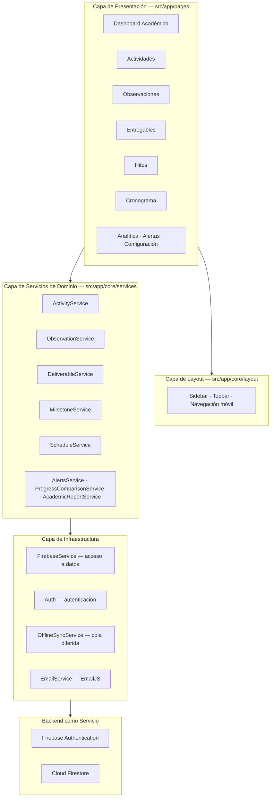
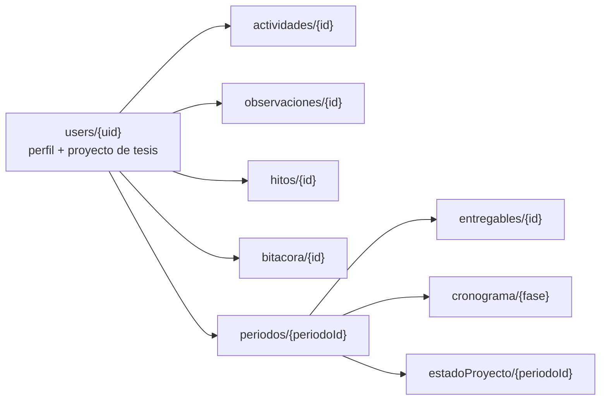

# TesisFlow — Plan de Refactorización Académica

> Transformación de **Tracky** (Sistema de Gestión Financiera Personal) en
> **TesisFlow** (Sistema Inteligente de Seguimiento de Proyectos de Investigación y Tesis)
> reutilizando el código existente. Angular 21 · TypeScript · Firebase Auth · Firestore · Chart.js · SCSS · Vercel.

**Documento:** Plan de refactorización · **Versión:** 1.0 · **Fecha:** 3 de septiembre de 2026
**Estado:** Propuesta previa a implementación — *especificación, sin código de producción.*

---

## 0. Análisis de Impacto

Análisis realizado sobre el código real: 22.113 líneas de TS/HTML/SCSS, 18 servicios, 6 modelos, 13 páginas.

### 0.1 Hallazgo estructural clave

La lógica de negocio de Tracky **no es financiera, es temporal y aritmética**. Opera sobre:

- un número planificado frente a un número real,
- una fecha de vencimiento frente a una fecha de ejecución,
- un porcentaje de cumplimiento con umbral de alerta,
- una recurrencia en el calendario,
- una acumulación por periodo mensual.

Ese es exactamente el modelo de un sistema de seguimiento de proyectos. Por eso la conversión es **semántica y no estructural**: se cambia qué significan los números, no cómo se calculan.

### 0.2 Qué se mantiene EXACTAMENTE IGUAL (0 líneas modificadas)

| Archivo / Módulo | Motivo |
|---|---|
| `src/main.ts`, `src/app/app.ts`, `app.html`, `app.scss` | Bootstrap neutro al dominio |
| `src/app/app.config.ts` | Providers de Firebase, Router y Chart.js: idénticos |
| `src/app/core/guards/auth-guard.ts` | Protección de rutas |
| `src/app/core/services/auth.ts` | Firebase Auth completo (email/password + Google) |
| `src/app/core/services/dev-settings.ts` | Panel de desarrollador |
| `src/app/core/services/layout.service.ts` | Estado del sidebar con signals |
| `src/app/core/services/offline-sync.service.ts` | Cola offline, agnóstica al dominio |
| `src/app/core/services/migration.service.ts` | Motor de migración, reutilizable para datos legacy |
| `src/app/core/components/icon/`, `password-strength/` | Componentes puros |
| `src/app/core/utils/lucide-icons.ts` | Catálogo de iconos SVG |
| `src/styles/_reset.scss` | Reset CSS |
| `src/app/pages/login/login.ts` | Lógica de login; solo cambian textos e imágenes |
| `src/app/pages/migration/migration.ts` | Utilidad de migración |
| `angular.json`, `tsconfig*.json`, `vercel.json`, `firebase-rules.txt` | Build, tipado, deploy y seguridad válidos tal cual |
| **Motor de recurrencia** (`generateOccurrences`, `clampDay`, `detectPattern`, `predictFutureIncome`) | Calcula fechas, no dinero |
| **Cálculos de progreso** (`calculateProgress`, `calculateMonthsToGoal`, `calculateProjectedDate`) | Aritmética de avance |
| **Semáforo de umbral** (`calculateBudgetStatus`, `calculatePercentage`) | Lógica de desviación |

**Estimación: ~38 % del código no se toca.**

### 0.3 Qué se RENOMBRA (rename de archivo + reemplazo de símbolos, sin lógica nueva)

5 modelos, 5 servicios, 8 carpetas de páginas con sus clases, y todo el vocabulario de la interfaz.
Es un cambio mecánico verificable por el compilador: si TypeScript compila en modo `strict`, el renombrado está completo.

**Estimación: ~47 % del código.**

### 0.4 Qué requiere CAMBIOS MÍNIMOS de lógica

| Cambio | Alcance real |
|---|---|
| `amount` deja de formatearse como `S/` y pasa a `h` / `%` / `pág.` | 18 archivos; un pipe de formato centralizado resuelve la mayoría |
| Catálogos de categorías (arrays con label e icono) | 4 métodos: `getAvailableTypes()`, `getPrimordialCategories()`, `getNonPrimordialCategories()`, `getCategories()` |
| Gastos por defecto → observaciones frecuentes por defecto | `getDefaultPrimordialExpenses()` y `getDefaultNonPrimordialExpenses()`: arrays de datos |
| Regla **50/30/20** → regla **40/30/30** por fase | `budget.ts:autoCreateBudgetsFromIncome()`: cambian 3 constantes |
| Onboarding financiero → onboarding académico | `onboarding.model.ts`: 450 líneas de datos declarativos, no lógica |
| Mensajes de alerta del dashboard | `dashboard.ts:401-439`: 6 strings |
| Nombres de colecciones Firestore | `firebase.ts`: ~40 template literals, una pasada de reemplazo |

**Estimación: ~13 % del código.**

### 0.5 Qué es GENUINAMENTE NUEVO

Un solo artefacto: **`project.model.ts`**, más los campos del proyecto en el documento de perfil `users/{uid}`, que **ya existe** y ya tiene `getUserProfileComplete()` y `saveUserProfile()` implementados en `firebase.ts`. No requiere colección nueva ni servicio nuevo.

**Estimación: ~2 % del código.**

### 0.6 Qué hará que parezca un proyecto completamente distinto ante el docente

Ordenado por relación impacto/esfuerzo:

| # | Cambio | Esfuerzo | Impacto |
|---|---|---|---|
| 1 | **Identidad visual completa**: verde oscuro → azul institucional y dorado, tema claro tipo "papel académico" | 1 archivo (`_design-system.scss`) | Máximo |
| 2 | **Vocabulario 100 % académico** en menús, títulos, botones, mensajes y validaciones | ~120 strings | Máximo |
| 3 | **Dashboard con curva S** de avance acumulado y barras Planificado vs. Ejecutado | Reutiliza los 3 charts existentes; cambian los datasets | Alto |
| 4 | **Logo, mascota y nombre**: `public/TRACKY/` → `public/TESISFLOW/`, "Tracky" → "Tesio" | Renombrar carpeta + 6 referencias | Alto |
| 5 | **Colecciones Firestore en español académico** (`actividades`, `observaciones`, `entregables`, `hitos`, `cronograma`) | 1 archivo | Alto, si el docente abre la consola de Firebase |
| 6 | **Proyecto Firebase nuevo** llamado `tesisflow` | Configuración externa | Alto |
| 7 | **Onboarding académico**: título de tesis, asesor, línea de investigación, fecha de sustentación | Datos declarativos | Alto — es la primera pantalla del evaluador |
| 8 | **Documentación reescrita**: README, RF/RNF, casos de uso, historias de usuario | Este documento | Alto |

> **Advertencia crítica sobre el punto 6.** Aunque se renombre todo el código, el diálogo "Iniciar sesión con Google" muestra el dominio del proyecto Firebase. Hoy dice `track-pays.firebaseapp.com` (`environment.ts:5-7`). Si no se crea un proyecto Firebase nuevo, ese es el único punto donde el origen del sistema queda a la vista.

### 0.7 Deuda técnica preexistente que conviene resolver durante el refactor

Detectada al analizar el código actual. Corregirla eleva la calidad del entregable:

| Defecto | Ubicación | Corrección |
|---|---|---|
| Ruta `/goal` enlazada pero no registrada: cae al wildcard y redirige al dashboard | `app.routes.ts` vs `pages/goals/goals.ts:16` | Registrar la ruta al renombrarla a `milestone` |
| 6 de 8 archivos `.spec.ts` importan símbolos inexistentes (`Transaction`, `Goal`, `Dashboard`, `Login`, `Transactions`) y no compilan | `src/**/*.spec.ts` | Corregir imports durante el renombrado de clases |
| `environment.prod.ts` es residuo de Supabase, sin bloque `firebase`, y no está referenciado en `angular.json` | `src/environments/` | Reescribir con la config de Firebase y añadir `fileReplacements` |
| `.env` con claves de Supabase no está cubierto por `.gitignore` | raíz | Eliminar el archivo y ajustar el `.gitignore` |
| La regla `*.json` del `.gitignore` ignora `vercel.json`, `tsconfig.app.json`, `tsconfig.spec.json` y `package-lock.json` | `.gitignore` | Añadir las excepciones |
| `scripts/firestore-admin.ts` importa `firebase-admin`, ausente de `package.json` | `scripts/` | Declarar la dependencia o retirar el script |
| 135 usos de `: any` concentrados en la frontera de datos, pese a `strict: true` | `core/services/firebase.ts` | Tipar con los nuevos modelos durante el renombrado |

---

## 1. Nombre Comercial del Sistema

**TesisFlow**

- **Nombre completo:** TesisFlow — Sistema Inteligente de Seguimiento de Proyectos de Investigación y Tesis
- **Eslogan principal:** *De la idea a la sustentación, sin perder el hilo.*
- **Eslogan de login:** *Tu tesis, semana a semana.*
- **Mascota:** **Tesio**, sustituye a Tracky y reutiliza los 5 PNG existentes renombrados
- **Identificador técnico:** `tesisflow` (paquete npm `tesisflow`, proyecto Angular `tesisFlow`, dominio `tesisflow.vercel.app`)

---

## 2. Descripción Profesional del Proyecto

TesisFlow es una aplicación web de página única (SPA) que permite a estudiantes de pregrado y posgrado planificar, ejecutar y monitorear su proyecto de investigación o tesis desde la aprobación del plan hasta la sustentación.

El sistema estructura el trabajo de investigación en cuatro entidades vinculadas — **actividades** (lo que se planifica hacer), **entregables** (lo que efectivamente se produce), **observaciones** (lo que el asesor exige corregir) e **hitos** (los objetivos comprometidos) — y las proyecta sobre un **cronograma** por fases que contrasta horas planificadas con horas ejecutadas.

Sobre esa base calcula indicadores objetivos: porcentaje de avance global, índice de cumplimiento del cronograma, tasa de subsanación de observaciones, velocidad semanal de trabajo y fecha proyectada de sustentación. Un dashboard construido con Chart.js traduce esos indicadores en una lectura inmediata del estado del proyecto, y un motor de alertas notifica entregables por vencer, observaciones críticas pendientes y desviaciones del cronograma.

La aplicación se construye sobre Angular 21 con componentes standalone y signals, autenticación y persistencia en Firebase, y despliegue continuo en Vercel. Cada tesista accede únicamente a sus propios datos mediante reglas de seguridad de Firestore basadas en el UID autenticado.

---

## 3. Problema que Resuelve

El proceso de tesis universitaria se prolonga o fracasa por causas que son **de gestión, no de capacidad académica**:

1. **Ausencia de trazabilidad de las observaciones.** El asesor devuelve correcciones por correo, mensajería o comentarios en el documento. No existe un registro consolidado de qué se observó, cuándo, si se subsanó y si volvió a observarse. Las observaciones reincidentes son la primera causa de retraso.
2. **Cronogramas que solo existen en papel.** El diagrama de Gantt del plan de tesis se aprueba y no vuelve a consultarse. Sin comparación entre lo planificado y lo ejecutado, la desviación se descubre cuando ya es irrecuperable.
3. **Avance percibido en lugar de avance medido.** El tesista no puede responder con un número a la pregunta "¿en qué porcentaje va tu tesis?". Estima por intuición, y la intuición sobreestima sistemáticamente el progreso.
4. **Pérdida del control de versiones.** Circulan múltiples copias del mismo capítulo sin saber cuál revisó el asesor ni cuál está aprobada.
5. **Invisibilidad del riesgo de retraso.** No hay alerta temprana; el problema se detecta al vencer el plazo institucional.
6. **Falta de evidencia del proceso.** Sin bitácora, la evaluación del desempeño depende de la memoria de las partes.

TesisFlow convierte el seguimiento de tesis en un proceso **medible, trazable y con alerta temprana**, aplicando al ámbito académico los principios de control de avance de la gestión de proyectos.

---

## 4. Objetivo General

Desarrollar e implementar un sistema web inteligente de seguimiento de proyectos de investigación y tesis que permita al estudiante planificar sus actividades, registrar sus entregables, gestionar las observaciones de su asesor y monitorear el avance mediante indicadores cuantitativos y alertas automáticas, garantizando la trazabilidad completa del proceso desde la aprobación del plan hasta la sustentación.

---

## 5. Objetivos Específicos

| # | Objetivo específico |
|---|---|
| OE-01 | Implementar un módulo de registro y control de estado del proyecto de tesis que centralice título, línea de investigación, asesor, nivel académico y fechas comprometidas. |
| OE-02 | Desarrollar un módulo de gestión de actividades de investigación con planificación recurrente, estimación de horas y registro de ejecución real. |
| OE-03 | Implementar un módulo de entregables con control de versiones y estados de revisión que documente la producción académica del tesista. |
| OE-04 | Construir un módulo de observaciones del asesor que clasifique cada corrección por severidad y sección de la tesis, con seguimiento hasta su subsanación. |
| OE-05 | Desarrollar un módulo de hitos que permita definir objetivos comprometidos y calcular su fecha proyectada de cumplimiento. |
| OE-06 | Implementar un cronograma por fases que contraste horas planificadas con horas ejecutadas y detecte desviaciones mediante umbrales configurables. |
| OE-07 | Diseñar un dashboard académico que visualice el avance mediante curva S, comparativos por fase e indicadores de gestión, reutilizando Chart.js. |
| OE-08 | Implementar un motor de alertas automáticas para entregables por vencer, observaciones críticas pendientes y desviación del cronograma. |
| OE-09 | Garantizar la seguridad y el aislamiento de la información de cada tesista mediante autenticación Firebase y reglas de acceso por UID. |
| OE-10 | Asegurar la operación del sistema en dispositivos de escritorio y móviles mediante diseño responsivo y capacidad de trabajo sin conexión. |

---

## 6. Alcance

### 6.1 Incluido

- Autenticación con correo y contraseña, e inicio de sesión con Google.
- Onboarding académico de configuración inicial del proyecto de tesis.
- Un proyecto de tesis activo por usuario, con control de estado y ciclo de vida.
- CRUD completo de actividades, entregables, observaciones e hitos.
- Cronograma por fases con seguimiento de horas planificadas frente a ejecutadas.
- Dashboard académico con 6 visualizaciones y 12 indicadores.
- Motor de alertas y notificaciones por correo electrónico.
- Generación y exportación de reporte de avance.
- Bitácora histórica inmutable de actividades y entregables.
- Cierre automático de periodo mensual con arrastre de pendientes.
- Operación sin conexión con sincronización diferida.
- Interfaz responsiva (escritorio, tablet y móvil) en español.

### 6.2 Excluido de esta versión

- Acceso del asesor como usuario autenticado. En esta versión el tesista registra las observaciones que recibe; el asesor no ingresa al sistema.
- Gestión de múltiples proyectos de tesis por usuario. La arquitectura queda preparada, la funcionalidad se difiere.
- Almacenamiento del archivo del entregable. Se registra la referencia y la versión, no el binario, ya que requeriría Firebase Storage.
- Detección de similitud o antiplagio.
- Integración con repositorios institucionales, ORCID o gestores bibliográficos.
- Aplicación móvil nativa.
- Trámites administrativos o de pago de la sustentación.

### 6.3 Supuestos y restricciones

- El plan de tesis ya fue aprobado; el sistema gestiona la ejecución, no la formulación.
- El tesista dispone de conexión a internet para la sincronización inicial.
- El sistema documenta el proceso formal de la escuela profesional, no lo reemplaza.
- Se conserva íntegramente el stack tecnológico existente por restricción del proyecto.

---

## 7. Stakeholders

| Stakeholder | Tipo | Interés en el sistema | Influencia |
|---|---|---|---|
| **Tesista / investigador** | Primario, usuario directo | Planificar, registrar y visualizar su avance; anticipar retrasos | Alta |
| **Asesor de tesis** | Primario, usuario indirecto | Que sus observaciones queden registradas y se subsanen con trazabilidad | Alta |
| **Coordinador de investigación** | Secundario | Conocer el estado agregado de los proyectos de la escuela | Media |
| **Jurado evaluador** | Secundario | Verificar la evidencia del proceso y la calidad de los entregables | Media |
| **Escuela profesional / facultad** | Secundario | Reducir la deserción y el tiempo promedio de titulación | Media |
| **Docente del curso de Administración de Software** | Externo, evaluador | Verificar la aplicación de la metodología de desarrollo y gestión | Alta |
| **Equipo de desarrollo** | Interno | Mantener y evolucionar el sistema | Alta |
| **Administrador del sistema** | Interno | Configuración, respaldo y disponibilidad | Baja |

---

## 8. Requisitos Funcionales

### Módulo de Autenticación y Perfil

| ID | Requisito | Prioridad | Reutiliza |
|---|---|---|---|
| RF-01 | El sistema debe permitir el registro de un tesista con correo y contraseña, validando la fortaleza de la clave. | Alta | `auth.ts`, `password-strength` |
| RF-02 | El sistema debe permitir el inicio de sesión con correo/contraseña y con cuenta Google. | Alta | `auth.ts` |
| RF-03 | El sistema debe impedir el acceso a cualquier módulo sin sesión activa. | Alta | `auth-guard.ts` |
| RF-04 | El sistema debe ejecutar un onboarding académico obligatorio en el primer ingreso. | Alta | `onboarding.ts` |
| RF-05 | El sistema debe permitir cerrar sesión desde cualquier pantalla. | Alta | `layout.component.ts` |

### Módulo de Proyecto de Tesis

| ID | Requisito | Prioridad | Reutiliza |
|---|---|---|---|
| RF-06 | El sistema debe permitir registrar el proyecto de tesis: título, línea de investigación, tipo de investigación, nivel académico, asesor, fecha de inicio y fecha comprometida de sustentación. | Alta | perfil `users/{uid}` |
| RF-07 | El sistema debe controlar el estado del proyecto entre: planificación, en desarrollo, en revisión, aprobado, sustentado y suspendido. | Alta | nuevo, mínimo |
| RF-08 | El sistema debe permitir editar los datos del proyecto desde Configuración del Proyecto. | Media | `settings` |
| RF-09 | El sistema debe calcular automáticamente los días restantes hasta la fecha comprometida de sustentación. | Media | lógica de `daysUntil` |

### Módulo de Actividades

| ID | Requisito | Prioridad | Reutiliza |
|---|---|---|---|
| RF-10 | El sistema debe permitir registrar actividades clasificadas por fase de investigación y tipo de actividad. | Alta | `income.ts` |
| RF-11 | El sistema debe permitir definir actividades recurrentes con frecuencia semanal, quincenal, mensual, bimestral, trimestral, semestral, anual o variable. | Alta | motor de recurrencia |
| RF-12 | El sistema debe calcular y mostrar las próximas 6 ocurrencias de cada actividad recurrente. | Media | `generateOccurrences()` |
| RF-13 | El sistema debe permitir marcar una actividad como completada registrando las horas realmente invertidas. | Alta | `markAsReceived()` |
| RF-14 | El sistema debe determinar el estado de cada actividad: programada, próxima, pendiente, completada o atrasada. | Alta | `calculatePaymentStatus()` |
| RF-15 | El sistema debe detectar el patrón de trabajo del tesista a partir de su historial de actividades completadas. | Baja | `detectPattern()` |
| RF-16 | El sistema debe permitir desactivar una actividad sin eliminar su historial. | Media | `deactivate()` |

### Módulo de Entregables

| ID | Requisito | Prioridad | Reutiliza |
|---|---|---|---|
| RF-17 | El sistema debe permitir registrar entregables con título, tipo, fecha, versión y porcentaje de aporte al avance. | Alta | `transaction.ts` |
| RF-18 | El sistema debe distinguir entre entregas, que suman avance, y correcciones, que registran retrabajo. | Alta | campo `type` |
| RF-19 | El sistema debe controlar el estado de revisión de cada entregable: borrador, enviado, en revisión, observado o aprobado. | Alta | cambio mínimo |
| RF-20 | El sistema debe mantener el historial de versiones de cada entregable. | Media | campo `version` |
| RF-21 | El sistema debe permitir filtrar y buscar entregables por tipo, hito, estado y texto libre. | Media | `transactions.ts` |
| RF-22 | El sistema debe agrupar los entregables por día en la bitácora. | Baja | ya implementado |

### Módulo de Observaciones

| ID | Requisito | Prioridad | Reutiliza |
|---|---|---|---|
| RF-23 | El sistema debe permitir registrar observaciones del asesor clasificadas por sección de la tesis. | Alta | `expense.ts` |
| RF-24 | El sistema debe clasificar cada observación como bloqueante o como sugerencia. | Alta | `isPrimordial` |
| RF-25 | El sistema debe permitir asignar a cada observación una fecha límite de subsanación y una estimación de horas. | Alta | `dueDate`, `budgetedAmount` |
| RF-26 | El sistema debe permitir marcar una observación como subsanada registrando las horas reales invertidas y generando el entregable asociado. | Alta | `markAsPaid()` |
| RF-27 | El sistema debe identificar observaciones reincidentes y registrar el cambio de severidad respecto de la revisión anterior. | Media | lógica de suscripciones |
| RF-28 | El sistema debe controlar el estado de cada observación: pendiente, en proceso, subsanada, vencida o descartada. | Alta | enum de `PaymentStatus` |
| RF-29 | El sistema debe registrar el nombre del asesor que emitió cada observación. | Media | campo `provider` |

### Módulo de Hitos

| ID | Requisito | Prioridad | Reutiliza |
|---|---|---|---|
| RF-30 | El sistema debe permitir definir hitos con nombre, tipo, meta de avance, fecha comprometida y prioridad. | Alta | `goal.ts` |
| RF-31 | El sistema debe registrar aportes de avance a cada hito y actualizar su porcentaje de progreso. | Alta | `addContribution()` |
| RF-32 | El sistema debe proyectar la fecha estimada de cumplimiento de cada hito según el ritmo de avance registrado. | Media | `calculateProjectedDate()` |
| RF-33 | El sistema debe controlar el estado de cada hito: activo, completado, pausado o cancelado. | Alta | `GoalStatus` |
| RF-34 | El sistema debe permitir gestionar varios hitos simultáneos y ordenarlos por prioridad. | Media | `getByPriority()` |

### Módulo de Cronograma

| ID | Requisito | Prioridad | Reutiliza |
|---|---|---|---|
| RF-35 | El sistema debe permitir planificar horas por fase de investigación para cada periodo mensual. | Alta | `budget.ts` |
| RF-36 | El sistema debe calcular el porcentaje de ejecución de cada fase comparando horas ejecutadas con horas planificadas. | Alta | `calculatePercentage()` |
| RF-37 | El sistema debe clasificar cada fase como en tiempo, en riesgo, retrasada o no iniciada, según un umbral configurable. | Alta | `calculateBudgetStatus()` |
| RF-38 | El sistema debe generar automáticamente una propuesta de cronograma aplicando la distribución 40/30/30 entre investigación, redacción y revisión. | Media | `autoCreateBudgetsFromIncome()` |
| RF-39 | El sistema debe ejecutar el cierre de periodo mensual arrastrando actividades y observaciones pendientes. | Media | `month-rollover.service.ts` |

### Módulo de Dashboard y Analítica

| ID | Requisito | Prioridad | Reutiliza |
|---|---|---|---|
| RF-40 | El sistema debe presentar el porcentaje de avance global del proyecto. | Alta | balance acumulado |
| RF-41 | El sistema debe graficar la curva S de avance acumulado por día. | Alta | gráfica de balance |
| RF-42 | El sistema debe graficar la comparación entre horas planificadas y horas ejecutadas por fase. | Alta | gráfica de barras |
| RF-43 | El sistema debe mostrar la distribución del esfuerzo por fase con barras de progreso. | Media | regla 50/30/20 |
| RF-44 | El sistema debe mostrar minigráficos de tendencia de los últimos 6 periodos. | Baja | sparklines |
| RF-45 | El sistema debe calcular y mostrar 12 indicadores académicos de gestión. | Alta | `comparison.ts` |
| RF-46 | El sistema debe presentar una comparativa del periodo actual contra el anterior. | Media | `getMonthComparison()` |

### Módulo de Alertas, Reportes y Configuración

| ID | Requisito | Prioridad | Reutiliza |
|---|---|---|---|
| RF-47 | El sistema debe generar alertas automáticas por entregables próximos a vencer, observaciones críticas pendientes, actividades atrasadas y desviación del cronograma. | Alta | `alerts.ts` |
| RF-48 | El sistema debe enviar una notificación por correo al registrar un entregable o al subsanar una observación. | Media | `email.ts` |
| RF-49 | El sistema debe generar un reporte exportable de avance del proyecto. | Media | `report.service.ts` |
| RF-50 | El sistema debe permitir configurar el proyecto, las preferencias de notificación y el modo desarrollador. | Media | `settings.ts` |
| RF-51 | El sistema debe permitir operar sin conexión y sincronizar los cambios al restablecerse. | Baja | `offline-sync.service.ts` |

---

## 9. Requisitos No Funcionales

| ID | Categoría | Requisito | Métrica de verificación |
|---|---|---|---|
| RNF-01 | Rendimiento | La carga inicial no debe superar los 2,5 s en conexión 4G. | LCP < 2,5 s en Lighthouse |
| RNF-02 | Rendimiento | El bundle inicial no debe exceder 1 MB. | Budget ya definido en `angular.json` |
| RNF-03 | Rendimiento | Cada módulo debe cargarse bajo demanda. | 13 rutas con `loadComponent` |
| RNF-04 | Seguridad | Cada usuario solo debe acceder a sus propios datos. | Reglas Firestore por `request.auth.uid` |
| RNF-05 | Seguridad | Toda comunicación debe viajar cifrada. | HTTPS obligatorio en Vercel |
| RNF-06 | Seguridad | La aplicación no debe poder embeberse en iframes de terceros. | `X-Frame-Options: DENY` en `vercel.json` |
| RNF-07 | Seguridad | Las contraseñas deben validarse por fortaleza antes del registro. | Componente `password-strength` |
| RNF-08 | Usabilidad | Toda la interfaz debe estar en español, con terminología académica uniforme. | Revisión de glosario |
| RNF-09 | Usabilidad | Toda operación destructiva debe requerir confirmación explícita. | Modales de confirmación |
| RNF-10 | Usabilidad | El usuario debe alcanzar cualquier módulo en un máximo de 2 clics. | Sidebar + navegación inferior |
| RNF-11 | Accesibilidad | Los elementos interactivos deben tener etiquetas ARIA y foco visible. | Auditoría de accesibilidad |
| RNF-12 | Compatibilidad | Debe funcionar en Chrome, Edge, Firefox y Safari en sus 2 últimas versiones. | Pruebas cruzadas |
| RNF-13 | Portabilidad | Debe adaptarse a pantallas desde 320 px hasta 1920 px. | Diseño responsivo con navegación inferior en móvil |
| RNF-14 | Disponibilidad | Disponibilidad objetivo del 99 % mensual. | SLA de Vercel y Firebase |
| RNF-15 | Mantenibilidad | El código debe compilar con TypeScript en modo `strict` sin errores. | `tsconfig.json` con `strict: true` |
| RNF-16 | Mantenibilidad | La arquitectura debe separar presentación, servicios y modelos. | Estructura `core/` y `pages/` |
| RNF-17 | Mantenibilidad | El formato del código debe ser uniforme. | Prettier + EditorConfig |
| RNF-18 | Escalabilidad | El modelo de datos debe soportar el crecimiento histórico sin degradar la consulta. | Particionamiento por periodo mensual |
| RNF-19 | Confiabilidad | La pérdida de conexión no debe provocar pérdida de datos. | Cola de sincronización offline |
| RNF-20 | Trazabilidad | Toda actividad completada y todo entregable deben quedar en bitácora permanente. | Colección `bitacora` inmutable |

---

## 10. Casos de Uso Principales

| ID | Caso de uso | Actor | Módulo |
|---|---|---|---|
| CU-01 | Iniciar sesión en el sistema | Tesista | Autenticación |
| CU-02 | Configurar el proyecto de tesis (onboarding) | Tesista | Proyecto |
| CU-03 | Registrar una actividad de investigación | Tesista | Actividades |
| CU-04 | Marcar una actividad como completada | Tesista | Actividades |
| CU-05 | Registrar un entregable | Tesista | Entregables |
| CU-06 | Registrar una observación del asesor | Tesista | Observaciones |
| CU-07 | Subsanar una observación | Tesista | Observaciones |
| CU-08 | Definir un hito de tesis | Tesista | Hitos |
| CU-09 | Planificar el cronograma del periodo | Tesista | Cronograma |
| CU-10 | Consultar el dashboard académico | Tesista | Dashboard |
| CU-11 | Revisar alertas del proyecto | Tesista | Alertas |
| CU-12 | Generar el reporte de avance | Tesista | Reportes |
| CU-13 | Cambiar el estado del proyecto | Tesista | Configuración |

### CU-06 — Registrar una observación del asesor (expandido)

| Elemento | Detalle |
|---|---|
| **Actor principal** | Tesista |
| **Actor secundario** | Asesor de tesis (origen de la información, no usuario del sistema) |
| **Precondición** | El tesista tiene sesión activa y un proyecto de tesis registrado. |
| **Postcondición** | La observación queda registrada con estado *pendiente*, se recalculan los indicadores y se genera alerta si es bloqueante. |
| **Disparador** | El asesor devuelve un entregable con correcciones. |

**Flujo principal**

1. El tesista ingresa al módulo Observaciones.
2. El sistema muestra las observaciones agrupadas en bloqueantes y sugerencias.
3. El tesista selecciona "Nueva observación".
4. El sistema presenta el formulario de registro.
5. El tesista indica la sección de la tesis observada, el título de la observación, la severidad, el asesor que la emitió, la fecha límite de subsanación y las horas estimadas de corrección.
6. El sistema valida que la fecha límite sea posterior a la fecha actual y que las horas estimadas sean un número positivo.
7. El sistema verifica si existe una observación previa subsanada sobre la misma sección con título equivalente.
8. Si existe coincidencia, el sistema marca la observación como reincidente y registra el cambio de severidad.
9. El sistema persiste la observación en Firestore y actualiza los indicadores del dashboard.
10. El sistema confirma el registro al tesista.

**Flujos alternativos**

- **6a.** Fecha límite inválida: el sistema indica el error, mantiene los datos ingresados y no persiste.
- **9a.** Sin conexión: el sistema encola la operación, informa el estado pendiente de sincronización y la envía al restablecerse la conexión.
- **8a.** Observación bloqueante con vencimiento en 3 días o menos: el sistema genera adicionalmente una alerta crítica en el dashboard.

---

## 11. Historias de Usuario

Formato: *Como [rol], quiero [funcionalidad], para [beneficio]*, con criterios de aceptación.

| ID | Historia | Criterios de aceptación | Puntos |
|---|---|---|---|
| **HU-01** | Como tesista, quiero registrar los datos de mi proyecto de tesis al ingresar por primera vez, para que el sistema calcule mi avance sobre una meta real. | Al completar el onboarding se guarda título, línea, asesor, nivel y fecha de sustentación; no se puede omitir; los datos son editables después. | 5 |
| **HU-02** | Como tesista, quiero registrar mis actividades semanales de investigación, para no depender de la memoria al planificar mi semana. | Puedo crear una actividad con fase, tipo, horas estimadas y recurrencia; el sistema muestra las próximas 6 fechas. | 8 |
| **HU-03** | Como tesista, quiero marcar una actividad como completada indicando las horas que realmente invertí, para conocer mi desviación de esfuerzo. | Al completar se solicitan las horas reales; el sistema calcula la diferencia frente a lo estimado y actualiza el cronograma. | 5 |
| **HU-04** | Como tesista, quiero registrar cada observación de mi asesor, para no perder ninguna corrección entre revisiones. | Puedo clasificarla como bloqueante o sugerencia, asignarle sección, fecha límite y horas estimadas. | 8 |
| **HU-05** | Como tesista, quiero ver de inmediato mis observaciones bloqueantes pendientes, para priorizar lo que impide avanzar. | El dashboard muestra el conteo de bloqueantes pendientes y la lista ordenada por fecha límite. | 3 |
| **HU-06** | Como tesista, quiero que el sistema me avise si una observación ya me la habían hecho antes, para corregir la causa y no solo el síntoma. | Al registrar una observación equivalente a una ya subsanada se marca como reincidente y se muestra con distintivo visual. | 5 |
| **HU-07** | Como tesista, quiero registrar cada entregable con su versión y estado de revisión, para saber siempre cuál es la versión vigente. | Cada entregable tiene versión incremental y estado entre borrador, enviado, en revisión, observado y aprobado. | 5 |
| **HU-08** | Como tesista, quiero definir hitos con fecha comprometida, para tener metas intermedias verificables. | Puedo crear varios hitos con prioridad; cada uno muestra su porcentaje de avance y fecha proyectada. | 5 |
| **HU-09** | Como tesista, quiero ver mi avance global en un número y en una curva, para responder con evidencia en qué porcentaje voy. | El dashboard muestra el porcentaje global y la curva S de avance acumulado. | 8 |
| **HU-10** | Como tesista, quiero comparar las horas que planifiqué con las que ejecuté por fase, para detectar dónde me estoy retrasando. | Gráfico de barras agrupadas por fase con semáforo de estado por umbral. | 8 |
| **HU-11** | Como tesista, quiero recibir alertas de entregables por vencer, para no incumplir plazos con mi asesor. | Se genera alerta con la anticipación configurada; aparece en el dashboard y en el módulo de alertas. | 5 |
| **HU-12** | Como tesista, quiero recibir un correo cuando registro un entregable, para tener constancia externa de la entrega. | Al registrar el entregable se envía correo con fecha, título y versión, si las notificaciones están activas. | 3 |
| **HU-13** | Como tesista, quiero generar un reporte de mi avance, para presentárselo a mi asesor o a la coordinación. | El reporte incluye avance global, hitos, entregables, observaciones y desviación del cronograma. | 8 |
| **HU-14** | Como tesista, quiero seguir registrando actividades sin conexión, para trabajar en cualquier lugar. | Las operaciones se encolan y se sincronizan al recuperar la conexión, con indicador visible de estado. | 8 |
| **HU-15** | Como tesista, quiero cambiar el estado de mi proyecto, para reflejar en qué etapa formal se encuentra. | El estado se selecciona entre 6 valores y se muestra en el encabezado del dashboard. | 3 |

---

## 12. Arquitectura Propuesta

La arquitectura **no cambia**. Se mantiene la SPA Angular con componentes standalone, señales reactivas, carga diferida por ruta y una capa de servicios que aísla el acceso a Firebase. Lo que cambia es la semántica de las entidades que atraviesan esas capas.

### 12.1 Vista de capas



### 12.2 Modelo de datos en Firestore



**Rutas resultantes**

| Colección TesisFlow | Ruta Firestore | Origen en Tracky |
|---|---|---|
| Perfil y proyecto | `users/{uid}` | `users/{uid}` |
| Actividades | `users/{uid}/actividades/{id}` | `incomeSources` |
| Observaciones | `users/{uid}/observaciones/{id}` | `expenses` |
| Hitos | `users/{uid}/hitos/{id}` | `goals` |
| Bitácora | `users/{uid}/bitacora/{id}` | `incomeHistory` |
| Periodos | `users/{uid}/periodos/{periodoId}` | `months` |
| Entregables | `users/{uid}/periodos/{periodoId}/entregables/{id}` | `transactions` |
| Cronograma | `users/{uid}/periodos/{periodoId}/cronograma/{fase}` | `budgets` |
| Estado del proyecto | `users/{uid}/periodos/{periodoId}/estadoProyecto` | `financialState` |

Las reglas de seguridad de `firebase-rules.txt` **funcionan sin modificación**, porque el comodín `match /{document=**}` bajo `users/{userId}` cubre cualquier subcolección con el nuevo nombre.

### 12.3 Patrones arquitectónicos conservados

| Patrón | Implementación existente |
|---|---|
| Componentes standalone | Las 13 páginas, sin NgModules |
| Estado reactivo con signals | `signal()` y `computed()` en páginas y servicios |
| Carga diferida por ruta | `loadComponent()` en las 13 rutas |
| Inyección de dependencias con `inject()` | Todos los servicios |
| Repositorio centralizado de datos | `FirebaseService` como única puerta a Firestore |
| Guard de ruta | `authGuard` sobre el layout autenticado |
| Design tokens en CSS custom properties | `_design-system.scss` |
| Modelo de dominio tipado | 6 interfaces con tipos literales de unión |

### 12.4 Cambio en la identidad visual

Único archivo a intervenir: `src/styles/_design-system.scss`. Se propone pasar del tema oscuro verde financiero a un **tema claro institucional**, que es la transformación de mayor impacto visual al menor costo.

| Token | Tracky (actual) | TesisFlow (propuesto) | Rol |
|---|---|---|---|
| `--color-primary` | `#166B46` | `#1E3A5F` | Azul institucional |
| `--color-primary-light` | `#2FA46A` | `#3B6EA5` | Azul de apoyo |
| `--color-primary-dark` | `#0D1B16` | `#132840` | Azul profundo |
| `--color-accent` | `#2FA46A` | `#C9A227` | Dorado académico |
| `--color-bg` | `#0E1212` | `#F6F7F9` | Fondo tipo papel |
| `--color-surface` | `#0D1B16` | `#FFFFFF` | Tarjetas |
| `--color-surface-elevated` | `#141618` | `#EEF1F5` | Superficie elevada |
| `--color-text` | `#F5F7F5` | `#16202B` | Texto principal |
| `--color-text-secondary` | `#AAB5AE` | `#5B6B7C` | Texto secundario |
| `--color-success` | `#2FA46A` | `#2E7D5B` | Fase en tiempo |
| `--color-warning` | `#f59e0b` | `#C97A20` | Fase en riesgo |
| `--color-error` | `#ef4444` | `#B3261E` | Fase retrasada / bloqueante |
| `--font-heading` | Poppins | Source Serif 4 | Títulos con carácter académico |
| `--font-body` | Inter / DM Sans | Inter | Texto corrido |

Los 129 renglones de `_design-system.scss` alimentan las 8 hojas SCSS de página, de modo que el cambio se propaga solo. Las curvas de animación (`--ease-out`, `--duration-*`) se conservan sin cambios.

---

## 13. Tabla Detallada de Equivalencias Tracky → TesisFlow

### 13.1 Equivalencia de módulos

| Módulo Tracky | Módulo TesisFlow | Naturaleza del cambio |
|---|---|---|
| Gestión de Ingresos | **Gestión de Actividades** | Renombrado + resemantización de `amount` a horas |
| Gestión de Gastos | **Observaciones y Correcciones** | Renombrado + resemantización de la dualidad |
| Movimientos / Transacciones | **Entregables** | Renombrado + 3 campos nuevos |
| Metas de Ahorro | **Hitos de Tesis** | Renombrado puro |
| Presupuestos | **Cronograma** | Renombrado + cambio de constantes de distribución |
| Dashboard Financiero | **Dashboard Académico** | Renombrado + nuevos datasets |
| Ahorro | **Banco de Horas** | Renombrado |
| Insights | **Analítica Académica** | Renombrado |
| Alertas | **Alertas del Proyecto** | Renombrado |
| Configuración | **Configuración del Proyecto** | Renombrado + campos del proyecto |
| Login | **Login** | Solo identidad visual y textos |
| Onboarding | **Onboarding Académico** | Cambio del contenido declarativo |
| Migración | **Migración de Datos** | Sin cambios |

### 13.2 `IncomeSource` → `Actividad`

| Campo Tracky | Campo TesisFlow | Tipo / Valores | Nota |
|---|---|---|---|
| `id`, `userId` | `id`, `userId` | `string` | Sin cambio |
| `category: IncomeCategory` | `fase: FaseInvestigacion` | `planificacion` · `revision_literatura` · `marco_teorico` · `metodologia` · `trabajo_campo` · `analisis_datos` · `redaccion` · `sustentacion` | 8 valores por 8 valores |
| `type: IncomeType` | `tipoActividad: TipoActividad` | `lectura_articulos`, `fichaje`, `busqueda_fuentes`, `redaccion_capitulo`, `diseño_instrumento`, `validacion_expertos`, `aplicacion_encuesta`, `entrevista`, `transcripcion`, `tabulacion`, `analisis_estadistico`, `elaboracion_tablas`, `revision_asesor`, `correccion`, `formato_apa`, `reunion_asesoria`, … | 28 tipos por 28 tipos |
| `name` | `nombre` | `string` | |
| `description` | `descripcion` | `string?` | |
| `amount` | `horasEstimadas` | `number` | **Resemantización clave** |
| `actualAmount` | `horasReales` | `number?` | |
| `currency` | `unidad` | `'h' \| 'pag' \| 'items'` | |
| `recurrence: RecurrenceRule` | `recurrencia: ReglaRecurrencia` | idéntica | **Motor reutilizado íntegro** |
| `nextOccurrences` | `proximasSesiones` | `string[]` | |
| `lastReceivedDate` | `ultimaEjecucion` | `string?` | |
| `paymentStatus.status` | `estado.estado` | `pendiente` · `completada` · `atrasada` · `proxima` · `programada` | Mismo enum, otros nombres |
| `paymentStatus.daysUntil` | `estado.diasRestantes` | `number \| null` | |
| `paymentStatus.missedCount` | `estado.sesionesOmitidas` | `number` | |
| `alertBeforeDays` | `alertarDiasAntes` | `number \| null` | |
| `autoCreateTransaction` | `generarEntregableAuto` | `boolean` | |
| `deductions` | — | — | Campo específico de nómina: se retira del modelo |
| `isActive`, `notes`, `createdAt`, `updatedAt` | `activa`, `notas`, `creadoEn`, `actualizadoEn` | | |

### 13.3 `Expense` → `Observacion`

| Campo Tracky | Campo TesisFlow | Tipo / Valores | Nota |
|---|---|---|---|
| `isPrimordial` | `esBloqueante` | `boolean` | `true` = impide avanzar; `false` = sugerencia. **La dualidad se conserva intacta** |
| `category: ExpenseCategory` | `seccion: SeccionTesis` | Bloqueantes: `metodologia`, `marco_teorico`, `resultados`, `discusion`, `conclusiones`, `instrumento`, `objetivos`. Sugerencias: `formato_apa`, `redaccion`, `ortografia`, `tablas_figuras`, `citas`, `anexos`, `coherencia`, `extension`, `otros` | 7 + 9 por 7 + 9 |
| `subcategory` | `detalleSeccion` | `string?` | "Capítulo III, punto 3.2" |
| `name` | `titulo` | `string` | "Falta justificación del muestreo" |
| `provider` | `asesor` | `string?` | Quién emitió la observación |
| `description` | `detalle` | `string?` | Texto literal de la observación |
| `budgetedAmount` | `horasEstimadas` | `number` | Esfuerzo estimado de corrección |
| `actualAmount` | `horasInvertidas` | `number` | Esfuerzo real |
| `dueDayOfMonth` | `diaLimiteMes` | `number \| null` | |
| `dueDate` | `fechaLimiteSubsanacion` | `string?` | |
| `paymentDate` | `fechaSubsanacion` | `string?` | |
| `startDate`, `endDate` | `fechaRecepcion`, `fechaCierre` | `string` | |
| `status: PaymentStatus` | `estado: EstadoObservacion` | `pendiente` · `en_proceso` · `subsanada` · `vencida` · `descartada` | Mismo enum de 5 valores |
| `isRecurring`, `frequency` | `esPeriodica`, `frecuenciaRevision` | | |
| `transactionId` | `entregableId` | `string?` | Vincula al entregable que la subsana |
| `isSubscription` | `esReincidente` | `boolean?` | **Reuso inteligente**: la lógica de detección de suscripciones detecta observaciones repetidas |
| `subscriptionPrice`, `lastPrice` | `severidadActual`, `severidadAnterior` | `number?` | |
| `priceChanged` | `cambioSeveridad` | `boolean?` | |
| `isVariable`, `averageAmount`, `lastMonthAmount` | `esfuerzoVariable`, `promedioHoras`, `horasPeriodoAnterior` | | |
| `dangerThreshold` | `umbralAlerta` | `number?` | |

### 13.4 `Transaction` → `Entregable`

| Campo Tracky | Campo TesisFlow | Tipo / Valores | Nota |
|---|---|---|---|
| `id`, `userId` | `id`, `userId` | `string` | |
| `type: 'income' \| 'expense'` | `tipo: 'entrega' \| 'correccion'` | | La entrega suma avance, la corrección registra retrabajo. **Conserva la aritmética del balance** |
| `amount` | `aporteAvance` | `number` | Porcentaje o páginas aportadas |
| `description` | `titulo` | `string` | |
| `date` | `fecha` | `string` | |
| `categoryId` | `hitoId` | `string \| null` | Vincula el entregable a un hito |
| `category` | `hito` | `{ nombre; icono; fase }` | |
| — | `version` | `number` | **Nuevo** |
| — | `estadoRevision` | `borrador` · `enviado` · `en_revision` · `observado` · `aprobado` | **Nuevo** |
| — | `referenciaArchivo` | `string?` | **Nuevo**: URL o nombre del archivo, sin binario |
| `createdAt`, `updatedAt` | `creadoEn`, `actualizadoEn` | | |

### 13.5 `SavingGoal` → `Hito`

| Campo Tracky | Campo TesisFlow | Tipo / Valores | Nota |
|---|---|---|---|
| `name` | `nombre` | `string` | "Capítulo III aprobado" |
| `category: GoalCategory` | `tipoHito: TipoHito` | `plan_tesis` · `capitulo_1` · `capitulo_2` · `capitulo_3` · `capitulo_4` · `capitulo_5` · `instrumento_validado` · `recoleccion_datos` · `informe_final` · `articulo_cientifico` · `sustentacion` · `otro` | 12 por 12 |
| `targetAmount` | `metaAvance` | `number` | 100 (%) o número de entregables |
| `currentAmount` | `avanceActual` | `number` | |
| `monthlyContribution` | `avanceMensualPlanificado` | `number` | |
| `targetDate` | `fechaComprometida` | `string?` | |
| `status: GoalStatus` | `estado: EstadoHito` | `activo` · `completado` · `pausado` · `cancelado` | |
| `priority: GoalPriority` | `prioridad` | `alta` · `media` · `baja` | |
| `isCompleted` | `estaCompletado` | `boolean` | |
| `monthsToGoal` | `periodosRestantes` | `number \| null` | |
| `projectedCompletionDate` | `fechaProyectada` | `string?` | |
| `contributions: GoalContribution[]` | `aportes: AporteAvance[]` | | |
| `GoalContribution.amount` | `AporteAvance.avance` | `number` | |
| `GoalContribution.note` | `AporteAvance.nota` | `string?` | |
| `tags`, `notes`, `version` | `etiquetas`, `notas`, `version` | | |
| `calculateProgress()` | `calcularProgreso()` | | **Función reutilizada sin cambio** |
| `calculateMonthsToGoal()` | `calcularPeriodosRestantes()` | | **Función reutilizada sin cambio** |
| `calculateProjectedDate()` | `calcularFechaProyectada()` | | **Función reutilizada sin cambio** |

### 13.6 `Budget` → `FaseCronograma`

| Campo Tracky | Campo TesisFlow | Tipo / Valores | Nota |
|---|---|---|---|
| `category`, `categoryName` | `fase`, `nombreFase` | `string` | |
| `isPrimordial` | `esFaseCritica` | `boolean` | Fase en la ruta crítica |
| `budgetedAmount` | `horasPlanificadas` | `number` | |
| `actualAmount` | `horasEjecutadas` | `number` | |
| `remainingAmount` | `horasRestantes` | `number` | |
| `percentageUsed` | `porcentajeEjecucion` | `number` | |
| `status: BudgetStatus` | `estado: EstadoFase` | `en_tiempo` · `en_riesgo` · `retrasado` · `no_iniciado` | Mapeo directo de `on_track` · `at_risk` · `exceeded` · `unused` |
| `alertThreshold` | `umbralDesviacion` | `number` | 80 por defecto |
| `monthId`, `year`, `month` | `periodoId`, `anio`, `mes` | | |
| `history: BudgetHistory[]` | `historial: HistorialFase[]` | | |
| `MonthlyBudgetSummary` | `ResumenCronograma` | | |
| `primordialBudgeted` / `nonPrimordialBudgeted` | `criticasPlanificadas` / `noCriticasPlanificadas` | | |
| Regla **50/30/20** | Regla **40/30/30** | Investigación 40 % · Redacción 30 % · Revisión 30 % | 3 constantes |
| `calculateBudgetStatus()` | `calcularEstadoFase()` | | **Función reutilizada sin cambio** |

### 13.7 Equivalencia de servicios

| Servicio Tracky | Servicio TesisFlow | Métodos que cambian de nombre | Lógica |
|---|---|---|---|
| `IncomeService` | `ActivityService` | `getAll` · `getActive` → `getActivas` · `markAsReceived` → `marcarCompletada` · `getMonthlyIncome` → `getActividadesPeriodo` | Idéntica |
| `ExpenseService` | `ObservationService` | `markAsPaid` → `marcarSubsanada` · `cancel` → `descartar` · `renewRecurringExpenses` → `renovarObservacionesPeriodicas` | Idéntica |
| `TransactionService` | `DeliverableService` | `getByMonth` → `getPorPeriodo` · `calcTotals` → `calcTotales` · `calcByCategory` → `calcPorHito` | Idéntica |
| `GoalService` | `MilestoneService` | `addContribution` → `registrarAporte` · `calcProgress` → `calcProgreso` | Idéntica |
| `BudgetService` | `ScheduleService` | `createOrUpdate` → `planificarFase` · `autoCreateBudgetsFromIncome` → `autoGenerarCronograma` · `getAtRiskCategories` → `getFasesEnRiesgo` | 3 constantes |
| `AlertsService` | `AlertsService` | `getAllAlerts` → `getAlertasProyecto` | Textos |
| `ComparisonService` | `ProgressComparisonService` | `getMonthComparison` → `getComparativaPeriodo` | Idéntica |
| `ReportService` | `AcademicReportService` | — | Textos |
| `MonthRolloverService` | `PeriodRolloverService` | — | Idéntica |
| `SurplusNotificationService` | `ProgressNotificationService` | — | Textos |
| `OnboardingService` | `OnboardingService` | `getQuestionsByEmploymentType` → `getPreguntasPorTipoInvestigacion` | Datos |
| `EmailService` | `EmailService` | `sendIncomeConfirmation` → `sendEntregableConfirmacion` | Plantillas |
| `Auth`, `FirebaseService`, `DevSettingsService`, `LayoutService`, `OfflineSyncService`, `MigrationService` | Sin cambio de nombre | — | Idéntica |

---

## 14. Nuevos Nombres para Páginas y Módulos

### 14.1 Rutas de la aplicación

| Ruta actual | Ruta nueva | Título de página | En menú |
|---|---|---|---|
| `/dashboard` | `/dashboard` | Dashboard Académico | Sí |
| `/income` | `/actividades` | Actividades del Proyecto | **Sí** (hoy no figura) |
| `/expenses` | `/observaciones` | Observaciones y Correcciones | **Sí** (hoy no figura) |
| `/transactions` | `/entregables` | Entregables | Sí |
| `/goals` | `/hitos` | Hitos de Tesis | Sí |
| `/goal` *(no registrada)* | `/hitos/detalle` | Detalle del Hito | No, acceso desde Hitos |
| `/budgets` | `/cronograma` | Cronograma | Sí |
| `/savings` | `/banco-horas` | Banco de Horas | **Sí** (hoy no figura) |
| `/insights` | `/analitica` | Analítica Académica | Sí |
| `/alerts` | `/alertas` | Alertas del Proyecto | Sí |
| `/settings` | `/configuracion` | Configuración del Proyecto | Sí |
| `/login` | `/login` | Acceso | No |
| `/onboarding` | `/onboarding` | Configuración Inicial | No |
| `/migration` | `/migracion` | Migración de Datos | No |

> **Corrección incluida:** al renombrar `/goal` a `/hitos/detalle` se registra la ruta que hoy falta en `app.routes.ts`, lo que rescata 765 líneas de código actualmente inalcanzables.

### 14.2 Etiquetas de navegación

| Sidebar actual | Sidebar TesisFlow | Nav móvil actual | Nav móvil TesisFlow |
|---|---|---|---|
| Dashboard | Dashboard | Home | Inicio |
| Presupuestos | Cronograma | Presup. | Cronog. |
| Movimientos | Entregables | Movim. | Entreg. |
| Alertas | Alertas | Alertas | Alertas |
| Insights | Analítica | — | — |
| Metas | Hitos | Metas | Hitos |
| Configuración | Configuración | Ajustes | Ajustes |
| *(ausente)* | **Actividades** | — | — |
| *(ausente)* | **Observaciones** | — | — |
| *(ausente)* | **Banco de Horas** | — | — |

---

## 15. Nuevos Modelos TypeScript

Especificación de las interfaces. Se conservan las convenciones actuales: tipos literales de unión, campos opcionales para retrocompatibilidad y funciones puras de cálculo junto al modelo.

### 15.1 `project.model.ts` — único modelo nuevo

```typescript
export type NivelAcademico = 'pregrado' | 'maestria' | 'doctorado' | 'segunda_especialidad';

export type TipoInvestigacion = 'cuantitativa' | 'cualitativa' | 'mixta' | 'aplicada' | 'documental';

export type EstadoProyecto =
  | 'planificacion' | 'en_desarrollo' | 'en_revision'
  | 'aprobado' | 'sustentado' | 'suspendido';

export interface ProyectoTesis {
  id: string;
  userId: string;
  titulo: string;
  lineaInvestigacion: string;
  tipoInvestigacion: TipoInvestigacion;
  nivelAcademico: NivelAcademico;
  escuelaProfesional: string;
  asesor: { nombre: string; correo?: string; grado?: string };
  fechaInicio: string;
  fechaComprometida: string;
  estado: EstadoProyecto;
  avanceGlobal: number;
  horasTotalesPlanificadas: number;
  horasTotalesEjecutadas: number;
  creadoEn: string;
  actualizadoEn: string;
}
```

### 15.2 `activity.model.ts` — deriva de `income.model.ts`

```typescript
export type FaseInvestigacion =
  | 'planificacion' | 'revision_literatura' | 'marco_teorico' | 'metodologia'
  | 'trabajo_campo' | 'analisis_datos' | 'redaccion' | 'sustentacion';

export type EstadoActividad =
  | 'programada' | 'proxima' | 'pendiente' | 'completada' | 'atrasada';

// ReglaRecurrencia, FrecuenciaActividad y ReglaMensual se mantienen
// estructuralmente idénticas a RecurrenceRule, IncomeFrequency y MonthlyRule.

export interface Actividad {
  id: string;
  userId: string;
  fase: FaseInvestigacion;
  tipoActividad: TipoActividad;
  nombre: string;
  descripcion?: string;
  horasEstimadas: number;
  horasReales?: number;
  unidad?: 'h' | 'pag' | 'items';
  recurrencia: ReglaRecurrencia;
  proximasSesiones: string[];
  ultimaEjecucion?: string;
  estado: {
    estado: EstadoActividad;
    proximaFecha: string | null;
    diasRestantes: number | null;
    estaAtrasada: boolean;
    sesionesOmitidas: number;
    periodosOmitidos: string[];
  };
  alertarDiasAntes?: number | null;
  generarEntregableAuto?: boolean;
  activa: boolean;
  notas?: string;
  creadoEn: string;
  actualizadoEn: string;
}
```

### 15.3 `observation.model.ts` — deriva de `expense.model.ts`

```typescript
export type SeccionBloqueante =
  | 'metodologia' | 'marco_teorico' | 'resultados' | 'discusion'
  | 'conclusiones' | 'instrumento' | 'objetivos';

export type SeccionSugerencia =
  | 'formato_apa' | 'redaccion' | 'ortografia' | 'tablas_figuras'
  | 'citas' | 'anexos' | 'coherencia' | 'extension' | 'otros';

export type SeccionTesis = SeccionBloqueante | SeccionSugerencia;

export type EstadoObservacion =
  | 'pendiente' | 'en_proceso' | 'subsanada' | 'vencida' | 'descartada';

export type Severidad = 'critica' | 'mayor' | 'menor';

export interface Observacion {
  id: string;
  userId: string;
  esBloqueante: boolean;
  seccion: SeccionTesis;
  detalleSeccion?: string;
  titulo: string;
  detalle?: string;
  asesor?: string;
  severidad: Severidad;
  horasEstimadas: number;
  horasInvertidas: number;
  fechaRecepcion: string;
  fechaLimiteSubsanacion?: string;
  fechaSubsanacion?: string;
  diaLimiteMes: number | null;
  estado: EstadoObservacion;
  esPeriodica: boolean;
  entregableId?: string;
  esReincidente?: boolean;
  severidadAnterior?: Severidad;
  cambioSeveridad?: boolean;
  esfuerzoVariable?: boolean;
  promedioHoras?: number;
  umbralAlerta?: number;
  activa: boolean;
  creadoEn: string;
  actualizadoEn: string;
}
```

### 15.4 `deliverable.model.ts` — deriva de `transaction.model.ts`

```typescript
export type TipoEntregable = 'entrega' | 'correccion';

export type EstadoRevision =
  | 'borrador' | 'enviado' | 'en_revision' | 'observado' | 'aprobado';

export interface Entregable {
  id: string;
  userId: string;
  hitoId: string | null;
  titulo: string;
  descripcion: string | null;
  tipo: TipoEntregable;
  aporteAvance: number;
  version: number;
  estadoRevision: EstadoRevision;
  referenciaArchivo?: string;
  fecha: string;
  hito?: { nombre: string; icono: string; fase: FaseInvestigacion };
  creadoEn: string;
  actualizadoEn: string;
}
```

### 15.5 `milestone.model.ts` — deriva de `goal.model.ts`

```typescript
export type TipoHito =
  | 'plan_tesis' | 'capitulo_1' | 'capitulo_2' | 'capitulo_3' | 'capitulo_4'
  | 'capitulo_5' | 'instrumento_validado' | 'recoleccion_datos'
  | 'informe_final' | 'articulo_cientifico' | 'sustentacion' | 'otro';

export type PrioridadHito = 'alta' | 'media' | 'baja';
export type EstadoHito = 'activo' | 'completado' | 'pausado' | 'cancelado';

export interface Hito {
  id: string;
  userId: string;
  nombre: string;
  descripcion?: string;
  tipoHito: TipoHito;
  metaAvance: number;
  avanceActual: number;
  avanceMensualPlanificado: number;
  fechaComprometida?: string;
  estado: EstadoHito;
  prioridad: PrioridadHito;
  estaCompletado: boolean;
  periodosRestantes: number | null;
  fechaProyectada?: string;
  aportes: AporteAvance[];
  notas?: string;
  etiquetas?: string[];
  creadoEn: string;
  actualizadoEn: string;
}

export interface AporteAvance {
  id: string;
  avance: number;
  fecha: string;
  entregableId?: string;
  nota?: string;
}
```

### 15.6 `schedule.model.ts` — deriva de `budget.model.ts`

```typescript
export type EstadoFase = 'en_tiempo' | 'en_riesgo' | 'retrasado' | 'no_iniciado';

export interface FaseCronograma {
  id: string;
  userId: string;
  fase: FaseInvestigacion;
  nombreFase: string;
  esFaseCritica: boolean;
  horasPlanificadas: number;
  horasEjecutadas: number;
  horasRestantes: number;
  porcentajeEjecucion: number;
  estado: EstadoFase;
  umbralDesviacion: number;
  periodoId: string;
  anio: number;
  mes: number;
  historial: HistorialFase[];
  activa: boolean;
  notas?: string;
  creadoEn: string;
  actualizadoEn: string;
}

export interface ResumenCronograma {
  periodoId: string;
  horasTotalesPlanificadas: number;
  horasTotalesEjecutadas: number;
  horasTotalesRestantes: number;
  porcentajeGlobal: number;
  estadoGlobal: EstadoFase;
  criticasPlanificadas: number;
  criticasEjecutadas: number;
  noCriticasPlanificadas: number;
  noCriticasEjecutadas: number;
  fases: FaseCronograma[];
  alertas: { fase: string; nombre: string; planificadas: number;
             ejecutadas: number; porcentaje: number; estado: EstadoFase }[];
  ultimaActualizacion: string;
}
```

---

## 16. Nuevos Gráficos para el Dashboard

Los tres gráficos actuales se conservan como componentes y cambian únicamente sus datasets y etiquetas. Se añaden tres visualizaciones que usan tipos ya registrados por `withDefaultRegisterables()`, por lo que no requieren dependencias nuevas.

| # | Gráfico TesisFlow | Tipo Chart.js | Sustituye a | Datos |
|---|---|---|---|---|
| **G-01** | **Curva S de avance acumulado** | `line` con relleno | Gráfica de balance diario | Eje X: días del periodo. Eje Y: porcentaje acumulado. Dos series: avance planificado (línea punteada) y avance real (área). La brecha entre ambas es la desviación |
| **G-02** | **Planificado vs. Ejecutado por fase** | `bar` agrupado | Gráfica Ingresos vs. Gastos | 8 fases en el eje X, dos barras por fase, coloreadas por `EstadoFase` |
| **G-03** | **Distribución del esfuerzo por fase** | Barras de progreso CSS | Regla visual 50/30/20 | Investigación 40 % · Redacción 30 % · Revisión 30 %, con la ejecución real superpuesta |
| **G-04** | **Velocidad semanal** | `line` minimalista | Sparklines de tendencia | Horas efectivas de las últimas 6 semanas, con punto final resaltado |
| **G-05** | **Estado de observaciones** | `doughnut` | *Nuevo* | Subsanadas · en proceso · pendientes · vencidas, con el porcentaje de subsanación en el centro |
| **G-06** | **Progreso de hitos** | `bar` horizontal apilado | *Nuevo* | Un hito por fila, avance frente a meta, ordenado por prioridad |
| **G-07** | **Cobertura por capítulo** *(opcional)* | `radar` | *Nuevo* | 5 ejes, uno por capítulo, con el porcentaje de completitud. Alto impacto visual, bajo costo |

**Detalle de G-01.** Es la visualización que más diferencia a TesisFlow de Tracky, y reutiliza sin modificación el mecanismo que ya construye la gráfica de balance diario en `dashboard.ts:475-505`: recorre los días del periodo, acumula un valor y alimenta `labels` y `datasets`. Solo cambia el origen del valor acumulado — el aporte de avance de los entregables aprobados en lugar del saldo — y se añade la serie planificada calculada a partir del cronograma.

---

## 17. Métricas Académicas del Dashboard

| # | Indicador | Fórmula | Origen en Tracky | Presentación |
|---|---|---|---|---|
| M-01 | **Avance Global** | Σ aporte de entregables aprobados ÷ meta total × 100 | Balance acumulado | Cifra grande + curva S |
| M-02 | **Índice de Cumplimiento del Cronograma** | horas ejecutadas ÷ horas planificadas | `percentageUsed` | Valor con semáforo |
| M-03 | **Tasa de Subsanación** | observaciones subsanadas ÷ total de observaciones × 100 | Gastos pagados ÷ total | Anillo de progreso |
| M-04 | **Observaciones Bloqueantes Pendientes** | conteo con `esBloqueante = true` y estado `pendiente` | Gastos primordiales impagos | Contador con alerta roja |
| M-05 | **Densidad de Observaciones** | total de observaciones ÷ total de entregables | Gasto por transacción | Cifra con tendencia |
| M-06 | **Reincidencia** | observaciones reincidentes ÷ total × 100 | Suscripciones con cambio de precio | Porcentaje con alerta |
| M-07 | **Velocidad Semanal** | promedio móvil de horas ejecutadas por semana | Promedio de ingresos | Sparkline |
| M-08 | **Horas Efectivas Acumuladas** | Σ horas reales de actividades completadas | Ahorro acumulado | Cifra en Banco de Horas |
| M-09 | **Desviación de Esfuerzo** | (horas reales − horas estimadas) ÷ horas estimadas × 100 | Variación presupuestal | Porcentaje con signo |
| M-10 | **Hitos Completados** | hitos completados ÷ hitos totales | Metas completadas | Fracción y barra |
| M-11 | **Días hasta la Sustentación** | fecha comprometida − fecha actual | `daysUntil` | Cuenta regresiva |
| M-12 | **Fecha Proyectada de Sustentación** | fecha actual + (avance restante ÷ velocidad semanal) | `projectedCompletionDate` | Fecha con diferencia frente a lo comprometido |
| M-13 | **Riesgo de Retraso** | semáforo compuesto de M-02, M-04 y M-12 | Estado de presupuesto | Chip verde / ámbar / rojo |

**Semáforo de M-13**

| Nivel | Condición |
|---|---|
| 🟢 En tiempo | M-02 ≥ 0,9 · M-04 = 0 · M-12 anterior o igual a la fecha comprometida |
| 🟡 En riesgo | M-02 entre 0,7 y 0,9 · M-04 entre 1 y 2 · M-12 hasta 15 días de retraso |
| 🔴 Retrasado | M-02 < 0,7 · M-04 ≥ 3 · M-12 más de 15 días de retraso |

---

## 18. README Actualizado

Contenido propuesto para `README.md`, listo para reemplazar el actual.

````markdown
<div align="center">


# TesisFlow

### Sistema Inteligente de Seguimiento de Proyectos de Investigación y Tesis

**De la idea a la sustentación, sin perder el hilo.**


</div>

---

## Qué es TesisFlow

TesisFlow permite a estudiantes de pregrado y posgrado planificar, ejecutar y monitorear su proyecto de investigación desde la aprobación del plan hasta la sustentación.

El sistema estructura el trabajo en cuatro entidades vinculadas — actividades, entregables, observaciones e hitos — proyectadas sobre un cronograma por fases, y calcula indicadores objetivos de avance con alertas tempranas de retraso.

---

## Módulos

### Actividades del Proyecto
- **8 fases de investigación**: planificación, revisión de literatura, marco teórico, metodología, trabajo de campo, análisis de datos, redacción y sustentación
- **28 tipos de actividad**: lectura de artículos, fichaje, diseño de instrumento, validación por expertos, aplicación de encuestas, entrevistas, transcripción, tabulación, análisis estadístico y más
- **Motor de recurrencia**: semanal, quincenal, mensual, bimestral, trimestral, semestral, anual y variable
- **Detección de patrones** de trabajo a partir del historial
- **Proyección de carga** de las próximas semanas
- **Registro de horas reales** frente a horas estimadas

### Observaciones y Correcciones
- **Sistema dual**: observaciones bloqueantes frente a sugerencias de mejora
- **7 secciones críticas**: metodología, marco teórico, resultados, discusión, conclusiones, instrumento y objetivos
- **9 secciones de forma**: formato APA, redacción, ortografía, tablas y figuras, citas, anexos, coherencia, extensión y otros
- **Detección de reincidencia**: identifica observaciones que ya habían sido subsanadas
- **Control de subsanación** con fecha límite y esfuerzo real invertido
- **Registro del asesor** que emitió cada observación

### Entregables
- **Bitácora completa** agrupada por día
- **Control de versiones** de cada entregable
- **Estados de revisión**: borrador, enviado, en revisión, observado y aprobado
- **Filtros** por tipo, hito y estado
- **Búsqueda** por título o descripción

### Hitos de Tesis
- **12 tipos de hito**: plan de tesis, capítulos I a V, instrumento validado, recolección de datos, informe final, artículo científico y sustentación
- **Aportes de avance** vinculados a entregables
- **Proyección de fecha** de cumplimiento según el ritmo real
- **Prioridad** alta, media y baja

### Cronograma
- **Planificación por fase** y por periodo mensual
- **Horas planificadas frente a ejecutadas** con porcentaje de ejecución
- **Semáforo de estado**: en tiempo, en riesgo, retrasado y no iniciado
- **Distribución 40/30/30** sugerida entre investigación, redacción y revisión
- **Cierre de periodo** con arrastre automático de pendientes

### Dashboard Académico
- **Avance global** del proyecto en porcentaje
- **Curva S** de avance acumulado frente al planificado
- **Comparativo** de horas planificadas y ejecutadas por fase
- **Distribución del esfuerzo** con barras de progreso
- **Velocidad semanal** en minigráficos de tendencia
- **13 indicadores** de gestión académica
- **Alertas automáticas**: entregables por vencer, observaciones bloqueantes y desviación del cronograma

### Configuración del Proyecto
- **Datos de la tesis**: título, línea de investigación, asesor, nivel académico y fecha de sustentación
- **Estado del proyecto**: planificación, en desarrollo, en revisión, aprobado, sustentado y suspendido
- **Panel de desarrollador**: notificaciones y modo depuración
- **Perfil** del tesista

---

## Arquitectura

```
src/app/
├── core/
│   ├── components/        # Componentes reutilizables (Icon, PasswordStrength)
│   ├── guards/            # Guard de autenticación
│   ├── layout/            # Sidebar, Topbar y navegación móvil
│   ├── models/            # Interfaces y tipos TypeScript
│   │   ├── project.model.ts      # Proyecto de tesis
│   │   ├── activity.model.ts     # Actividades y motor de recurrencia
│   │   ├── observation.model.ts  # Sistema dual de observaciones
│   │   ├── deliverable.model.ts  # Entregables y versiones
│   │   ├── milestone.model.ts    # Hitos de tesis
│   │   └── schedule.model.ts     # Cronograma por fases
│   ├── services/          # Servicios de dominio
│   │   ├── firebase.ts    # Capa de acceso a Firestore
│   │   ├── auth.ts        # Autenticación Firebase
│   │   ├── activity.ts    # Lógica de actividades
│   │   ├── observation.ts # Lógica de observaciones
│   │   ├── deliverable.ts # Entregables
│   │   ├── milestone.ts   # Hitos
│   │   ├── schedule.ts    # Cronograma
│   │   ├── alerts.ts      # Motor de alertas
│   │   ├── email.ts       # Notificaciones (EmailJS)
│   │   └── dev-settings.ts
│   └── utils/             # Utilidades (iconos Lucide)
└── pages/
    ├── dashboard/         # Dashboard académico
    ├── activities/        # Actividades del proyecto
    ├── observations/      # Observaciones y correcciones
    ├── deliverables/      # Entregables
    ├── milestones/        # Hitos de tesis
    ├── milestone/         # Detalle de hito
    ├── schedule/          # Cronograma
    ├── workload/          # Banco de horas
    ├── analytics/         # Analítica académica
    ├── alerts/            # Alertas del proyecto
    ├── settings/          # Configuración del proyecto
    ├── onboarding/        # Configuración inicial
    └── login/             # Acceso
```

---

## Modelo de datos

```
users/{uid}                                   → perfil del tesista + proyecto de tesis
users/{uid}/actividades/{id}                  → actividades de investigación
users/{uid}/observaciones/{id}                → observaciones del asesor
users/{uid}/hitos/{id}                        → hitos de tesis
users/{uid}/bitacora/{id}                     → historial permanente
users/{uid}/periodos/{periodoId}              → periodo mensual
users/{uid}/periodos/{periodoId}/entregables  → entregables del periodo
users/{uid}/periodos/{periodoId}/cronograma   → fases planificadas del periodo
```

---

## Tecnologías

| Tecnología | Versión | Uso |
|-----------|---------|-----|
| Angular | 21.2 | Framework principal (componentes standalone, signals) |
| Firebase | — | Authentication y Firestore |
| Chart.js | 4.5 | Visualizaciones del dashboard (vía ng2-charts) |
| EmailJS | 4.4 | Notificaciones por correo desde el cliente |
| Lucide Icons | 0.469 | Iconografía SVG |
| TypeScript | 5.9 | Tipado estricto |
| SCSS | — | Design system propio |
| Vercel | — | Despliegue y hosting |

---

## Instalación

### Prerrequisitos
- Node.js 18 o superior
- pnpm (recomendado) o npm
- Cuenta de Firebase

### Pasos

```bash
git clone https://github.com/<usuario>/tesisflow.git
cd tesisflow
pnpm install
pnpm start
```

La aplicación queda disponible en `http://localhost:4200`.

---

## Configuración de Firebase

1. Crear un proyecto en [Firebase Console](https://console.firebase.google.com).
2. Habilitar Authentication con proveedores Email/Password y Google.
3. Crear una base de datos Cloud Firestore.
4. Copiar las credenciales en `src/environments/environment.ts` y `environment.prod.ts`.
5. Desplegar las reglas de seguridad: `firebase deploy --only firestore:rules`.

---

## Build y despliegue

```bash
pnpm build
```

El proyecto está configurado para Vercel mediante `vercel.json`. Conectar el repositorio en [vercel.com/new](https://vercel.com/new) y el despliegue se ejecuta automáticamente en cada push.

---

## Indicadores que calcula el sistema

| Indicador | Descripción |
|---|---|
| Avance Global | Porcentaje de progreso del proyecto |
| Índice de Cumplimiento del Cronograma | Horas ejecutadas sobre horas planificadas |
| Tasa de Subsanación | Observaciones resueltas sobre el total recibido |
| Observaciones Bloqueantes Pendientes | Correcciones que impiden avanzar |
| Densidad de Observaciones | Observaciones por entregable |
| Reincidencia | Observaciones repetidas tras haber sido subsanadas |
| Velocidad Semanal | Promedio móvil de horas efectivas |
| Horas Efectivas Acumuladas | Total invertido en el proyecto |
| Desviación de Esfuerzo | Diferencia entre lo estimado y lo real |
| Hitos Completados | Fracción de hitos alcanzados |
| Días hasta la Sustentación | Cuenta regresiva |
| Fecha Proyectada de Sustentación | Estimación según el ritmo real |
| Riesgo de Retraso | Semáforo compuesto |

---

## Licencia

Proyecto académico desarrollado para el curso de Administración de Software. Todos los derechos reservados.

---

<div align="center">


**TesisFlow** — De la idea a la sustentación, sin perder el hilo.

</div>
````

---

## 19. Lista Exacta de Archivos a Renombrar

### 19.1 Modelos — `src/app/core/models/`

| Archivo actual | Archivo nuevo | Símbolos exportados a renombrar |
|---|---|---|
| `income.model.ts` | `activity.model.ts` | `IncomeSource` → `Actividad` · `IncomeCategory` → `FaseInvestigacion` · `IncomeType` → `TipoActividad` · `IncomeFrequency` → `FrecuenciaActividad` · `RecurrenceRule` → `ReglaRecurrencia` · `MonthlyRule` → `ReglaMensual` · `IncomeSourcePayload` → `ActividadPayload` · `MonthlyIncome` → `ActividadesPeriodo` |
| `expense.model.ts` | `observation.model.ts` | `Expense` → `Observacion` · `ExpenseCategory` → `SeccionTesis` · `PrimordialCategory` → `SeccionBloqueante` · `NonPrimordialCategory` → `SeccionSugerencia` · `PaymentStatus` → `EstadoObservacion` · `ExpenseFrequency` → `FrecuenciaRevision` · `ExpensePayload` → `ObservacionPayload` · `MonthlyExpenseSummary` → `ResumenObservaciones` |
| `transaction.model.ts` | `deliverable.model.ts` | `Transaction` → `Entregable` · `TransactionPayload` → `EntregablePayload` |
| `goal.model.ts` | `milestone.model.ts` | `SavingGoal` → `Hito` · `GoalCategory` → `TipoHito` · `GoalPriority` → `PrioridadHito` · `GoalStatus` → `EstadoHito` · `GoalContribution` → `AporteAvance` · `GoalPayload` → `HitoPayload` · `calculateMonthsToGoal` → `calcularPeriodosRestantes` · `calculateProgress` → `calcularProgreso` · `calculateProjectedDate` → `calcularFechaProyectada` · `calculateMonthlyNeeded` → `calcularAvanceMensualRequerido` |
| `budget.model.ts` | `schedule.model.ts` | `Budget` → `FaseCronograma` · `BudgetStatus` → `EstadoFase` · `BudgetHistory` → `HistorialFase` · `BudgetPayload` → `FasePayload` · `MonthlyBudgetSummary` → `ResumenCronograma` · `calculateBudgetStatus` → `calcularEstadoFase` · `calculateRemaining` → `calcularRestante` · `calculatePercentage` → `calcularPorcentaje` |
| `onboarding.model.ts` | `onboarding.model.ts` | Sin renombrar el archivo. Cambia el contenido: `EmploymentType` → `TipoInvestigacion`, catálogo de preguntas |
| — | **`project.model.ts`** | **Archivo nuevo**: `ProyectoTesis`, `EstadoProyecto`, `NivelAcademico`, `TipoInvestigacion` |

### 19.2 Servicios — `src/app/core/services/`

| Archivo actual | Archivo nuevo | Clase |
|---|---|---|
| `income.ts` | `activity.ts` | `IncomeService` → `ActivityService` |
| `expense.ts` | `observation.ts` | `ExpenseService` → `ObservationService` |
| `transaction.ts` | `deliverable.ts` | `TransactionService` → `DeliverableService` |
| `goal.ts` | `milestone.ts` | `GoalService` → `MilestoneService` |
| `budget.ts` | `schedule.ts` | `BudgetService` → `ScheduleService` |
| `comparison.ts` | `progress-comparison.ts` | `ComparisonService` → `ProgressComparisonService` |
| `report.service.ts` | `academic-report.service.ts` | `ReportService` → `AcademicReportService` |
| `month-rollover.service.ts` | `period-rollover.service.ts` | `MonthRolloverService` → `PeriodRolloverService` |
| `surplus-notification.service.ts` | `progress-notification.service.ts` | `SurplusNotificationService` → `ProgressNotificationService` |
| `alerts.ts` | `alerts.ts` | Se mantiene; cambian los textos de las alertas |
| `auth.ts`, `firebase.ts`, `email.ts`, `dev-settings.ts`, `layout.service.ts`, `offline-sync.service.ts`, `migration.service.ts`, `onboarding.ts` | Sin cambio de nombre | — |
| — | **`project.ts`** | **Servicio nuevo y mínimo**: `ProjectService`, envuelve `getUserProfileComplete()` y `saveUserProfile()` |

### 19.3 Páginas — `src/app/pages/`

| Carpeta actual | Carpeta nueva | Archivos | Clase |
|---|---|---|---|
| `income/` | `activities/` | `income.ts` → `activities.ts` · `income.html` → `activities.html` · `income.scss` → `activities.scss` | `IncomeComponent` → `ActivitiesComponent` |
| `expenses/` | `observations/` | `expenses.{ts,html,scss}` → `observations.{ts,html,scss}` | `ExpensesComponent` → `ObservationsComponent` |
| `transactions/` | `deliverables/` | `transactions.{ts,html,scss,spec.ts}` → `deliverables.{ts,html,scss,spec.ts}` | `TransactionsComponent` → `DeliverablesComponent` |
| `goals/` | `milestones/` | `goals.ts` → `milestones.ts` | `GoalsComponent` → `MilestonesComponent` |
| `goal/` | `milestone/` | `goal.{ts,html,scss,spec.ts}` → `milestone.{ts,html,scss,spec.ts}` | `GoalComponent` → `MilestoneComponent` · **registrar la ruta faltante** |
| `budgets/` | `schedule/` | `budgets.{ts,html,scss}` → `schedule.{ts,html,scss}` | `BudgetsComponent` → `ScheduleComponent` |
| `savings/` | `workload/` | `savings.{ts,html,scss}` → `workload.{ts,html,scss}` | `SavingsComponent` → `WorkloadComponent` |
| `insights/` | `analytics/` | `insights.{ts,html,scss}` → `analytics.{ts,html,scss}` | `InsightsComponent` → `AnalyticsComponent` |
| `dashboard/`, `alerts/`, `settings/`, `login/`, `onboarding/`, `migration/` | Sin cambio de carpeta | — | Solo textos |

### 19.4 Recursos estáticos — `public/`

| Ruta actual | Ruta nueva |
|---|---|
| `public/TRACKY/` | `public/TESISFLOW/` |
| `public/TRACKY/Tracky.png` | `public/TESISFLOW/Tesio.png` |
| `public/TRACKY/Logo titulo.png` | `public/TESISFLOW/Logo titulo.png` |
| `public/TRACKY/Login/logo.png` | `public/TESISFLOW/Login/logo.png` |
| `public/TRACKY/Login/1.png`, `2.png`, `fondo.png`, `Logo titulo.png` | Misma estructura bajo `TESISFLOW/` |
| `public/favicon.ico` | Reemplazar por el favicon de TesisFlow |

### 19.5 Configuración del proyecto

| Archivo | Cambio |
|---|---|
| `package.json` | `"name": "track-pays2.0"` → `"name": "tesisflow"` |
| `angular.json` | Clave del proyecto `"trackPays2.0"` → `"tesisFlow"` y los 2 `buildTarget` que la referencian |
| `vercel.json` | `"outputDirectory": "dist/trackPays2.0/browser"` → `"dist/tesisFlow/browser"` |
| `src/environments/environment.ts` | Credenciales del nuevo proyecto Firebase `tesisflow` |
| `src/environments/environment.prod.ts` | Reescribir con la config de Firebase y registrar `fileReplacements` en `angular.json` |
| `src/environments/enviroments.example.ts` | Renombrar a `environment.example.ts` y actualizar el contenido |
| `.env` | Eliminar; el archivo pertenece a la etapa Supabase y no está cubierto por `.gitignore` |
| `firebase-rules.txt` | Sin cambios: el comodín cubre las nuevas subcolecciones |
| `docs/` | Los 18 documentos existentes describen el dominio financiero; reescribir o archivar |

---

## 20. Lista Exacta de Textos, Títulos, Menús, Labels y Descripciones a Modificar

Referencias verificadas contra el código actual, con archivo y línea.

### 20.1 Metadatos del documento — `src/index.html`

| Línea | Texto actual | Texto nuevo |
|---|---|---|
| 5 | `Track Pays — Toma el control de tu dinero` | `TesisFlow — Seguimiento de proyectos de tesis` |
| 8 | `Sistema de gestión financiera personal. Controla tus ingresos, gastos, presupuestos y metas de ahorro.` | `Sistema inteligente de seguimiento de proyectos de investigación y tesis. Planifica actividades, gestiona observaciones y monitorea tu avance.` |
| 10 | `<meta property="og:title" content="Track Pays">` | `content="TesisFlow"` |
| 11 | `Tu sistema de gestión financiera personal. Toma el control. Construye tu libertad.` | `De la idea a la sustentación, sin perder el hilo.` |
| 13 | `<meta name="theme-color" content="#0E1212">` | `content="#1E3A5F"` |

### 20.2 Navegación — `src/app/core/layout/layout.component.ts`

| Línea | Actual | Nuevo |
|---|---|---|
| 18 | `src="TRACKY/Logo titulo.png"` · `alt="Track Pays"` | `src="TESISFLOW/Logo titulo.png"` · `alt="TesisFlow"` |
| 19 | `src="TRACKY/Login/logo.png"` · `alt="Track Pays"` | `src="TESISFLOW/Login/logo.png"` · `alt="TesisFlow"` |
| 30 | Enlace `/dashboard` — `Dashboard` | `Dashboard` |
| 40 | Enlace `/budgets` — `Presupuestos` | `/cronograma` — `Cronograma` |
| 47 | Enlace `/transactions` — `Movimientos` | `/entregables` — `Entregables` |
| 56 | Enlace `/alerts` — `Alertas` | `/alertas` — `Alertas` |
| 64 | Enlace `/insights` — `Insights` | `/analitica` — `Analítica` |
| 72 | Enlace `/goals` — `Metas` | `/hitos` — `Hitos` |
| 83-88 | Enlace `/settings` — `Configuración` | `/configuracion` — `Configuración` |
| 97 | `Cerrar sesión` | `Cerrar sesión` (sin cambio) |
| — | *(añadir)* | Enlaces nuevos a `/actividades` — `Actividades`, `/observaciones` — `Observaciones` y `/banco-horas` — `Banco de Horas` |
| 146 | `Home` | `Inicio` |
| 153 | `Presup.` | `Cronog.` |
| 160 | `Movim.` | `Entreg.` |
| 168 | `Alertas` | `Alertas` |
| 177 | `Metas` | `Hitos` |
| 185 | `Ajustes` | `Ajustes` |

### 20.3 Dashboard — `src/app/pages/dashboard/dashboard.html`

| Línea | Actual | Nuevo |
|---|---|---|
| 4 | `Cargando...` | `Cargando tu proyecto...` |
| 14 | `Dashboard` | `Dashboard Académico` |
| 26 | `Balance Total` | `Avance Global` |
| 62 | `Reducir` | `Ver riesgo` |
| 65 | `Ver detalle` | `Ver detalle` |
| 84 | `Ingresos vs Gastos` | `Planificado vs Ejecutado` |
| 123 | `Ingresos` | `Actividades` |
| 161 | `Gastos` | `Observaciones` |
| 179 | `Ahorro` | `Horas Efectivas` |
| 200 | `Vista Mensual` | `Esfuerzo del Periodo` |
| 206 | `Gasto Primordial` | `Investigación` |
| 216 | `Gasto No Esencial` | `Redacción` |
| 226 | `Ahorro/Inversión` | `Revisión` |
| 240 | `Metas` | `Hitos` |
| 241 | `Meta: 50/30/20` | `Distribución 40/30/30` |
| 263 | `Sin meta activa` | `Sin hitos activos` |
| 273 | `Transacciones Recientes` | `Entregables Recientes` |
| 274 | `Ver todas` | `Ver todos` |
| 278-280 | `Descripción` · `Fecha` · `Monto` | `Entregable` · `Fecha` · `Avance` |
| 299 | `Sin transacciones` | `Sin entregables registrados` |
| 313 | `Nueva transacción` | `Nuevo entregable` |
| 322-323 | `Ingreso` · `Gasto` | `Entrega` · `Corrección` |

### 20.4 Mensajes de alerta — `src/app/pages/dashboard/dashboard.ts`

| Línea | Actual | Nuevo |
|---|---|---|
| 409 | `${s.name} vence ${label}` | `${a.nombre} programada ${label}` |
| 416 | `${s.name} está atrasado` | `${a.nombre} está atrasada` |
| 422 | `Tus ingresos subieron este mes, sigue así` | `Tu ritmo de trabajo subió este periodo, sigue así` |
| 425 | `Tus gastos subieron más del 15%` | `Las observaciones pendientes subieron más del 15%` |
| 435 | `${next.name} en ${days} días` | `${next.nombre} en ${days} días` |
| 439 | `Registra tus ingresos para ver alertas` | `Registra tus actividades para ver alertas` |

### 20.5 Títulos de páginas

| Archivo:línea | Actual | Nuevo |
|---|---|---|
| `pages/income/income.html:4` | `Ingresos` | `Actividades del Proyecto` |
| `pages/expenses/expenses.html:4` | `Gastos` | `Observaciones y Correcciones` |
| `pages/transactions/transactions.html:10` | `Movimientos` | `Entregables` |
| `pages/budgets/budgets.html:3` | `Presupuestos` | `Cronograma` |
| `pages/goals/goals.ts:12` | `Metas de Ahorro` | `Hitos de Tesis` |
| `pages/goals/goals.ts:13` | `Visualiza tu progreso hacia tus objetivos financieros` | `Visualiza tu progreso hacia los objetivos de tu tesis` |
| `pages/goals/goals.ts:16` | `routerLink="/goal"` | `routerLink="/hitos/detalle"` **(ruta hoy inexistente)** |
| `pages/goal/goal.html:10` | `Meta de ahorro` | `Detalle del Hito` |
| `pages/savings/savings.html:9` | `Ahorro` | `Banco de Horas` |
| `pages/savings/savings.html:53` | `Historial de Ahorro` | `Historial de Horas Efectivas` |
| `pages/savings/savings.html:70` | `Meta de Ahorro` | `Meta de Horas del Periodo` |
| `pages/insights/insights.html:3` | `Insights` | `Analítica Académica` |
| `pages/alerts/alerts.ts:11` | `Alertas` | `Alertas del Proyecto` |
| `pages/alerts/alerts.ts:12` | `Notificaciones cuando tus gastos superen los límites` | `Notificaciones de entregables por vencer y observaciones críticas` |
| `pages/settings/settings.ts:13` | `Configuración` | `Configuración del Proyecto` |
| `pages/settings/settings.ts:14` | `Ajustes de tu cuenta y preferencias` | `Datos de tu tesis, cuenta y preferencias` |
| `pages/settings/settings.ts:18` | `Perfil` | `Perfil del Tesista` |
| `pages/settings/settings.ts:34` | `App` | `Proyecto de Tesis` |
| `pages/settings/settings.ts:52` | `Desarrollador` | `Desarrollador` |
| `pages/migration/migration.ts:11` | `Migración de Datos` | `Migración de Datos` |

### 20.6 Login — `src/app/pages/login/`

| Archivo:línea | Actual | Nuevo |
|---|---|---|
| `login.html:17` | `Track Pays te ayuda a entender, decidir y avanzar hacia tus metas financieras` | `TesisFlow te ayuda a planificar, avanzar y sustentar tu investigación a tiempo` |
| `login.html:40` | `'TRACKY/Login/2.png' : 'TRACKY/Login/1.png'` | `'TESISFLOW/Login/2.png' : 'TESISFLOW/Login/1.png'` |
| `login.html:63-64` | `src="TRACKY/Logo titulo.png"` · `alt="Track Pays"` | `src="TESISFLOW/Logo titulo.png"` · `alt="TesisFlow"` |
| `login.html:66` | `Bienvenido de nuevo` | `Bienvenido de nuevo` |
| `login.scss:2` | `// LOGIN — Track Pays Redesign` | `// LOGIN — TesisFlow` |
| `login.scss:68` | `url('/TRACKY/Login/fondo.png')` | `url('/TESISFLOW/Login/fondo.png')` |
| `login.ts:40` | `new Image().src = 'TRACKY/Login/2.png'` | `'TESISFLOW/Login/2.png'` |

### 20.7 Onboarding — `src/app/pages/onboarding/onboarding.ts`

| Línea | Actual | Nuevo |
|---|---|---|
| 29 | `Bienvenido a TrackPays` | `Bienvenido a TesisFlow` |
| 38 | `¿Cómo te llamas?` | `¿Cómo te llamas?` |
| 58 | `¿Cuál es tu ingreso mensual?` | `¿Cuál es el título de tu tesis?` |
| 89 | `¿Tienes una meta de ahorro?` | `¿Cuándo planeas sustentar?` |
| — | *(añadir)* | `¿Quién es tu asesor?` · `¿Qué tipo de investigación realizas?` · `¿En qué nivel académico?` |

### 20.8 Correo — `src/app/core/services/email.ts`

| Línea | Actual | Nuevo |
|---|---|---|
| 73 | `app_name: 'Track Pays'` | `app_name: 'TesisFlow'` |
| 119 | `app_name: 'Track Pays'` | `app_name: 'TesisFlow'` |
| — | Plantillas EmailJS `template_72dublr` y `template_drjgfr3` | Reescribir el contenido en el panel de EmailJS: confirmación de entregable y recordatorio de observaciones pendientes |

### 20.9 Formato de valores

| Concepto | Actual | Nuevo | Archivos afectados |
|---|---|---|---|
| Símbolo de moneda | `S/` | `h` para horas, `%` para avance, `pág.` para páginas | 18 archivos, con estas cantidades: `onboarding.model.ts` (8), `expenses.ts` (6), `goal.ts` (6), `alerts.ts` (4), `dashboard.ts` (4), `firebase.ts` (3), `surplus-notification.service.ts` (3), `email.ts` (2), `expenses.html` (2), y 9 archivos con 1 ocurrencia |
| Código de moneda | `'PEN'` | `'HORAS'` o eliminar el concepto | 33 referencias a `currency` en el proyecto |
| Etiqueta de monto | `Monto` | `Horas` / `Avance` | Formularios de las 5 páginas CRUD |

### 20.10 Comentarios de encabezado en SCSS

| Archivo:línea | Actual | Nuevo |
|---|---|---|
| `src/styles.scss:2` | `// Track Pays - Global Styles` | `// TesisFlow - Global Styles` |
| `src/styles/_design-system.scss:2` | `// DESIGN SYSTEM - Track Pays` | `// DESIGN SYSTEM - TesisFlow` |
| `core/layout/layout.component.scss:2` | `// LAYOUT COMPONENT - Track Pays` | `// LAYOUT COMPONENT - TesisFlow` |

### 20.11 Pruebas

| Archivo:línea | Actual | Nuevo |
|---|---|---|
| `app.spec.ts:21` | `toContain('Hello, trackPays2.0')` | `toContain('TesisFlow')` |
| `core/services/transaction.spec.ts:3` | `import { Transaction }` — **símbolo inexistente** | `import { DeliverableService }` |
| `core/services/goal.spec.ts:3` | `import { Goal }` — **símbolo inexistente** | `import { MilestoneService }` |
| `core/services/auth.spec.ts:3` | `import { Auth }` — correcto | Sin cambio |
| `pages/dashboard/dashboard.spec.ts:3` | `import { Dashboard }` — **símbolo inexistente** | `import { DashboardComponent }` |
| `pages/goal/goal.spec.ts:3` | `import { Goal }` — **símbolo inexistente** | `import { MilestoneComponent }` |
| `pages/login/login.spec.ts:3` | `import { Login }` — **símbolo inexistente** | `import { LoginComponent }` |
| `pages/transactions/transactions.spec.ts:3` | `import { Transactions }` — **símbolo inexistente** | `import { DeliverablesComponent }` |

---

## 21. Orden de Ejecución Propuesto

Siete fases, cada una dejando el proyecto compilable y funcional. No se avanza a la siguiente sin que `pnpm build` termine sin errores.

| Fase | Trabajo | Archivos | Riesgo | Esfuerzo |
|---|---|---|---|---|
| **F1 — Preparación** | Copia de respaldo del proyecto. Crear el proyecto Firebase `tesisflow`. Corregir la deuda técnica de la sección 0.7. Instalar dependencias. | `.gitignore`, `environment*.ts`, `angular.json`, `package.json` | Bajo | 2 h |
| **F2 — Identidad visual** | Reescribir los tokens de `_design-system.scss`. Renombrar `public/TRACKY/` a `public/TESISFLOW/` y actualizar las 6 referencias. Cambiar `index.html`. | 4 archivos | Bajo | 3 h |
| **F3 — Modelos** | Renombrar los 5 modelos y sus símbolos. Crear `project.model.ts`. Ajustar catálogos de categorías y tipos. | `core/models/` | Medio | 6 h |
| **F4 — Servicios** | Renombrar los 9 servicios y sus métodos. Renombrar las colecciones en `firebase.ts`. Cambiar las constantes 50/30/20 a 40/30/30. | `core/services/` | Medio | 8 h |
| **F5 — Páginas y rutas** | Renombrar las 8 carpetas de páginas y sus clases. Reescribir `app.routes.ts`, incluido el registro de la ruta faltante. Actualizar la navegación del layout con los 3 enlaces ausentes. | `pages/`, `app.routes.ts`, `layout.component.ts` | Alto | 10 h |
| **F6 — Textos y dashboard** | Aplicar la sección 20 completa. Reconfigurar los datasets de los 3 charts. Añadir G-05 y G-06. Reescribir el onboarding. | ~120 strings, `dashboard.ts` | Medio | 8 h |
| **F7 — Documentación y despliegue** | Reemplazar el README. Archivar o reescribir los 18 documentos de `docs/`. Desplegar en Vercel. Verificar el flujo completo. | `README.md`, `docs/`, Vercel | Bajo | 5 h |

**Esfuerzo total estimado: 42 horas.** Un desarrollo equivalente desde cero, con este alcance funcional, supera las 300 horas.

---

## 22. Riesgos y Mitigación

| Riesgo | Probabilidad | Impacto | Mitigación |
|---|---|---|---|
| El renombrado masivo rompe imports y la aplicación deja de compilar | Alta | Alto | Renombrar por capas (F3 → F4 → F5), compilando tras cada capa. Usar el refactor "Rename Symbol" del IDE, no buscar y reemplazar texto |
| Quedan textos financieros sin traducir en pantallas poco visitadas | Media | Medio | Búsqueda final de los términos `ingreso`, `gasto`, `ahorro`, `monto`, `presupuesto`, `S/`, `PEN`, `meta` en todo `src/` |
| Los datos existentes en Firestore quedan huérfanos al renombrar las colecciones | Media | Medio | Usar `migration.service.ts`, que ya implementa migración entre colecciones, o partir de un proyecto Firebase nuevo con datos de prueba |
| El dominio `track-pays.firebaseapp.com` aparece en el inicio de sesión con Google | Alta | Alto | Crear el proyecto Firebase `tesisflow` en la fase F1 |
| El vocabulario financiero persiste en la carpeta `docs/` | Alta | Medio | Archivar los 18 documentos en `docs/legacy/` y generar la documentación nueva a partir de este plan |
| La resemantización de `amount` a horas produce formatos inconsistentes | Media | Bajo | Centralizar el formato en un pipe único antes de la fase F6 |
| El alcance crece hacia funciones nuevas y se pierde la ventaja de la reutilización | Media | Alto | Congelar el alcance en la sección 6.1. Toda función adicional se difiere a una versión posterior |

---

## Resumen Ejecutivo

| Dimensión | Valor |
|---|---|
| Código reutilizado sin modificación | ~38 % |
| Código renombrado sin cambio de lógica | ~47 % |
| Código con cambios mínimos de lógica | ~13 % |
| Código genuinamente nuevo | ~2 % |
| Archivos a renombrar | 5 modelos · 9 servicios · 8 páginas · 1 carpeta de recursos |
| Archivos nuevos | 2 (`project.model.ts`, `project.ts`) |
| Textos a modificar | ~120 |
| Esfuerzo estimado | 42 horas |
| Arquitectura | Sin cambios |
| Stack tecnológico | Sin cambios |
| Funcionalidad existente perdida | Ninguna |

La conversión es viable porque la lógica de Tracky nunca fue financiera: es aritmética temporal sobre valores planificados y ejecutados. TesisFlow no reescribe ese motor, le cambia el significado.
